# KitchCu — Complete Executive & Engineering Guide

**The Growth Operating System for Cloud Kitchens & Home Food Businesses**

| Field | Value |
|-------|-------|
| Version | **3.2.3** |
| Status | Phase 1 **S1–S18** + post-S18 **P19–P40**; prod `*.kitchcu.com`; tracker [`ADVANCEMENT-TRACKER.md`](./ADVANCEMENT-TRACKER.md); solution depth [`PLATFORM-SOLUTION-BLUEPRINT.md`](./PLATFORM-SOLUTION-BLUEPRINT.md); **E1/E2** design pack only |
| Audience | CEO, CPO, CTO, Product, Engineering, DBA, QA, Investors, AI coding agents |
| Last updated | 2026-07-20 |
| Supersedes | `CKAC-COMPLETE-GUIDE.md` v3.2.2 (July 2026) |
| Operating charter | [`.cursor/rules/kitchcu-executive-operating-charter.mdc`](../.cursor/rules/kitchcu-executive-operating-charter.mdc) — always-on, non-negotiable |
| Engineering constitution | [`KITCHCU-ENGINEERING-STANDARDS.md`](./KITCHCU-ENGINEERING-STANDARDS.md) |
| Agent quick spec | [`AGENTS.md`](../AGENTS.md) |
| Design pack in flight | [`E1-E2-KITCHEN-QUALITY-LOOP-DESIGN.md`](./E1-E2-KITCHEN-QUALITY-LOOP-DESIGN.md) |
| Full user journeys | [`CKAC-USERFLOWS.md`](./CKAC-USERFLOWS.md) · [`CKAC-USERFLOWS.pdf`](./CKAC-USERFLOWS.pdf) |
| Public API reference | [`API.md`](./API.md) · aggregated spec at gateway `/openapi.json`, `/docs`, `/redoc` · portal explorer `/openapi` |
| UI reference screenshots | [`docs/assets/ui/`](./assets/ui/) |

> **Purpose of this document.** One encyclopedia that a CEO, a CPO, and a CTO can each read cover-to-cover and come away with the *same* mental model: what KitchCu is, why it is built the way it is, how every module works end-to-end (data in → logic → data/events out → UI), and exactly what is shipped versus designed. Every claim below is traceable to code in this repository (`e:\projects\CKAC`) as of July 2026 — nothing here is aspirational marketing copy.

---

## Table of Contents

**Part 0 — Definitions**
0.1 [What KitchCu Is / Is Not](#01-what-kitchcu-is--is-not)
0.2 [Glossary](#02-glossary)

**Part I — CEO Lens**
1. [Executive Summary & Platform Snapshot](#1-executive-summary--platform-snapshot)
2. [Market Positioning & Business Model](#2-market-positioning--business-model)
3. [Go-to-Market Phases & Risks](#3-go-to-market-phases--risks)

**Part II — CPO Lens**
4. [Product Vision, Personas & Principles](#4-product-vision-personas--principles)
5. [Challenges → Module Solutions](#5-challenges--module-solutions)
6. [Module Catalog — Every Major Module](#6-module-catalog--every-major-module)
7. [Product Journeys & Capability Ladder](#7-product-journeys--capability-ladder)
8. [Product KPIs](#8-product-kpis)

**Part III — CTO Lens**
9. [Architecture — Why & How](#9-architecture--why--how)
10. [Scale Lens — Designing for 100,000 Concurrent Sessions](#10-scale-lens--designing-for-100000-concurrent-sessions)
11. [TDD + EDD — Rules and Rationale](#11-tdd--edd--rules-and-rationale)
12. [System Architecture Diagram](#12-system-architecture-diagram)
13. [Event & Data Flow Diagrams](#13-event--data-flow-diagrams)
14. [ER / Schema Overview — Per `ckac_*` Schema](#14-er--schema-overview--per-ckac_-schema)
15. [Services, APIs, Security & Standards](#15-services-apis-security--standards)
   15.5 [Aggregated OpenAPI & API Reference](#155-aggregated-openapi--api-reference)
16. [Build Status Matrix](#16-build-status-matrix)

**Part IV — Product Flows (Step-by-Step)**

> Full step-by-step user journeys (every persona, every screen, every API call) live in the dedicated pack: [`CKAC-USERFLOWS.md`](./CKAC-USERFLOWS.md) / [`.pdf`](./CKAC-USERFLOWS.pdf). §17 below is the condensed, Mermaid-annotated version for this guide.

17. [Owner Onboarding](#171-owner-onboarding)
17.2 [OTP Login (Owner & Customer)](#172-otp-login-owner--customer)
17.3 [WhatsApp / Manual Order Intake](#173-whatsapp--manual-order-intake)
17.4 [Customer Checkout — Single Kitchen](#174-customer-checkout--single-kitchen)
17.5 [Customer Checkout — Multi-Kitchen (Master Order)](#175-customer-checkout--multi-kitchen-master-order)
17.6 [Payment & Split Settlement](#176-payment--split-settlement)
17.7 [GST Monthly Close](#177-gst-monthly-close)
17.8 [Ratings After Delivery](#178-ratings-after-delivery)
17.9 [Delivery Payer Modes & Maps Tracking](#179-delivery-payer-modes--maps-tracking)
17.10 [Super Admin Control Plane](#1710-super-admin-control-plane)

**Part V — UI Catalog**
18. [UI Catalog — Reference Surfaces (Login, Ops, Control)](#18-ui-catalog--reference-surfaces-login-ops-control)

**Part VI — Brand & UX System**
19. [Brand / UX System](#19-brand--ux-system)

**Part VII — Operating Reference**
20. [Demo Credentials](#20-demo-credentials)
21. [Ports Table](#21-ports-table)
22. [Operating Charter Reference](#22-operating-charter-reference)

**Part VIII — Forward Design**
23. [E1 + E2 Kitchen Quality Loop (Design, Not Built)](#23-e1--e2-kitchen-quality-loop-design-not-built)

**Appendices**
A. [Feature Implementation Matrix (F01–F48)](#appendix-a--feature-implementation-matrix-f01f48)
B. [Document Index](#appendix-b--document-index)
C. [Document Control](#appendix-c--document-control)

---

# Part 0 — Definitions

## 0.1 What KitchCu Is / Is Not

KitchCu (repo/schema identifiers use the legacy short name **`ckac`** — CloudKitchen Assist & Commerce) is a **B2B2C growth operating system for cloud kitchens and home food businesses**. It is deliberately **not** a food-delivery marketplace and **not** a restaurant point-of-sale system.

| KitchCu **IS** | KitchCu **IS NOT** |
|----------------|---------------------|
| Owner-facing ops hub: orders, menu, ingredients, GST, CRM, growth, ratings | A food aggregator that owns the customer relationship |
| Subscription SaaS for the kitchen owner | A per-order-commission marketplace |
| A customer-facing discovery + checkout + tracking + ratings PWA | A restaurant POS: no dine-in, tables, waiters, KDS, bar, banquets, hotel, buffet billing |
| Multi-kitchen cart with one payment and fair per-kitchen settlement | A single-vendor checkout that hides fees |
| Live-capture-only dish media (`is_live_capture: true` enforced server-side) | A catalog that accepts stock/studio photography as a dish hero |
| Event-driven microservices, each owning one Postgres schema | A monolith or a system that lets services write into each other's tables |
| Built to a 100k-concurrent-session scale lens from day one | A prototype that "figures out scale later" |

**The one gate every feature must pass:** *Does this help a cloud kitchen grow, without dependence on an aggregator?* If the honest answer is no, the feature is rejected regardless of how compelling it looks in isolation. This gate lives in the always-on [operating charter](../.cursor/rules/kitchcu-executive-operating-charter.mdc) and is enforced on every PR, human or AI-authored.

**Revenue model:** Owner subscription tiers (Starter / Growth / Pro) with **zero per-order food commission**. This is the single non-negotiable business principle referenced throughout this document — it explains why Billing exists to manage subscriptions and split *settlements*, not commission ledgers.

## 0.2 Glossary

| Term | Definition |
|------|------------|
| **Kitchen** | A tenant — one cloud kitchen or home food business, owned by exactly one `Owner` row (today), identified by a human-readable code (`CKPNQ001`) and a PostGIS point for delivery-radius math. All business data is scoped to a `kitchen_id`. |
| **Owner** | The person who runs a kitchen. Authenticates via phone OTP → JWT. Can own more than one kitchen. |
| **Customer** | A diner. Authenticates via WhatsApp OTP or social OAuth (Google/Facebook/Instagram/X) → JWT of `type: customer`, distinct token namespace from owner JWTs. |
| **Dish** | A menu item owned by a kitchen; belongs to a `Category` and a `Cuisine`; carries price, diet flags, prep/delivery/`max_time_min`, and one or more `DishMedia` rows. |
| **Ready-within / `max_time_min`** | Customer-facing honest readiness window derived from dish timing (cart uses the max across items). Never a fake aggregator-style “10 min” race timer. |
| **Delivery payer mode** | Who pays logistics: **owner** when the customer is in-range (`fee=0`); **customer** when extended beyond max radius. Modes: `self` or `platform` courier. |
| **Feature flag** | Platform kill-switch row (`ckac_identity.feature_flags`) toggling journeys or money paths (e.g. `refunds_gateway`, `refunds_direct`) from Admin Control. |
| **Live-capture** | A server-enforced trust rule: a dish's hero image must be flagged `is_live_capture: true`, meaning it was captured through the owner's camera at the time of upload (via `getUserMedia`), never selected from a gallery or stock library. This is KitchCu's core anti-deception mechanism (`C1` / `P4` in the challenge tables below). |
| **Order** | A single-kitchen purchase: `order_items` + a status machine (`received → accepted → preparing → ready → out_for_delivery → delivered`, with `cancelled` as a terminal branch) + `order_status_events` audit trail. |
| **Master order** | A customer-facing wrapper (code `MORD-YYYYMMDD-XXXX`) around 2+ per-kitchen sub-`orders` created from one multi-kitchen cart, paid with **one** customer payment, and settled to each kitchen independently. Exists to give customers an Amazon-cart-style experience without KitchCu ever taking a commission cut. |
| **Bill / Order code** | `BILL-YYYYMMDD-SEQ` per kitchen per day; the customer/owner-facing order code is `{kitchen_code}-{bill_id}`, e.g. `CKPNQ001-BILL-20260712-0042`. |
| **GST profile** | A kitchen's GST registration record (`kitchen_gst_profiles`) — GSTIN, legal name, filing frequency — that gates whether delivered orders sync into `gst_tax_invoices`. |
| **Settlement** | The net amount owed to one kitchen out of a captured master/aggregated payment, after any platform-side split logic (Razorpay Route in production; dev-mode Route simulation today). Never confused with "commission" — settlement math has **no** percentage taken by KitchCu. |
| **Tenant / `kitchen_id`** | The mandatory foreign-key-shaped column (UUID, no cross-schema FK — logical only) present on nearly every business table across every schema. It is the unit of isolation for queries, cache keys, and authorization checks. See §9.4. |
| **Schema (`ckac_<domain>`)** | A dedicated PostgreSQL schema owned by exactly one microservice, e.g. `ckac_catalog`, `ckac_orders`. One schema = one bounded context = one team's blast radius. No other service may `INSERT`/`UPDATE`/`DELETE` into a schema it does not own. |
| **Gateway** | The single public HTTP edge (`services/gateway`, port 18000). Routes `/api/v1/*` to the owning internal service by path prefix, attaches a correlation ID, and is the *only* thing PWAs and WhatsApp webhooks are allowed to call directly. |
| **Event / Event envelope** | A structured fact (`ckac_common.events.EventEnvelope`: `event_id`, `event_type`, `aggregate_type`, `aggregate_id`, `occurred_at`, `producer`, `correlation_id`, `payload`) published after every state-changing write, so other services can react without a synchronous call. |
| **Redis Stream / stream key** | The Phase-1 event transport. Naming convention `ckac:<domain>:<aggregate>`, e.g. `ckac:orders:order`, `ckac:catalog:dish`. Consumers use consumer groups; Phase 4 target is Kafka at higher event volume. |
| **Transactional outbox** | The reliability pattern behind every event: the domain write **and** an `ckac_events.outbox` row are committed in the *same* Postgres transaction, then the event is `XADD`-ed to Redis. If the process crashes between commit and publish, the outbox row is the source of truth for a future relay/replay — the event can never be silently lost even though it was never silently duplicated into another service's database. |
| **Idempotency key** | A client-supplied header (`Idempotency-Key`) on money-moving `POST`s (purchases, payments) so a network retry cannot double-charge or double-post; the server returns the original result instead of creating a duplicate row. |
| **Correlation ID** | An `X-Correlation-ID` header generated at the gateway and forwarded to every downstream service call, letting one request be traced across service logs without a full tracing stack in Phase 1. |
| **Chef brief / Recipe standard lock** | Design-stage (E2, not yet built) concepts: a daily suggestion card ranking dishes by volume × home-taste × accepted customer tips, and an explicit owner action that snapshots a dish's ingredient quantities into an immutable `recipe_standard_versions` row so "the recipe" stops drifting batch to batch. |
| **Purchase / stock movement** | Design-stage (E1, not yet built) concepts: an immutable ledger row for every increase (`purchase`) or decrease (`deduct`) of ingredient stock, replacing "restock by memory" with a bill-backed pantry truth. |
| **PWA** | Progressive Web App — installable, offline-capable web app (Workbox-based on the customer/kitchen surfaces). KitchCu ships four: **Portal**, **Customer**, **Kitchen**, **Admin** — see §21. |
| **Home-taste rating** | A verified-purchase-only rating (`dish_ratings`) split into `home_taste` (does it taste like real home cooking) and `quality` (freshness/packaging/temperature), aggregated per dish as `0.6 × avg_home_taste + 0.4 × avg_quality`. |

---

# Part I — CEO Lens

## 1. Executive Summary & Platform Snapshot

**KitchCu** is a B2B2C cloud kitchen operating system. Owners run orders, menu, quality, CRM, payments, GST, and growth from one PWA. Customers get live-capture honesty, distance-aware delivery fees, home-taste ratings, and a multi-kitchen checkout — **without** KitchCu ever taking customer ownership away from the kitchen, and **without** a per-order commission.

| Stakeholder | Challenge | KitchCu answer |
|-------------|-----------|-----------------|
| Owner / chef | WhatsApp chaos, aggregator tax, no quality OS | Unified order hub · flat subscription SaaS · ratings + recipe standards |
| Customer | Fake dish photos, opaque delivery fees, one-kitchen-only carts | Live-capture media · transparent PostGIS-based fee quotes · multi-kitchen master order |
| Platform | Needs a capital-efficient path to scale | PWA-first distribution (no app-store gatekeeping) · event-driven microservices · zero food commission |

### CEO guiding principle

> Keep day one simple: an owner accepts an order and sees revenue the same day. Growth, streaming, and community layers unlock only after traction — never build ahead of the owner's actual need.

### Platform snapshot (July 2026)

| Metric | Value |
|--------|-------|
| Sprints shipped | **S1 – S18** (identity through live streaming) |
| Microservices | Gateway + **13** domain services |
| Public web surfaces | Portal · `customer.kitchcu.in` · `kitchen.kitchcu.in` · `admin.kitchcu.in` |
| Billing / GST | Payments, UPI intents, subscriptions, split settlements, **refunds (gateway/direct)**, **GST profiles + tax invoices + monthly audit + balance sheet** |
| Delivery / timing | Dish **ready-within** (`max_time_min`); **delivery payer** (owner in-range / customer extended) + platform courier + Google Maps track |
| Super admin | Customers, Refunds, **Control** (feature flags + application data journeys), kitchen suspend, subscription overrides |
| Design-only (next) | **E1 + E2 Kitchen Quality Loop** — purchase ledger + chef standard lock — design pack approved for review, **no production code yet** |
| Engineering method | TDD (RED→GREEN→REFACTOR) + EDD (event + outbox on every write), enforced by the [operating charter](../.cursor/rules/kitchcu-executive-operating-charter.mdc) on every change |

## 2. Market Positioning & Business Model

```
Aggregators (marketplace)          KitchCu (operating system)
─────────────────────────          ───────────────────────────
Per-order commission 18–30%        Flat monthly subscription
Platform owns the customer         Owner owns CRM + customer data
Stock / studio dish photos         Live-capture dish media, enforced server-side
Speed-race delivery timers         Owner-set prep/delivery/`max_time` — honest ready-within
Single-kitchen cart only           Multi-kitchen master checkout, one payment
No GST / quality OS for the owner  GST invoicing, ingredient ledger, recipe standards
```

**Revenue:** Owner Starter / Growth / Pro subscriptions; optional live-prep / premium AI add-ons later.
**Non-negotiable:** **Zero per-order food commission** — this is a product-design constraint, not a slogan; it is why Billing's `Settlement` model has no take-rate field.

| Tier (dev defaults) | Monthly | Unlocks |
|---------------------|---------|---------|
| Starter | ₹499 | Operations + basic reports |
| Growth | ₹999 | CRM, coupons, deeper insights |
| Pro | ₹1,999 | Multi-kitchen ops, priority support |

Target unit economics: CAC < ₹2,000 · LTV > ₹18,000 · LTV:CAC > 3:1 · gross margin > 75%.

## 3. Go-to-Market Phases & Risks

| Phase | Goal | Status |
|-------|------|--------|
| **1 — Foundation** | Owner can run a kitchen end-to-end | ✅ S1–S18 shipped |
| **2 — Growth polish** | Deeper offline PWA, CRM automation | Continuous |
| **3 — Quality loop** | Purchase ledger + locked chef standards (E1/E2) | Design pack ready, awaiting approval |
| **4 — Scale** | National chef rankings, demand forecasting, white-label | Future |

| Risk | Mitigation |
|------|------------|
| WhatsApp Cloud API policy change | Manual + PWA order intake always available as a fallback channel |
| Feature scope creep | MoSCoW prioritization + mandatory design pack gate before any code |
| Rating fraud / fake reviews | Ratings gated to **verified, delivered** purchases only |
| Multi-kitchen refund complexity | Atomic per-kitchen sub-orders + independent settlements, never one giant refund |
| Onboarding friction | Target: kitchen created → first dish → first order in under 5 minutes |

---

# Part II — CPO Lens

## 4. Product Vision, Personas & Principles

**Vision:** Every cloud kitchen scales like a brand — with data, taste standards, and a direct relationship with its own customers — while diners see honest, real-time food truth instead of marketplace noise.

| Persona | Promise | Primary surface |
|---------|---------|------------------|
| **Owner / chef** | WhatsApp chaos → revenue visibility, same day | `kitchen.kitchcu.in` |
| **Customer** | Trust + fair delivery fees + rate real home taste | `customer.kitchcu.in` |
| **Platform admin** | Support queue, kitchen oversight, tickets | `admin.kitchcu.in` |
| **Guest / market** | Discover the brand story, see pricing, book a demo | Portal (`kitchcu.in`) |

**Non-negotiable principles** (from `AGENTS.md` §1):

1. **Quality over speed** — owner-set prep/delivery times; never fake "10-minute delivery" races.
2. **Truth in media** — dish hero images must be live-capture; no stock-photo deception.
3. **Owner owns CRM** — customer spend, patterns, and coupon targeting belong to the kitchen, never sold or exposed cross-tenant.
4. **Progressive complexity** — MVP flows first; advanced modules (growth, learning, community, streaming) surface only once a kitchen has traction, so a day-one owner is never overwhelmed.
5. **Minimal diff** — every change, human or AI, touches only what the task requires and matches existing conventions.

## 5. Challenges → Module Solutions

### Owner-side challenges

| ID | Challenge | Modules that solve it |
|----|-----------|-------------------------|
| P1 | Orders trapped in WhatsApp / phone calls | Order · Notification |
| P2 | Aggregator commission destroys margin | Billing (subscription model) |
| P3 | No daily revenue / segment visibility | Order analytics · Growth · Reports UI |
| P4 | Stock photos erode customer trust | Catalog live-capture validator |
| P5 | Taste drifts batch to batch | Catalog recipes · Ratings · Growth (**E2 design**) |
| P6 | Customer data owned by platforms, not the kitchen | Marketing CRM · Coupons |
| P7 | Promotions are guesswork | Growth suggestions · Daily menu push |
| P8 | Multi-channel order lifecycle chaos | Order status machine |
| P9 | Stock runs out mid-service, discovered too late | Ingredients (F19) · Purchases (**E1 design**) |
| P10 | GST / monthly accountant handoff pain | Billing GST |
| P11 | Skills and trial-dish management is hard for home chefs scaling up | Learning · Community |
| P12 | Trust and engagement without paid ads | Streaming (owner opt-in live) |

### Customer-side challenges

| ID | Challenge | Modules |
|----|-----------|---------|
| C1 | Cannot trust menu photos | Catalog live-capture |
| C2 | Opaque delivery fees | Delivery |
| C3 | Weak order tracking | Order · Notification · Delivery tracking links |
| C4 | Generic, low-signal star ratings | Ratings (home-taste + quality split) |
| C5 | One kitchen per cart, aggregator-style lock-in | Order master checkout · Billing split |
| C6 | Hard to (re-)find good local kitchens | Identity discovery (nearby, PostGIS) |

## 6. Module Catalog — Every Major Module

Each module is a **bounded product + engineering context**: one row per module with **Definition**, **Problem solved**, **Logic / how it works**, **Data & events**, **Surfaces**, and **Status**. Status reflects what is actually running in the monorepo, not the roadmap.

---

### M01 — API Gateway

| | |
|--|--|
| **Definition** | The single public HTTP edge for all `/api/v1/*` traffic. |
| **Problem solved** | Without a gateway, four PWAs would need to know the address of 13 internal services, and every service would need to reimplement CORS, correlation IDs, and health aggregation. Client blast radius and internal topology change independently. |
| **Logic / how it works** | Path-prefix router (`services/gateway/app/main.py`): inspects the incoming path, forwards to the owning service's internal Docker hostname (e.g. `/api/v1/orders/*` → `order:8003`), injects `X-Correlation-ID` if absent, aggregates `/health/live` + `/health/ready` across services, and contains **zero** business logic. |
| **Data / events** | No schema of its own; proxies only. |
| **Surfaces** | Consumed by all four PWAs + WhatsApp webhook ingress. |
| **Status** | ✅ Live — `services/gateway/`, port **18000**. |

---

### M02 — Identity & Kitchen Profile

| | |
|--|--|
| **Definition** | Authentication and tenant-root service for owners, customers, kitchens, and platform admins. |
| **Problem solved** | P1 (bootstrap an owner + kitchen), C6 (nearby discovery), multi-kitchen ownership. |
| **Logic / how it works** | Owner: phone OTP (dev fixed `123456`) → JWT. Customer: WhatsApp OTP **or** social OAuth (Google/Facebook/Instagram/X) → JWT with `type: customer`, kept in a separate token namespace so an owner session can never be replayed against customer-scoped routes. Kitchen creation assigns a PostGIS `GEOGRAPHY(POINT, 4326)` location and a human code (`CK` + 3-letter city + 3-digit sequence, e.g. `CKPNQ001`). Nearby discovery queries kitchens by `ST_DWithin`. |
| **Data / events** | Schema `ckac_identity`: `owners`, `kitchens`, `customers`, `customer_oauth_identities`, `platform_admins`. Events: `kitchen.created` on stream `ckac:identity:kitchen`. |
| **Surfaces** | Kitchen PWA (owner auth + kitchen setup) · Customer PWA (customer auth + nearby map) · Admin PWA (platform admin auth). |
| **Status** | ✅ S1 · nearby discovery (F32) ✅ · delivery-fee rule columns (S13 migration) ✅. |

---

### M03 — Catalog & Live Media

| | |
|--|--|
| **Definition** | The menu of truth — cuisines, categories, dishes, prices, and live-capture hero media. |
| **Problem solved** | P4 / C1 photo deception; keeping the menu identical and fast across four independent PWAs. |
| **Logic / how it works** | `DishMediaInput` Pydantic validator rejects any hero image lacking `is_live_capture: true` at the API boundary — the rule cannot be bypassed by a client. Public menu reads go through a **read-through Redis cache** keyed `menu:{kitchen_id}` (TTL 5 min); any `dish.created` / `dish.updated` write invalidates that key immediately so the cache never serves stale menus after an edit. Cuisine → veg/non-veg/vegan → dish is a first-class hierarchy for the customer discovery grid. Each dish carries **prep_time_min**, **delivery_time_min**, and **max_time_min**; the API exposes `projected_ready_min` so customers see an honest **ready-within** window (never a fake “10 min delivery” race). Cart/checkout takes the **max** across line items; order ETA for delivery uses that max. |
| **Data / events** | Schema `ckac_catalog`: `cuisines`, `categories`, `dishes` (incl. `max_time_min`), `dish_media`. Events on `ckac:catalog:dish`: `dish.created`, `dish.updated`. Migration `007_dish_max_time`. |
| **Surfaces** | Kitchen PWA (Add Dish, Menu “Edit timing”) · Customer PWA (menu cards + checkout ready-within). |
| **Status** | ✅ S2 · cuisine hierarchy + grouped menu API · **dish timing / ready-within** ✅. |

---

### M04 — Ingredients & Recipes (F19)

| | |
|--|--|
| **Definition** | Pantry stock, per-dish recipe standards, and prep-step guidance. |
| **Problem solved** | P9 (mid-service stock-outs discovered too late); lays the foundation for taste consistency (P5) that E2 will complete. |
| **Logic / how it works** | `ingredients` carry a low-stock `threshold`; `dish_ingredients` is the many-to-many recipe line (ingredient × quantity × unit) per dish; on **order accept** (not on placement — an unaccepted order should never move stock) the order service calls catalog internally to deduct each recipe line's quantity × order quantity from `current_stock`, clamped at zero with a warning event rather than going negative. `dish_prep_steps` hold ordered textual/photo guidance for consistent execution. |
| **Data / events** | Schema `ckac_catalog`: `ingredients`, `dish_ingredients`, `dish_prep_steps`. Events on `ckac:catalog:ingredient`: `ingredient.stock.deducted`, `ingredient.stock.adjusted`. |
| **Surfaces** | Kitchen PWA — **Ingredients** page (pantry list, low-stock badges, recipe editor). |
| **Status** | ✅ S15. **E1 (purchase ledger) is the next design increment — not built.** |

---

### M05 — Order Operations

| | |
|--|--|
| **Definition** | Order intake (any channel), lifecycle state machine, PDF bills, and owner analytics. |
| **Problem solved** | P1, P3, P8, C3 — the single operational source of truth for "what did we sell, to whom, and where is it right now." |
| **Logic / how it works** | Orders can originate from manual entry, WhatsApp draft confirmation, or customer PWA checkout — all converge on one `orders` table and one status machine: `received → accepted → preparing → ready → out_for_delivery → delivered`, with `cancelled` reachable from any pre-delivered state. Every transition appends an immutable `order_status_events` row (audit trail) and publishes `order.status.changed`. A PDF bill is generated per order/master order. Delivery fulfillment stores `delivery_mode` (`self` \| `platform`), `delivery_payer` (`owner` \| `customer`), `owner_delivery_cost`, and customer lat/lng for Maps tracking; owners set fulfillment via `PATCH /orders/{id}/delivery-fulfillment`. `services/order/app/analytics.py` computes revenue summaries, 30-day trend, top dishes, IST-bucketed peak hours, and repeat/VIP/churn customer segments, Redis-cached (120s TTL) per kitchen. |
| **Data / events** | Schema `ckac_orders`: `orders` (incl. delivery payer fields), `order_items`, `order_status_events`, `order_drafts`, `master_orders`. Events on `ckac:orders:order` / `ckac:orders:draft` / `ckac:orders:master_order`: `order.placed`, `order.status.changed`, `order.draft.created`. Migration `005_delivery_payer_mode`. |
| **Surfaces** | Kitchen PWA (Orders, New Order, Order Detail + Maps, Reports, **CommissionAdvantagePanel** on Home) · Customer PWA (checkout, Track page with Google Maps, order history, customer dashboard). |
| **Status** | ✅ S3 + analytics + PDF bills + master orders (S8) · **delivery payer + Maps tracking** ✅. |

---

### M06 — Multi-Kitchen Checkout (F06)

| | |
|--|--|
| **Definition** | A cart that can span multiple kitchens, resolved into one customer payment. |
| **Problem solved** | C5 — the "aggregator-style convenience" of a multi-vendor cart, delivered **without** KitchCu taking a cut on any of the underlying kitchen orders. |
| **Logic / how it works** | The cart groups line items by `kitchen_id`; checkout creates one `master_orders` row plus one atomic `orders` row per kitchen (all-or-nothing — if any kitchen sub-order fails validation, none are created). One master receipt PDF represents the whole cart; each kitchen still sees and manages only its own sub-order in its own Orders queue, unaware of the others. |
| **Data / events** | `ckac_orders.master_orders` 1──* `orders`. Event `ckac:orders:master_order` → `master_order.created`. |
| **Surfaces** | Customer PWA (multi-kitchen cart, `MasterOrderConfirmPage`). |
| **Status** | ✅ S8. |

---

### M07 — Billing, Payments & Split Settlement

| | |
|--|--|
| **Definition** | Money movement: order payments, UPI intents, owner subscriptions, and multi-kitchen split settlements. |
| **Problem solved** | P2 (subscription revenue model) and fair, independent payout per kitchen inside a multi-kitchen master order. |
| **Logic / how it works** | Online/UPI capture goes through `payments`; Cash-on-Delivery orders are explicitly excluded from online capture bookkeeping. For a master order (F44), one aggregated `payment` is captured, then split into one `settlements` row per kitchen (`net_to_owner`) — modeled after Razorpay Route in dev-simulation mode today, swappable for the live Route API in production without a schema change. Payments and settlements are **never cached** (per the caching rules in §10) because staleness there is a financial-integrity bug, not a performance nicety. **Refunds** support full/partial amounts via gateway (Razorpay-style) or **direct** UPI/bank transfer with evidence upload; feature flags `refunds_gateway` / `refunds_direct` kill-switch each path. Admin money APIs expose refunds, payments, settlements, and money-stats under `/api/v1/admin/*` (gateway routes billing admin **before** identity catch-all). |
| **Data / events** | Schema `ckac_billing`: `payments`, `settlements`, `owner_subscriptions`, refund artifacts + evidence. Events on `ckac:billing:payment` / `ckac:billing:settlement` (+ refund lifecycle events). |
| **Surfaces** | Customer PWA (checkout payment, refund status on dashboard) · Kitchen PWA (Subscription, settlements) · **Admin PWA — Refunds tab**. |
| **Status** | ✅ S6 (payments/subscriptions) · S9 (split settlement) · **refunds + admin money oversight** ✅. |

---

### M08 — GST Finance

| | |
|--|--|
| **Definition** | GST registration profile, tax invoices, monthly audit close, and balance-sheet view per kitchen. |
| **Problem solved** | P10 — the recurring pain of an owner (or their accountant) manually reconstructing tax invoices from a chat history at month end. |
| **Logic / how it works** | An owner with a `kitchen_gst_profiles` row (GSTIN, legal name, filing frequency) gets every **delivered** order synced into `gst_tax_invoices` at the tax-inclusive food rate. `POST .../gst/monthly-audits/close` snapshots the month (invoice count, tax collected, net revenue) into `gst_monthly_audits` — an immutable record an accountant can hand to a filing tool without re-deriving numbers from raw orders. |
| **Data / events** | Schema `ckac_billing` (migration `003_gst`): `kitchen_gst_profiles`, `gst_tax_invoices`, `gst_monthly_audits`. Events on `ckac:billing:gst`: `gst.profile.created`, `gst.invoice.synced`, `gst.audit.closed`. |
| **Surfaces** | Kitchen PWA — **GST & Finance** page (`GstFinancePage.tsx`). |
| **Status** | ✅ Live. |

---

### M09 — Notification & Support

| | |
|--|--|
| **Definition** | WhatsApp ingress/egress, order-status push, delivery tracking-interval reminders, AI support chat, and ticketing. |
| **Problem solved** | P1 (order intake channel), C3 (tracking communication), general owner/customer support. |
| **Logic / how it works** | Meta WhatsApp Cloud API webhook lands here; inbound messages are parsed into `order_drafts` (internal call to Order) for owner confirmation. F45 pushes WhatsApp status updates on every `order.status.changed`. F29 sends interval reminders (not fake countdown timers — real interval nudges tied to the owner's own prep/delivery time settings). An AI support chat (knowledge-base first, optional OpenAI augmentation) answers owner/customer questions and escalates unresolved threads into `support_tickets`, visible to platform admins. |
| **Data / events** | Schema `ckac_support`: `support_tickets`, `support_ticket_messages`. Consumes `ckac:orders:order`; publishes on `ckac:notify:whatsapp` / `ckac:notify:dispatch` / `ckac:notify:tracking`. |
| **Surfaces** | WhatsApp (webhook) · Kitchen PWA (support chat) · Customer PWA (support chat) · Admin PWA (ticket queue). |
| **Status** | ✅ S4 (webhook + tickets) · S14 (tracking reminders + WhatsApp order updates). |

---

### M10 — Marketing, CRM & Coupons

| | |
|--|--|
| **Definition** | The owner-owned customer-relationship layer. |
| **Problem solved** | P6 (customer data ownership) and P7 (promotion ROI guesswork). |
| **Logic / how it works** | `kitchen_customers` rolls up per-customer spend, order count, and recency **scoped to that one kitchen** — a customer who orders from three kitchens produces three independent CRM rows, never a cross-kitchen profile (tenant isolation applies to CRM data exactly as it does to orders). `coupons` support flat/percentage discounts with usage caps; `promotions` target a customer segment (e.g. "lapsed 30-day") derived from the CRM rollup. |
| **Data / events** | Schema `ckac_marketing`: `kitchen_customers`, `coupons`, `promotions`. Events on `ckac:marketing:crm` / `coupon` / `promotion`. |
| **Surfaces** | Kitchen PWA — **CRM**, **Coupons** pages. |
| **Status** | ✅ S10. |

---

### M11 — Ratings & Customer Tips

| | |
|--|--|
| **Definition** | Verified home-taste / quality ratings, aggregate scoring, optional anonymous A/V reviews, and structured dish suggestions. |
| **Problem solved** | C4 (generic star ratings carry no real trust signal); P5 (quality drift needs a measurable signal, which E2 will consume). |
| **Logic / how it works** | A rating can only be submitted against an order in the **`delivered`** state, from the customer who placed it — no anonymous drive-by reviews. Each rating splits `home_taste` (1–5) and `quality` (1–5); `dish_rating_aggregates` maintains a running `overall = 0.6 × avg_home_taste + 0.4 × avg_quality` per dish, recomputed on every new rating. `dish_suggestions` (F20) let a customer propose a tweak ("less oil") which an owner can accept or reject — accepted tips become one of E2's scoring inputs. |
| **Data / events** | Schema `ckac_ratings`: `dish_ratings`, `dish_rating_aggregates`, `dish_suggestions`. Events on `ckac:ratings:rating` / `dish`: `rating.created`, `rating.aggregate.updated`. |
| **Surfaces** | Customer PWA — `RateOrderPage.tsx` (post-delivery). |
| **Status** | ✅ S11. |

---

### M12 — Growth Intelligence

| | |
|--|--|
| **Definition** | Actionable suggestions derived from cross-service pattern-mining — deliberately **not** a vanity-metrics dashboard. |
| **Problem solved** | P3 / P7 — turning raw order history into a next action, not just a chart. |
| **Logic / how it works** | Combos (F09) mine frequently-co-ordered dish pairs; order patterns (F10) surface day-of-week / hour trends per customer segment; growth suggestions (F11) synthesize combos + patterns + performance into a ranked action list; daily menu push (F39) drafts a WhatsApp-ready "today's specials" message from the active menu. Growth reads across `ckac_orders`, `ckac_catalog`, and `ckac_ratings` (read-only, ownership-checked) but writes **only** into its own `ckac_growth` schema — it never mutates another service's tables, which is exactly the boundary E2 will lean on. |
| **Data / events** | Schema `ckac_growth`: `suggestions`, `seasonal_patterns`. Events on `ckac:growth:suggestion` / `daily_menu`. |
| **Surfaces** | Kitchen PWA — **Growth** page (`GrowthPage.tsx`). |
| **Status** | ✅ S12. **E2 (chef-brief scoring + recipe-standard lock) is the next design increment — not built.** |

---

### M13 — Delivery Radius, Fees & Tracking

| | |
|--|--|
| **Definition** | Distance-aware delivery fee quotes, **who pays logistics**, platform-courier quotes, and shareable Maps tracking. |
| **Problem solved** | C2 (opaque delivery fees), C3 (weak journey visibility); owner control of in-range vs extended delivery economics. |
| **Logic / how it works** | Each kitchen configures free-delivery and max-service radii (identity `delivery_fee_rules`). A fee quote computes PostGIS geodesic distance kitchen→customer and returns accept decision **before** checkout (F27/F28/F31). **Payer rules:** when `distance ≤ max_delivery_radius_km` (in-range), modes are `self` or `platform` and the **owner** covers logistics (customer fee `0`); when distance is beyond max (`extended`), the **customer** pays (self fee or platform partner quote). Platform courier adapter: `services/delivery/app/platform_courier.py` (`DELIVERY_PARTNER=mock\|http`). Tracking issues a signed, time-bounded link; public Track + owner Order Detail embed **Google Maps directions** (kitchen→customer) without requiring partner GPS for v1. Design pack: [`DELIVERY-PAYER-MODE-DESIGN.md`](./DELIVERY-PAYER-MODE-DESIGN.md). |
| **Data / events** | Schema `ckac_delivery`: `delivery_quotes` (incl. payer/mode). Events on `ckac:delivery:quote` / `tracking`. Order fields owned by `ckac_orders` (see M05). |
| **Surfaces** | Customer PWA (checkout fee quote + Maps track) · Kitchen PWA (fulfillment controls on Order Detail). |
| **Status** | ✅ S13 · **delivery payer modes + platform courier + Maps** ✅. |

---

### M14 — Learning Portal & Dish Trials

| | |
|--|--|
| **Definition** | Curated skill-building content and controlled new-dish experiments. |
| **Problem solved** | P11 — home chefs scaling into a real cloud kitchen lack a structured way to build capability or safely trial a new dish before committing it to the permanent menu. |
| **Logic / how it works** | `curated_recipes` hold platform-curated technique content; `dish_trials` let an owner soft-launch a candidate dish to a limited `trial_invites` list, collect `trial_ratings`, and only then promote it into the real `ckac_catalog.dishes` menu — the trial never pollutes the live menu or its ratings history. |
| **Data / events** | Schema `ckac_learning`: `curated_recipes`, `dish_trials`, `trial_invites`, `trial_ratings`. Events on `ckac:learning:trial`. |
| **Surfaces** | Kitchen PWA — **Learning** page, `TrialDetailPage.tsx`. |
| **Status** | ✅ S16. |

---

### M15 — Community & Chef Rankings

| | |
|--|--|
| **Definition** | Recipe-sharing rewards and a chef league table. |
| **Problem solved** | Differentiation from faceless aggregator listings; a motivation loop that keeps owners engaged beyond raw transaction volume. |
| **Logic / how it works** | Owners publish `shared_recipes`; peer `recipe_appreciations` accrue `reward_point_ledger` entries redeemable via `reward_redemptions`; `chef_rankings` combine quality (ratings), activity (order volume), and community contribution into a periodic league table, gated at a minimum order count (`COMMUNITY_MIN_ORDERS_RANKING`) so a brand-new kitchen cannot game an empty leaderboard. |
| **Data / events** | Schema `ckac_community`: `shared_recipes`, `recipe_appreciations`, `kitchen_reward_balances`, `reward_point_ledger`, `reward_redemptions`, `chef_rankings`. Events on `ckac:community:recipe` / `reward` / `ranking`. |
| **Surfaces** | Kitchen PWA — **Community** page. |
| **Status** | ✅ S17. |

---

### M16 — Live Streaming

| | |
|--|--|
| **Definition** | Owner opt-in live kitchen-preparation sessions for customer trust. |
| **Problem solved** | P12 (engagement without ad spend) and a stronger version of C1 — live video is a harder trust signal than even a live-captured photo. |
| **Logic / how it works** | `kitchen_stream_settings` holds the owner's opt-in and go-live controls; `live_sessions` are LiveKit-backed WebRTC rooms with tenant-scoped access tokens; sessions can feature a **dish** and advance showcase phases `ingredients → prep → prepared` (P22) so viewers see the real cook path; the customer app exposes a "live now" filter (F48). |
| **Data / events** | Schema `ckac_streaming`: `kitchen_stream_settings`, `live_sessions` (+ dish/showcase fields). Events on `ckac:streaming:session` including `stream.showcase_updated`. |
| **Surfaces** | Kitchen PWA — **Stream** page · Customer PWA (live filter) · Admin kitchen **Streaming** module kill-switch. |
| **Status** | ✅ S18 + P22. |

---

### M17 — Website PWAs & Portal

| | |
|--|--|
| **Definition** | Installable React surfaces for every persona — including super-admin control. |
| **Problem solved** | Distribution without app-store gatekeeping or review delays; deep-linkable from WhatsApp; platform ops in one Admin shell. |
| **Logic / how it works** | One Vite monorepo (`apps/website/`) builds four independent bundles (`portal`, `customer`, `kitchen`, `admin`) sharing components, brand tokens (`shared/brand.ts`), and API helpers, but each with its own `main.tsx` entry, manifest, and service worker where offline matters (customer, kitchen). **`OwnerPageShell`** unifies the kitchen dashboard (incl. Growth → **Templates** for WA/email). **`AuthLoginHighlights`** lists subdomain-specific value props. Owner Home includes **`CommissionAdvantagePanel`**. Customer **Dashboard** covers savings, health tips, refunds, and addresses. Admin tabs: Overview · Kitchens · Owners · Customers · Orders · Refunds · Tickets · **Packages** · **Employees** · **Control**. Kitchen workspace: Profile / WhatsApp / Payments / Package / Marketing / Modules / Streaming. |
| **Data / events** | Client-only; identity RBAC + feature flags / journeys + billing packages/refunds power Admin. |
| **Surfaces** | All four apps — see §18/§21. |
| **Status** | ✅ Continuous polish; Packages · Employees · Templates · super-admin kitchen workspace ✅ (P25–P28). |

---

### M18 — Kitchen Quality Loop (E1 + E2) — Design Only

| | |
|--|--|
| **Definition** | The closed loop: **purchases restock pantry → recipes consume stock → ratings + volume signal → owner locks a recipe standard.** |
| **Problem solved** | Completes P5 (taste consistency) and P9 (stock truth), both only half-solved by F19 alone. |
| **Logic / how it works (planned)** | E1 adds an immutable purchase ledger (`stock_purchases` / `stock_purchase_lines` / `stock_movements`) so pantry stock is bill-backed, not memory-backed. E2 adds a rules-engine (no LLM in v1) "chef brief" that ranks dishes by `0.45×volume + 0.35×taste + tip_boost + 0.20×quality_risk` and proposes concrete ingredient-quantity deltas; an explicit owner **Lock** action snapshots the recipe into `recipe_standard_versions`. Growth **orchestrates** (reads across order/ratings/catalog); Catalog **owns the write** — Growth never mutates `ckac_catalog` directly, preserving the no-cross-schema-writes rule even for this tightly-coupled feature pair. |
| **Data / events (planned)** | New `ckac_catalog` tables `stock_purchases`, `stock_purchase_lines`, `stock_movements`, `recipe_standard_versions`; extended `ckac_growth.suggestions.suggestion_type ∈ {chef_standard, restock_plan}`. Events: `purchase.posted`, `purchase.voided`, `recipe.standard.locked`, `recipe.standard.unlocked`, `suggestion.chef_standard.generated`. |
| **Surfaces (planned)** | Kitchen PWA — Ingredients (Purchases + Forecast tabs), Growth (Chef Brief card). |
| **Status** | 📋 **Design pack complete and reviewed — implementation not started.** Full spec: [`E1-E2-KITCHEN-QUALITY-LOOP-DESIGN.md`](./E1-E2-KITCHEN-QUALITY-LOOP-DESIGN.md); summarized in §23. |

## 7. Product Journeys & Capability Ladder

### Owner day-1 journey

```
Register → OTP → JWT → Create kitchen (geo + code)
  → Add dish (live hero) → Optional GST profile
  → First manual / WhatsApp order → Accept → Deduct stock
  → Same-day revenue report
```

### Customer trust → order → rate journey

```
Nearby map → Menu (live photos) → Fee quote → Checkout
  → Pay (single or multi-kitchen) → Track → Delivered
  → Home-taste rating (+ optional tip)
```

### Capability ladder — progressive complexity (product principle #4)

A brand-new kitchen sees only rung 1. Every subsequent rung unlocks once the kitchen has enough real activity to make it useful, so nobody is handed an empty "Community" tab on day one.

| Rung | Unlocks |
|------|---------|
| 1 | Menu + Orders + Reports |
| 2 | CRM + Coupons + Delivery fee quotes |
| 3 | Ingredients + GST + Growth suggestions |
| 4 | Learning + Community + Live stream |
| 5 | Quality loop lock (E1/E2, once shipped) |

## 8. Product KPIs

| KPI | Near-term target | 12-month target |
|-----|-------------------|-------------------|
| Active kitchens | 10 pilots | 500 |
| Platform orders / day | 50 | 5,000 |
| Owner monthly retention | 80% | 90% |
| 30-day customer repeat rate | 25% | 40% |
| Locked recipe standards / kitchen (post-E2) | — | ≥ 3 |
| GST audits closed on time | — | ≥ 80% of registered kitchens |

---

# Part III — CTO Lens

## 9. Architecture — Why & How

### 9.1 Why microservices, and why now (not "microservices for their own sake")

Each domain (identity, catalog, orders, billing, …) is a genuinely different rate of change and a genuinely different failure domain: a bug in live-streaming should never take down order acceptance; a GST migration should never block a menu edit. The rule applied is **DDD + hexagonal**: a bounded context becomes a container the moment its data, its team ownership, or its deploy cadence would otherwise force unrelated code to redeploy together. 13 services exist today because 13 genuinely distinct bounded contexts have shipped — not because "13" is a target. The **split rule** (`docs/KITCHCU-ENGINEERING-STANDARDS.md` §4) is explicit: extract a new service only when team ownership, deploy cadence, or a load SLO actually requires isolation, never prematurely.

Each service follows the same internal shape so a new engineer (or AI agent) can navigate any of them identically:

```
services/<name>/
  app/main.py     # FastAPI app, lifespan (DB pool + Redis + EventPublisher), CORS, health
  app/routes.py   # thin HTTP adapters — no business logic
  app/schemas.py  # Pydantic + domain logic (the actual "brain" of the service)
  app/models.py   # SQLAlchemy 2.0 async models — persistence only
  alembic/        # migrations, one schema per service
  tests/          # test_schemas.py, test_*.py (API), test_events.py
```

This is hexagonal architecture in practice: `routes.py` is the adapter, `schemas.py` is the core domain, `models.py` is the persistence port. Business logic is **never** allowed to leak into `routes.py` — that single rule is what keeps 13 services individually testable without spinning up the whole stack for a domain-logic unit test.

### 9.2 Why a single gateway, not service mesh sprawl on day one

Public clients (four PWAs, WhatsApp webhook) must never learn the internal topology of 13 services — that topology will keep changing as bounded contexts split further. The gateway is intentionally "dumb": path-prefix routing, CORS, correlation-ID injection, health aggregation, and (from S5/S6 onward) rate limiting. It contains **zero** business logic on purpose, so it can be scaled and cached (CDN-fronted) independently of every domain service behind it, and so no domain service ever needs to special-case "am I being called through the gateway or directly" — the gateway is simply the only front door that exists for public traffic.

### 9.3 Why one Postgres schema per service (`ckac_*`)

A single shared schema with 13 services all reading and writing the same tables is exactly how monoliths quietly re-form inside a "microservices" repo. Giving each service its own `ckac_<domain>` schema inside **one Postgres cluster** buys two things simultaneously: (1) the operational simplicity of one database to back up, patch, and monitor in Phase 1 — no premature database-per-service infrastructure cost — and (2) a hard logical wall enforced by Postgres grants: a service's SQLAlchemy models physically cannot `INSERT`/`UPDATE`/`DELETE` outside its own schema. Cross-schema **reads** are explicitly allowed for ownership checks and evidence-gathering (e.g. Growth reading `ckac_orders.order_items` to compute volume) — but cross-schema **writes** are never allowed. That single asymmetric rule is what lets 13 teams (or agents) touch the same database cluster without ever corrupting each other's invariants.

### 9.4 Why `kitchen_id` on (almost) every table

KitchCu is multi-tenant at the level of the *kitchen*, not the customer or the deployment. A single Postgres row leaking across `kitchen_id` boundaries is both a privacy incident (competitor sees another kitchen's order volume) and a business-integrity incident (wrong kitchen's stock gets deducted). So `kitchen_id` (UUID, no cross-schema FK — logical join only) is mandatory on every tenant-scoped table, is always part of the query's `WHERE` clause, is always part of the cache key (`menu:{kitchen_id}`, never a global `menu` key), and is always checked against the authenticated owner's kitchen ownership before any write. This single column is the backbone of the "never return cross-tenant data" rule in the [security & observability rule](../.cursor/rules/kitchcu-security-observability.mdc).

### 9.5 Why Redis Streams + transactional outbox instead of a synchronous call graph

If Order called Notification called Catalog synchronously to place one order, a single slow or down downstream service would make order placement itself fail — the exact opposite of "quality over speed, but still fast and reliable." Instead, every state-changing write commits its own schema's row **and** an outbox row in `ckac_events.outbox` in the *same* database transaction, then publishes to a Redis Stream (`ckac:<domain>:<aggregate>`) named for the domain and aggregate that changed. Two independent guarantees fall out of this:

1. **The write can never silently lose its event.** Because the outbox row and the domain row commit atomically, a crash between "commit" and "Redis XADD" leaves a recoverable outbox row, not a phantom event that only existed in a message broker's memory.
2. **The write can never be blocked by a slow consumer.** Order placement does not wait for Notification to actually send a WhatsApp message; it only waits for its own transaction and the Redis `XADD`, both fast, local operations.

Redis Streams (not Kafka) is the deliberate Phase-1 choice: team size and ops cost do not yet justify Kafka's operational surface, and Streams + outbox comfortably clears the pilot-kitchen event volume. The engineering standards document (`KITCHCU-ENGINEERING-STANDARDS.md` §6) records this explicitly as a phase decision, not a permanent one — Kafka is the named Phase-4 target when consumer count or event volume breaks the SLO.

### 9.6 The non-negotiable architecture rules, restated plainly

| Rule | Why it exists |
|------|----------------|
| One bounded context per service container | Independent deploy, independent failure domain |
| Schema-per-domain (`ckac_<domain>`) | Logical isolation without database-per-service ops cost |
| No cross-schema writes | Prevents silent re-formation of a monolith |
| Cross-schema reads allowed only for ownership/evidence | Keeps reads cheap without granting write coupling |
| Transactional outbox on every write | Event delivery survives process crashes |
| Gateway is the sole public edge | Internal topology can change without breaking any client |
| `kitchen_id` tenant scoping everywhere | Multi-tenant privacy and business-integrity guarantee |

## 10. Scale Lens — Designing for 100,000 Concurrent Sessions

Every architectural decision in this document is reviewed against a single non-negotiable lens (from the [operating charter](../.cursor/rules/kitchcu-executive-operating-charter.mdc)): **would this survive 100,000 concurrent sessions and continued multi-tenant growth?** This is a design discipline applied *today*, at pilot scale, precisely so that scaling later never means a rewrite. Concretely, that lens implies:

| Dimension | Design implication at 100k-session scale | Where it is enforced today |
|-----------|-------------------------------------------|------------------------------|
| **Statelessness** | Every FastAPI service must be horizontally replicable behind the gateway with zero in-process session state; all session/OTP state lives in Redis with a TTL, never in a Python process dict. | `ckac_common.auth` (JWT, stateless) + Redis-backed OTP |
| **Caching** | Cache keys must be tenant-scoped (`menu:{kitchen_id}`, never a global `menu`) so cache eviction and hit-rate reasoning stays per-tenant and a hot kitchen cannot evict a cold kitchen's cache. Never cache money-moving data (payments, settlements, coupon redemption counters) — staleness there is a correctness bug, not a latency trade-off. | `packages/ckac-common/ckac_common/cache.py`; §9 caching rules |
| **Indexing** | Every list/filter query path used by a PWA screen needs a matching Postgres index that includes `kitchen_id` as a leading column — a full-table scan that happens to work at 10 pilot kitchens becomes a P0 incident at 500 kitchens. | Alembic migrations across all services (e.g. `stock_movements (kitchen_id, created_at)`) |
| **Events over sync fan-out** | Cross-service work (notify on order status, invalidate a cache, recompute a rating aggregate) must be asynchronous via Redis Streams, never a synchronous HTTP fan-out from one write path to five services — fan-out latency compounds exactly when load is highest. | EDD (§11.2) — enforced on every write path |
| **Idempotency + outbox on money paths** | Retried network requests on `POST` purchases/payments must never double-charge or double-post; the transactional outbox guarantees the event side survives crashes, and `Idempotency-Key` guarantees the write side does. | `Idempotency-Key` header; `ckac_events.outbox` |
| **Read replicas / CQRS readiness** | Analytics and menu reads (the hottest read paths at scale) are already isolated behind cache + dedicated query functions (`analytics.py`), so promoting them to a read replica or a materialized view later is a swap, not a rewrite. | `services/order/app/analytics.py`; Redis-cached summaries |
| **PWA payload discipline** | At 100k sessions, PWA bundle size and menu-payload size directly become bandwidth and CDN cost. Offline-first Workbox caching on Customer/Kitchen apps means a returning session re-fetches only deltas, not the full menu, on every load. | Workbox service workers (`sw.js`) on customer/kitchen builds |
| **Connection pooling** | Async SQLAlchemy connection pools per service must be sized so 13 services × N replicas never exceeds Postgres's max connections; pooling (not per-request connections) is mandatory on every async DB call. | `packages/ckac-common/ckac_common/database.py` |
| **Correlation, not full tracing, in Phase 1** | At current scale, `X-Correlation-ID` propagation is sufficient to debug one request across services from logs alone; OpenTelemetry + Prometheus is the named Phase-2 target once request volume makes log-grep debugging impractical. | `ckac_common.observability.CorrelationMiddleware` |

**Performance SLO targets** (from `KITCHCU-ENGINEERING-STANDARDS.md` §13), used as the concrete numbers behind the scale lens:

| Metric | Phase 1 target | Scale target |
|--------|------------------|----------------|
| API p95 read | < 200 ms | < 100 ms |
| API p95 write | < 500 ms | < 200 ms |
| Menu PWA load | < 2 s on 4G | < 1 s |
| Order placement end-to-end | < 3 s | < 2 s |

**What this lens rejects outright, on sight:** an N+1 query in any hot path, an unbounded list endpoint without pagination, a synchronous fan-out call chain triggered from a single write, or a cache key that is not tenant-scoped. Any of these is grounds to stop and redesign before merging, per the role-gate table in the operating charter.

## 11. TDD + EDD — Rules and Rationale

### 11.1 TDD — why RED → GREEN → REFACTOR is mandatory, not aspirational

The rule is simple to state and easy to skip under deadline pressure, which is exactly why it is enforced as a gate rather than a suggestion: **write the failing test before the implementation, for every new feature or bugfix that touches business logic.**

| Step | What happens | Why it matters here specifically |
|------|----------------|------------------------------------|
| **RED** | A failing test is written first in `services/<name>/tests/test_*.py`, asserting the acceptance criteria pulled directly from the feature's ID in `CKAC-COMPLETE-PLANNING-BENCHMARK.md`. | Forces the acceptance criteria to be read and understood *before* code exists — a design pack that nobody reads is worthless; a failing test that nobody can make pass forces the reading. |
| **GREEN** | The minimal production code needed to pass the test is written — no speculative generality, no unused abstraction. | Prevents the classic "build a framework for a feature that needed 20 lines" failure mode that kills small-team velocity. |
| **REFACTOR** | Code is cleaned up with the safety net of passing tests; no `TODO`, dummy logic, or placeholder is allowed to remain in a production path. | The tests are what make refactoring *safe* — without them, "clean up later" never actually happens. |

Test layers per service, and what each is *for*:

| Layer | File | Answers |
|-------|------|---------|
| Unit / domain | `tests/test_schemas.py` | Do the Pydantic validators and pure domain functions behave correctly in isolation (e.g. does `DishMediaInput` actually reject a non-live-capture hero)? |
| API | `tests/test_*.py` (httpx + LifespanManager) | Does the real FastAPI app, wired to a real (test) database, return the right status codes and shapes for auth failures, tenant isolation, validation errors, and the happy path? |
| Events | `tests/test_events.py` | Was `EventPublisher.publish()` actually called with the correct `EventEnvelope`, and did the outbox row land? |

**Coverage bar:** 80%+ on any touched module today, 95%+ target as the codebase matures, and **100% on the payment/order state machine** — the one place where an untested edge case is a money bug, not a UX bug.

### 11.2 EDD — why every write publishes an event, and why through an outbox

Event-Driven Design is not decoration on top of the REST API — it is how 13 independently-deployed services stay consistent with each other **without** ever writing into each other's schemas. The rule, restated as a checklist every write path must satisfy:

1. **Commit the domain write in the owning schema only.** (`ckac_orders` commits an order; it never reaches into `ckac_catalog` to deduct stock directly — it calls Catalog's own internal API, which does its own commit + its own event.)
2. **Publish via `EventPublisher.publish(..., session=session)` — in the same transaction as the domain commit.** This is the mechanism that makes the outbox row and the domain row atomic: either both commit, or neither does.
3. **Use the standard `EventEnvelope`** (`ckac_common.events`) — every event carries `event_type`, `aggregate_type`, `aggregate_id`, `producer`, `correlation_id`, and a `payload` dict, so any consumer can deserialize any event from any service identically.
4. **Publish to the correctly named stream:** `ckac:<domain>:<aggregate>`, e.g. `ckac:orders:order`, `ckac:catalog:dish` — naming is `{aggregate}.{past_tense}` for the event type itself (`order.placed`, `dish.updated`), so a human reading a stream of events can tell what happened without reading code.
5. **Assert it in `tests/test_events.py`.** An event that is never asserted in a test is an event that will silently stop firing the first time someone refactors the write path.

```python
event = EventPublisher.build(
    event_type="dish.created",
    aggregate_type="dish",
    aggregate_id=str(dish.id),
    producer="catalog-service",
    payload={...},
)
await publisher.publish(stream_key("catalog", "dish"), event, session=session)
```

**Why the outbox specifically, and not "just publish to Redis after commit":** publishing to Redis *after* the database commit, with no outbox, has a real failure window — if the process dies between the commit and the `XADD`, the event is gone forever even though the domain state changed. The outbox closes that window: the outbox row commits atomically with the domain row, so even a crash right after commit leaves a durable, replayable record of "this event still needs to be published." A future relay worker (Phase 4 target) can walk unpublished outbox rows and guarantee eventual delivery — the pattern is already correct today; only the relay automation is a future increment.

### 11.3 Why both together, and why this order

TDD guarantees the *logic* is correct before it ships. EDD guarantees that correctness is *visible to the rest of the system* without coupling services together at the database level. Skipping TDD produces bugs; skipping EDD produces a system where services silently drift out of sync with each other (a stale menu cache that never invalidates, a rating aggregate that never updates) — a failure mode that is far harder to detect in production than a failing test is to catch in CI. Both are therefore mandatory on every feature, with no exception smaller than "a trivial bugfix in an existing module."

## 12. System Architecture Diagram

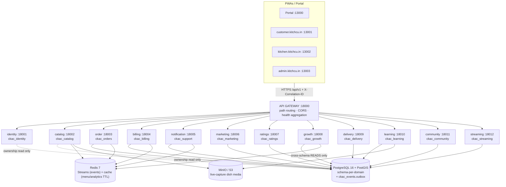

**Rules encoded in this diagram:** one bounded context per container · cross-service writes happen only via events, never direct calls into another schema · cross-schema reads are permitted only for ownership/evidence checks (Growth is the clearest example — it reads Orders and Ratings but writes only its own schema) · the gateway is the sole public edge.

## 13. Event & Data Flow Diagrams

### 13.1 Order + stock + notify (happy path)

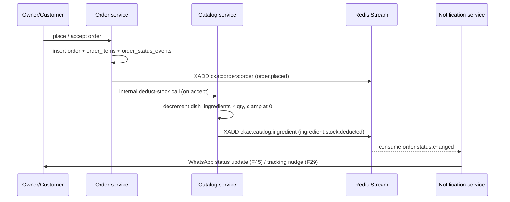

### 13.2 Multi-kitchen payment (F06 / F44)

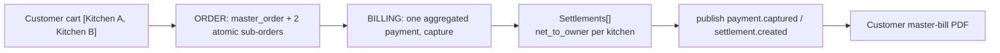

### 13.3 GST monthly loop

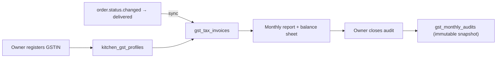

### 13.4 Kitchen Quality Loop (E1/E2 — design, not built)

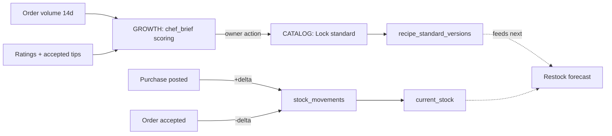

### 13.5 Core Redis streams (representative)

| Stream | Representative event types |
|--------|-------------------------------|
| `ckac:identity:kitchen` | `kitchen.created` |
| `ckac:orders:order` / `draft` / `master_order` | `order.placed`, `order.status.changed`, `order.draft.created`, `master_order.created` |
| `ckac:catalog:dish` / `ingredient` | `dish.created`, `dish.updated`, `ingredient.stock.deducted`, `ingredient.stock.adjusted` |
| `ckac:billing:payment` / `settlement` / `subscription` / `gst` | `payment.captured`, `settlement.created`, `subscription.updated`, `gst.invoice.synced`, `gst.audit.closed` |
| `ckac:marketing:coupon` / `crm` / `promotion` | `coupon.redeemed`, `crm.customer.updated`, `promotion.sent` |
| `ckac:ratings:rating` / `dish` | `rating.created`, `rating.aggregate.updated` |
| `ckac:growth:suggestion` / `daily_menu` | `suggestion.generated`, `daily_menu.pushed` |
| `ckac:delivery:quote` / `tracking` | `quote.calculated`, `tracking.link.created` |
| `ckac:learning:trial` | `trial.promoted` |
| `ckac:community:recipe` / `reward` / `ranking` | `recipe.shared`, `reward.credited`, `ranking.updated` |
| `ckac:streaming:session` | `session.started`, `session.ended` |
| `ckac:notify:whatsapp` / `dispatch` / `tracking` | `whatsapp.message.received`, `notification.dispatched`, `tracking.reminder.sent` |

Every one of the above is written through the **transactional outbox** in `ckac_events.outbox` in the same commit as its owning domain write — this is the mechanism, restated diagrammatically, behind §11.2.

## 14. ER / Schema Overview — Per `ckac_*` Schema

Schemas are **separate PostgreSQL schemas inside one cluster** — there are no cross-schema foreign keys. Relationships below are *logical* (joined in application code via `kitchen_id` / entity UUIDs), never enforced by the database across schema boundaries.

### `ckac_identity` — auth & tenant roots

```
owners 1──* kitchens
kitchens (referenced logically by every other schema's kitchen_id)
customers 1──* customer_oauth_identities
platform_admins (standalone — platform scope only, no owner JWT)
```

| Table | Purpose |
|-------|---------|
| `owners` | Phone + OTP identity, subscription tier/status |
| `kitchens` | Tenant root: PostGIS location, kitchen code, delivery-fee rule columns |
| `customers` | Diner identity (WhatsApp OTP primary) |
| `customer_oauth_identities` | Linked Google/Facebook/Instagram/X identities per customer |
| `platform_admins` | Admin login, platform-scope only |
| `feature_flags` | Platform kill-switches (key, scope, enabled, description) — migration `008_feature_flags` |

### `ckac_catalog` — menu of truth + pantry

```
cuisines 1──* categories 1──* dishes
dishes 1──* dish_media
dishes *──* ingredients (via dish_ingredients)
dishes 1──* dish_prep_steps
```

| Table | Purpose |
|-------|---------|
| `cuisines` / `categories` | Menu hierarchy (cuisine → veg/non-veg/vegan → dish) |
| `dishes` | Menu item: price, diet flags, prep/delivery/`max_time_min` (ready-within) |
| `dish_media` | Hero + gallery images; `is_live_capture` enforced |
| `ingredients` | Pantry item with low-stock threshold |
| `dish_ingredients` | Recipe line (many-to-many, ingredient × qty × unit) |
| `dish_prep_steps` | Ordered prep guidance per dish |
| *(planned E1/E2)* `stock_purchases`, `stock_purchase_lines`, `stock_movements`, `recipe_standard_versions` | Purchase ledger + recipe lock — see §23 |

### `ckac_orders` — the operational source of truth

```
master_orders 1──* orders
orders 1──* order_items
orders 1──* order_status_events
order_drafts (pre-confirmation, from WhatsApp parser)
```

| Table | Purpose |
|-------|---------|
| `orders` | One kitchen's order: status machine, totals, source channel, `delivery_mode` / `delivery_payer` / Maps lat-lng |
| `master_orders` | Multi-kitchen wrapper around 2+ `orders` |
| `order_items` | Line items (dish × qty × price at time of order) |
| `order_status_events` | Immutable audit trail of every status transition |
| `order_drafts` | Pre-confirmation orders parsed from WhatsApp messages |

### `ckac_billing` — money movement + GST

```
payments 1──* settlements
owner_subscriptions (per owner)
kitchen_gst_profiles 1──* gst_tax_invoices
gst_monthly_audits (monthly snapshot)
```

| Table | Purpose |
|-------|---------|
| `payments` | Captured online/UPI payment (single or aggregated master order) |
| `settlements` | Per-kitchen net payout from a captured payment |
| `owner_subscriptions` | Subscription tier/status/billing cycle |
| `kitchen_gst_profiles` | GSTIN + legal name + filing frequency |
| `gst_tax_invoices` | Tax invoice synced from a delivered order |
| `gst_monthly_audits` | Immutable monthly close snapshot |

### `ckac_marketing` — owner-owned CRM

| Table | Purpose |
|-------|---------|
| `kitchen_customers` | Per-kitchen customer spend/order-count/recency rollup |
| `coupons` | Flat/percentage discount codes with usage caps |
| `promotions` | Targeted campaign to a CRM-derived segment |

### `ckac_ratings` — trust signal

```
dish_ratings *──1 dishes (logical)
dish_rating_aggregates 1──1 dishes (logical, rolling aggregate)
dish_suggestions (F20 customer tips, accept/reject by owner)
```

| Table | Purpose |
|-------|---------|
| `dish_ratings` | One verified, delivered-order rating (home_taste + quality) |
| `dish_rating_aggregates` | Rolling `0.6×taste + 0.4×quality` per dish |
| `dish_suggestions` | Structured/free-text customer tip, owner accept/reject |

### `ckac_growth` — pattern intelligence (read-heavy, write-light)

| Table | Purpose |
|-------|---------|
| `suggestions` | Ranked action card (combos, patterns, daily menu, and — planned — `chef_standard` / `restock_plan`) |
| `seasonal_patterns` | Time-bucketed demand pattern per kitchen |

### `ckac_delivery` — distance & fees

| Table | Purpose |
|-------|---------|
| `delivery_quotes` | Computed fee quote for a kitchen↔address pair |

### `ckac_learning` — capability building

```
curated_recipes (platform content)
dish_trials 1──* trial_invites
dish_trials 1──* trial_ratings
```

| Table | Purpose |
|-------|---------|
| `curated_recipes` | Platform-curated technique content |
| `dish_trials` | Candidate dish soft-launch |
| `trial_invites` | Limited-audience invite list for a trial |
| `trial_ratings` | Feedback on a trial before promote-to-menu |

### `ckac_community` — recognition & rewards

```
shared_recipes 1──* recipe_appreciations
kitchen_reward_balances 1──* reward_point_ledger
kitchen_reward_balances 1──* reward_redemptions
chef_rankings (periodic snapshot)
```

| Table | Purpose |
|-------|---------|
| `shared_recipes` | Owner-published recipe |
| `recipe_appreciations` | Peer appreciation on a shared recipe |
| `kitchen_reward_balances` | Current point balance per kitchen |
| `reward_point_ledger` | Append-only point movements |
| `reward_redemptions` | Points redeemed for a benefit |
| `chef_rankings` | Periodic quality × activity × contribution league table |

### `ckac_streaming` — live trust

| Table | Purpose |
|-------|---------|
| `kitchen_stream_settings` | Owner opt-in / go-live configuration |
| `live_sessions` | LiveKit-backed session record, tenant-scoped tokens |

### `ckac_support` — notification & tickets

| Table | Purpose |
|-------|---------|
| `support_tickets` | Owner/customer support ticket, AI-chat-escalated or manual |
| `support_ticket_messages` | Threaded messages on a ticket |

### `ckac_events` — the outbox

| Table | Purpose |
|-------|---------|
| `outbox` | Every published event, committed atomically with its domain write — see §11.2 |
| `processed_events` *(inbox pattern, target)* | Idempotent-consumer bookkeeping — Phase 2+ |

**Tenant rule, restated:** almost every business table above carries `kitchen_id` (or joins to a kitchen through an owning entity). A table without `kitchen_id` is either a platform-scoped table (`platform_admins`) or a genuinely global lookup (`cuisines`), and that exception must be deliberate, not accidental.

## 15. Services, APIs, Security & Standards

| Service | Port | Schema | Gateway prefix highlights |
|---------|------|--------|------------------------------|
| gateway | 18000 | — | `/api/v1/*` (router only) |
| identity | 18001 | `ckac_identity` | `/auth`, `/owners`, `/admin`, `/customers`, `/kitchens` |
| catalog | 18002 | `ckac_catalog` | `/kitchens/{id}/menu|dishes|ingredients` |
| order | 18003 | `ckac_orders` | `/orders`, `/kitchens/{id}/analytics`, bill `.pdf` |
| billing | 18004 | `ckac_billing` | `/billing/*`, `/webhooks/razorpay`, `/kitchens/{id}/gst/*` |
| notification | 18005 | `ckac_support` | `/webhooks/whatsapp`, `/support/*` |
| marketing | 18006 | `ckac_marketing` | `/marketing/*` (CRM, coupons, promotions) |
| ratings | 18007 | `ckac_ratings` | `/kitchens/{id}/dishes/{id}/ratings|suggestions` |
| growth | 18008 | `ckac_growth` | `/growth/*` |
| delivery | 18009 | `ckac_delivery` | `/delivery/*` |
| learning | 18010 | `ckac_learning` | `/learning/*` |
| community | 18011 | `ckac_community` | `/community/*` |
| streaming | 18012 | `ckac_streaming` | `/stream/*` |

**Security posture** (full detail in the [security & observability rule](../.cursor/rules/kitchcu-security-observability.mdc)):

- JWT Bearer on every owner and customer route; admin JWT is platform-scope only and never accepted on owner-scoped routes.
- `kitchen_id` tenant filter enforced in the domain layer (not just the query) — the check is "does this JWT's owner actually own this `kitchen_id`," repeated on every mutating call.
- Pydantic validation on every input boundary; SQLAlchemy parameterized queries everywhere — no string-built SQL.
- Secrets only via environment variables / `.env.example`; never committed.
- Phone numbers and other PII masked in logs; OTPs and tokens are never logged.
- Internal service-to-service calls carry `X-Internal-Key` (`ckac_common.internal_auth`), distinct from any public JWT.
- `GET /health/live` + `GET /health/ready` on every service, aggregated at the gateway.
- Correlation ID (`X-Correlation-ID`) generated at the gateway, forwarded to every downstream call (`ckac_common.observability.CorrelationMiddleware`).
- Rate limiting at the gateway is a named Phase-2 target, not yet implemented — tracked explicitly rather than silently assumed.

**Engineering constitution, restated:** TDD + EDD on every change · a design pack before any new module (skippable only for trivial bugfixes) · Alembic-only schema changes · no restaurant-POS-shaped feature, ever.

### 15.5 Aggregated OpenAPI & API Reference

Every one of the 12 domain services ships its own FastAPI-generated `/openapi.json`; the gateway does not hand-write a contract — it **fetches and merges** all of them into one document at request time (`services/gateway/app/openapi_aggregate.py`), so the public contract can never drift from what a service actually implements.

| Surface | URL | Purpose |
|---------|-----|---------|
| Aggregated spec (JSON) | Gateway [`/openapi.json`](http://localhost:18000/openapi.json) | Merged OpenAPI 3.x document — schemas/paths namespaced per service (`identity_OwnerResponse`, tags prefixed `Identity: Auth`) |
| Swagger UI | Gateway [`/docs`](http://localhost:18000/docs) | Interactive explorer over the aggregated spec |
| ReDoc | Gateway [`/redoc`](http://localhost:18000/redoc) | Read-only reference rendering |
| Portal explorer | Portal [`/openapi`](http://localhost:13000/openapi) (alias `/api-docs`) — `apps/website/src/portal/OpenApiPage.tsx` | Same aggregated schema, embedded in the marketing/portal shell so a prospective owner or partner never needs gateway internals |
| Human index | [`docs/API.md`](./API.md) | Auth cheat-sheet, quick-start request/response examples, domain-tag map, error catalog — the *narrative* companion to the machine-readable spec |

**How the aggregation works:**

1. On gateway startup (and lazily on first `/openapi.json` call) the gateway's internal HTTP clients call each service's own `/openapi.json`.
2. `merge_openapi_specs()` rewrites every `$ref` with a service-prefixed schema name, re-tags every operation `"{ServiceLabel}: {original_tag}"` (or just `"{ServiceLabel}"` if the route had no tag), and stamps `x-kitchcu-service` on each operation so the origin service is always traceable from the merged doc.
3. The merged document is cached in-process; pass `?refresh=true` to `/openapi.json` to force an immediate re-fetch from all services after a route change, without restarting the gateway.
4. Health/docs-only paths (`/health/*`, `/openapi.json`, `/docs`, `/redoc`) are stripped from every upstream spec before merge so they don't collide or clutter the aggregate.

**Route documentation is mandatory, not auto-only.** FastAPI's automatic schema generation is the mechanism, but every route in every service is required to carry an explicit `summary`, `description`, `responses=` map (via `ckac_common.openapi.error_response` / `auth_errors` helpers for the standard `400/401/403/404/409/422` shapes), and every Pydantic field must carry a `Field(..., description=...)` — an auto-generated schema with no summaries or field descriptions does not satisfy the engineering standard (§10 of `KITCHCU-ENGINEERING-STANDARDS.md`), because the aggregated `/docs` is the actual integration surface partners and AI agents read.

```powershell
docker compose up -d
start http://localhost:18000/docs             # Swagger, aggregated
start http://localhost:13000/openapi          # Portal explorer (same schema)
curl "http://localhost:18000/openapi.json?refresh=true"   # force refresh after route changes
```

## 16. Build Status Matrix

| Module | Sprint | Status |
|--------|--------|--------|
| Gateway / Identity / Catalog / Order / Notification | S1–S4 | ✅ |
| PWAs + customer checkout + owner analytics | S5 | ✅ |
| Billing + subscriptions | S6 | ✅ |
| GST profiles/invoices/audit | (billing extension) | ✅ |
| Discovery (F32) / order history + repeat (F33) | S7 | ✅ |
| Multi-kitchen cart + master receipt (F06) | S8 | ✅ |
| Split payment / Route settlements (F44) | S9 | ✅ |
| CRM / coupons / targeted promotions | S10 | ✅ |
| Home-taste ratings + aggregates + A/V | S11 | ✅ |
| Combos / patterns / suggestions / daily menu push | S12 | ✅ |
| Delivery radius / fees / distance / tracking | S13 | ✅ |
| Delivery payer modes + platform courier + Maps track | (delivery/order extension) | ✅ |
| Dish prep/delivery/max_time + customer ready-within | (catalog extension) | ✅ |
| Super admin: customers, refunds, flags, journeys, Control | (identity + billing + admin PWA) | ✅ |
| Login feature highlights + owner commission panel + customer dashboard | (website PWAs) | ✅ |
| Tracking-interval reminders + WhatsApp order updates | S14 | ✅ |
| Ingredient balance mapper (F19) | S15 | ✅ |
| Learning portal + dish trials | S16 | ✅ |
| Recipe rewards + chef rankings | S17 | ✅ |
| Live streaming (LiveKit opt-in) | S18 | ✅ |
| Branded kitchen storefront `/k/{code}` | P19 | ✅ |
| Golden performance day + ML comment sentiment | P20 | ✅ |
| Kitchen WhatsApp + Razorpay (owner + admin workspace) | P21 | ✅ |
| Go-live per-dish showcase (ingredients → prep → prepared) | P22 | ✅ |
| Admin password sync from `ADMIN_PASSWORD` env | P23 | ✅ |
| Package mapper (features → packages → plans → kitchen) | P25 | ✅ |
| Owner WhatsApp/email marketing templates | P26 | ✅ |
| Platform employees CRUD + RBAC | P27 | ✅ |
| Super-admin kitchen workspace (Package/Marketing/Streaming + Cursor gate) | P28 | ✅ |
| Dual referral program (customer↔kitchen) | P37 | ✅ |
| GST monthly Excel/PDF + admin kitchen GST | P38 | ✅ |
| Super-admin ops console (orders/tickets/settlements/health) | P39 | ✅ |
| Platform i18n (10 locales) + HTML/API-key/login-hint harden | P40 | ✅ |
| **Purchases ledger + chef-standard lock (E1/E2)** | **S19 proposed** | **📋 Design only — not started** |

---

# Part IV — Product Flows (Step-by-Step)

Each flow below states the acting persona, the surface, the API/service path, the state change, and the event(s) emitted — the full `Actor → API → Domain → DB (tenant) → Outbox/Event → Consumers → UI reflection` chain required by the operating charter for every non-trivial flow.

**For the full journey pack** — every persona, every screen state, every API call and edge case, not just the condensed Mermaid version below — see the dedicated [`CKAC-USERFLOWS.md`](./CKAC-USERFLOWS.md) (and [`CKAC-USERFLOWS.pdf`](./CKAC-USERFLOWS.pdf)). This section stays intentionally condensed so it remains readable inline in this encyclopedia.

## 17.1 Owner Onboarding

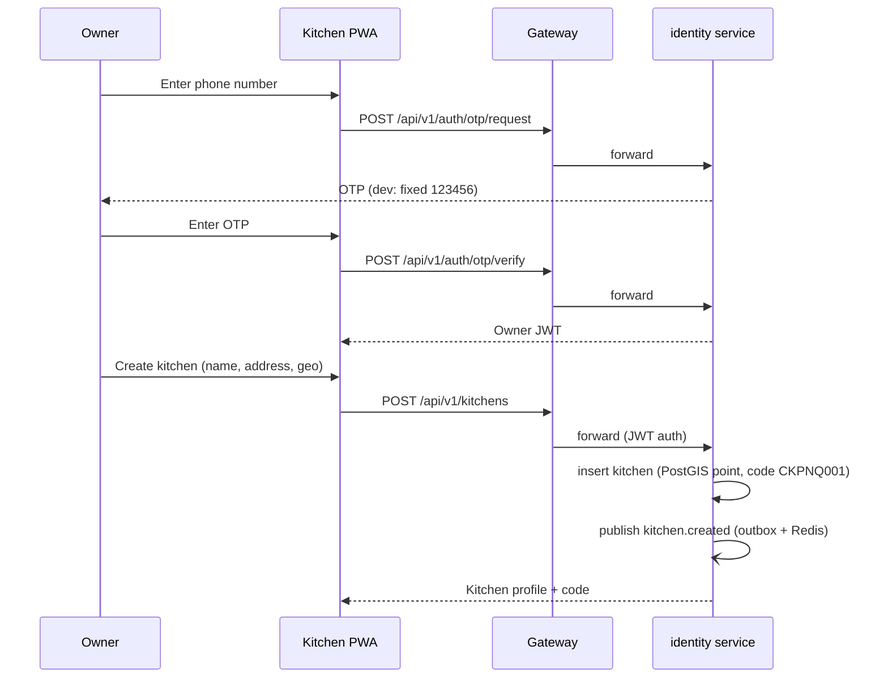

1. Owner opens `kitchen.kitchcu.in`, enters phone number → `POST /api/v1/auth/otp/request`.
2. Owner enters OTP (dev fixed `123456`) → `POST /api/v1/auth/otp/verify` → Identity issues an **Owner JWT**.
3. Owner creates a kitchen (`POST /api/v1/kitchens`) with address; Identity geocodes to a PostGIS point, assigns a code (`CK` + city + sequence, e.g. `CKPNQ001`), inserts the `kitchens` row, and publishes `kitchen.created` on `ckac:identity:kitchen` through the outbox.
4. Kitchen PWA reflects the new kitchen profile and code immediately; the owner is guided to add the first dish next (capability ladder rung 1).

## 17.2 OTP Login (Owner & Customer)

| Step | Owner path | Customer path |
|------|------------|-----------------|
| 1 | Phone number entered on `kitchen.kitchcu.in` | WhatsApp number entered **or** social OAuth tapped on `customer.kitchcu.in` |
| 2 | `POST /api/v1/auth/otp/request` (identity) | `POST /api/v1/customers/otp/request` **or** OAuth redirect (`customer/pages/CustomerOAuthCallbackPage.tsx`) |
| 3 | OTP `123456` (dev) entered | OTP `123456` (dev) entered, or OAuth provider callback completes |
| 4 | `POST /api/v1/auth/otp/verify` → **Owner JWT** | `POST /api/v1/customers/otp/verify` → **Customer JWT** (`type: customer`) |
| 5 | JWT stored under owner session key; scoped to owned kitchen(s) | JWT stored under a distinct customer session key — never interchangeable with an owner JWT, even in the same browser |

Both paths share the OTP mechanism (Redis-backed, TTL-expiring, never a plaintext DB column) but issue **structurally distinct JWTs** — an owner token is rejected by every customer-scoped route and vice versa, which is what makes "no owner JWT on admin/customer APIs" enforceable rather than aspirational.

## 17.3 WhatsApp / Manual Order Intake

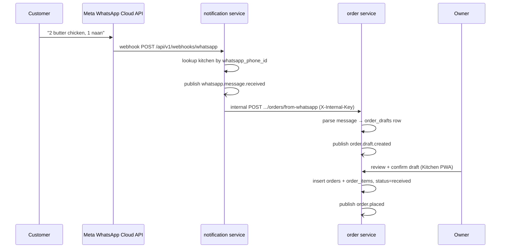

**Manual path** skips the WhatsApp/parser steps entirely: the owner opens **New Order** on the Kitchen PWA, selects dishes and quantity directly, and the same `orders` insert + `order.placed` publish happens from `POST /api/v1/orders` with `source=manual`. Both channels converge on one lifecycle from this point forward (§9.5's "one status machine" guarantee).

## 17.4 Customer Checkout — Single Kitchen

1. Customer browses a kitchen's menu (`customer.kitchcu.in/kitchen/{code}`), reads live-capture photos, adds dishes to cart.
2. Checkout requests a delivery fee quote (`POST /api/v1/delivery/quote`) using the customer's address and the kitchen's PostGIS location + fee rules; the fee is shown **before** payment, never revealed at the last step (closes C2).
3. Customer confirms payment method — online/UPI or COD.
4. `POST /api/v1/orders` (customer JWT) creates the order with `source=customer_app`; if online, Billing captures a `payments` row; if COD, no online capture row is created.
5. Order enters `received`; owner sees it appear in the Kitchen PWA Orders queue in real time (poll/refresh on `order.placed`).
6. Owner accepts → Catalog deducts recipe stock → status flows through `preparing → ready → out_for_delivery → delivered`, each transition notifying the customer (F45) and, at configured intervals, nudging tracking (F29).

## 17.5 Customer Checkout — Multi-Kitchen (Master Order)

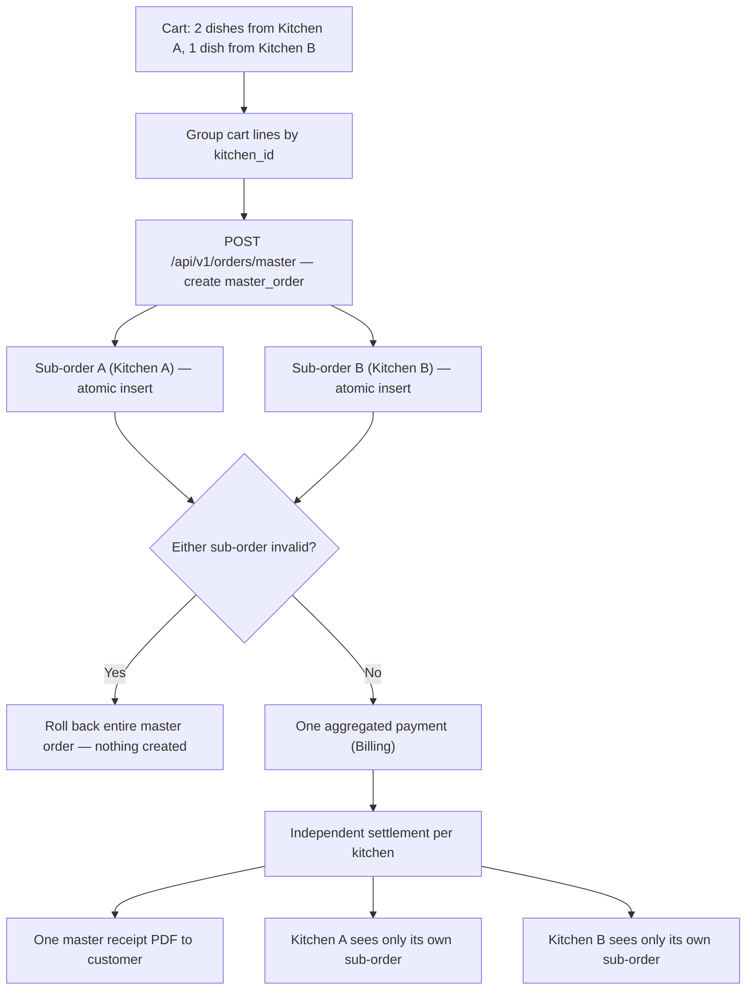

The critical product guarantee here: Kitchen A's owner never learns Kitchen B was even part of the same cart — each kitchen's Orders queue shows only its own sub-order, preserving the "owner owns their own operational view" principle even inside a shared-cart feature.

## 17.6 Payment & Split Settlement

1. Master order (or single order) reaches checkout with a total.
2. `POST /api/v1/billing/payments` creates one `payments` row (aggregated across sub-orders if multi-kitchen) and initiates capture (Razorpay UPI intent in production; dev-mode simulated capture).
3. On capture confirmation, Billing computes one `settlements` row **per kitchen** — `net_to_owner` — modeled on Razorpay Route's split-transfer semantics; **no percentage is withheld as commission**, only the actual per-kitchen order total flows through.
4. `payment.captured` and `settlement.created` publish on `ckac:billing:payment` / `settlement`.
5. Each kitchen's Subscription/Billing page reflects its own settlement; the customer sees one master receipt regardless of how many kitchens were involved.

## 17.7 GST Monthly Close

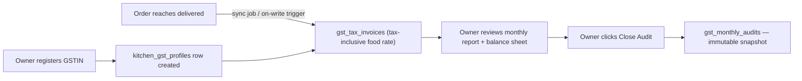

1. Owner opens **GST & Finance** on the Kitchen PWA and submits GSTIN + legal name + filing frequency → `kitchen_gst_profiles` row created.
2. From that point forward, every order that reaches `delivered` is synced into `gst_tax_invoices` at the tax-inclusive food rate — no retroactive backfill of pre-registration orders, since tax liability only begins at registration.
3. At month end, the owner reviews the generated report (invoice count, tax collected, net revenue) and the balance-sheet view.
4. `POST .../gst/monthly-audits/close` snapshots the month into `gst_monthly_audits` — an immutable record suitable for handoff to an accountant or filing tool, closing P10.

## 17.8 Ratings After Delivery

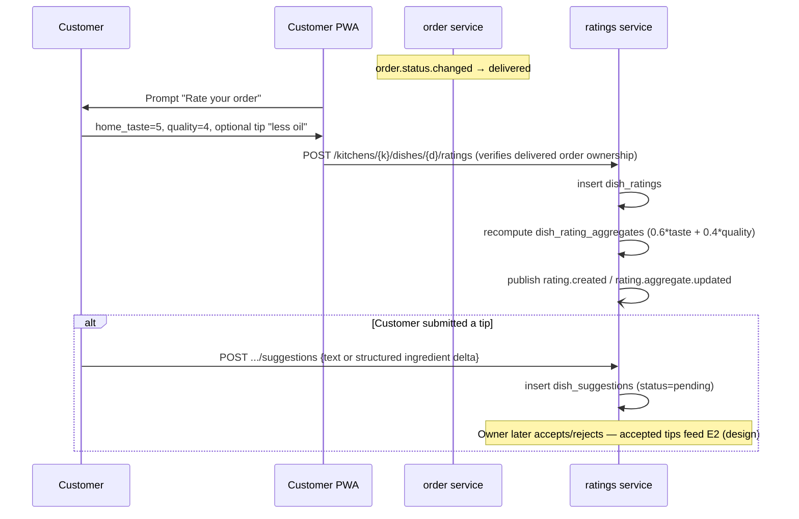

Ratings are only accepted against an order the requesting customer actually placed **and** that has reached `delivered` — a rating submitted against a `received` or `cancelled` order is rejected outright, which is what makes the aggregate a genuine trust signal rather than an easily-gamed counter.

## 17.9 Delivery Payer Modes & Maps Tracking

**Context.** Aggregators often hide who pays for last-mile logistics until checkout. KitchCu makes the rule explicit: **inside the kitchen’s max radius the owner covers logistics** (customer fee ₹0); **beyond range the customer pays** for self or platform courier — so kitchens can still fulfill without silently eating unbounded distance costs.

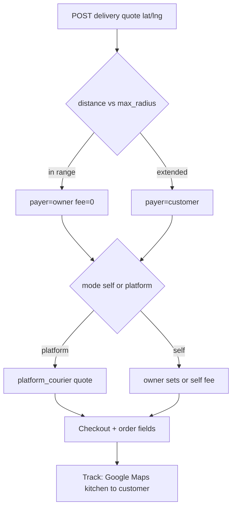

| Step | Actor | Surface / API | What changes |
|------|-------|---------------|--------------|
| 1 | Customer | Checkout requests quote with address lat/lng | Delivery service returns distance, fee, `payer`, available modes |
| 2 | Customer / Owner | Fulfillment choice | `orders.delivery_mode`, `delivery_payer`, `owner_delivery_cost`, customer lat/lng persisted |
| 3 | Owner | `PATCH .../orders/{id}/delivery-fulfillment` | Sets self vs platform when operating the kitchen |
| 4 | Customer / Owner | Track page / Order Detail | Google Maps directions embed + open-in-Maps; no partner GPS required for v1 |

See [`DELIVERY-PAYER-MODE-DESIGN.md`](./DELIVERY-PAYER-MODE-DESIGN.md) for the contract table.

## 17.10 Super Admin Control Plane

**Context.** Platform ops need one place to see **customers, refunds, money, packages, staff RBAC, kill-switches, and journey health** without impersonating an owner JWT (admin tokens never call owner-mutation routes). Every new kitchen-scoped feature must pass the Cursor gate in `.cursor/rules/kitchcu-superadmin-integration.mdc`.

| Area | Admin tab / API | Job |
|------|-----------------|-----|
| Health | Overview | Stat tiles, charts, quick actions (tickets, refunds, suspended kitchens, trials) |
| People | Customers, Owners, Kitchens | Suspend, activate, subscription overrides; customer **order + ticket history** + server search (P39) |
| Staff | **Employees** | CRUD/deactivate platform admins; roles `superadmin` / `ops` / `support` / `finance`; permissions `resource:action` |
| Monetization | **Packages** · **Referrals** | Map features→packages→plans; dual referral rewards + lead queue (P37) |
| Money | Refunds + settlements + billing admin | Gateway vs direct refunds, payments, settlements list, money-stats; GST kitchen exports (P38) |
| Governance | **Control** | Feature flags, journeys, subscription overrides, API Keys (`value_masked` never full secret — P40) |
| Support | Tickets | Escalated queues; **assignee / priority / resolution note**; deep-link to kitchen + refunds (P39) |
| Kitchen workspace | Profile / Brand / WhatsApp / Payments / Package / Marketing / Modules / **Orders** / Streaming / Delivery / Tiffin / **GST** | Care strip (open tickets/refunds, last order); per-kitchen credentials + GST (P38–P39) |

Gateway note: admin **billing** paths (packages, refunds, payment-gateway, GST) are registered **before** the identity admin catch-all so they proxy correctly.

**Security (P40):** `GET /admin/auth/login-hint` reveals `ADMIN_PASSWORD` only when `ADMIN_LOGIN_REVEAL_PASSWORD=1` (never inferred from `APP_ENV` alone). Dish HTML is sanitized server- and client-side.

---

# Part V — UI Catalog

## 18. UI Catalog — Reference Surfaces (Login, Ops, Control)

Screenshots live at [`docs/assets/ui/`](./assets/ui/) (PNG for markdown; `*-pdf.jpg` for PDF size). Each capture documents **anatomy**, **UX intent**, **brand theme**, and **product context** for the July 2026 addons (login highlights, super-admin Control, ready-within / Maps / zero-commission messaging).

### 18.1 Portal Home

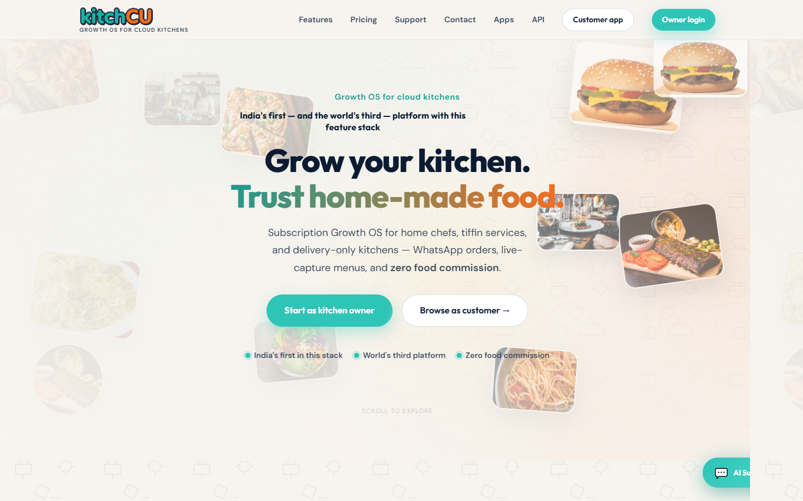

| | |
|--|--|
| **Surface** | Portal, `kitchcu.in` :13000 |
| **Anatomy** | `PortalNavbar` → `Hero` / `HeroCopyParallax` → `AudienceSections` → `Features` → `Pricing` → live-capture showcase → Support → Footer. |
| **UX intent** | Persuasion only — positioning claim + path to pricing in two scrolls. |
| **Brand cues** | Light marketing: cream `#FFF8EE`, teal/orange wordmark, parallax hero. |
| **Demo** | Static; Starter ₹499 / Growth ₹999 / Pro ₹1,999. |

### 18.2 Customer Home

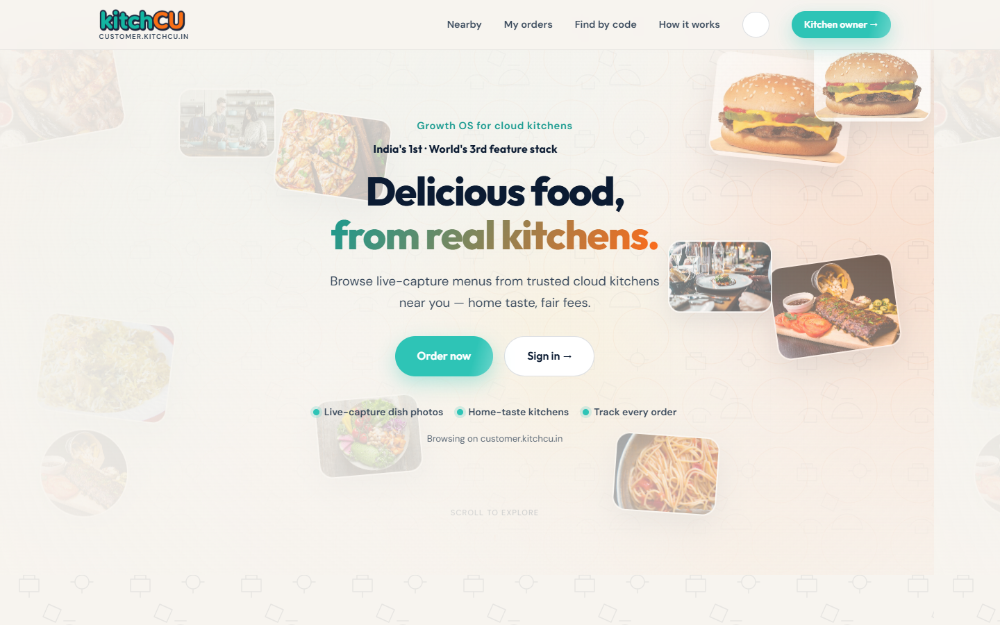

| | |
|--|--|
| **Surface** | Customer PWA :13001 |
| **Anatomy** | Navbar (Nearby, My orders, Dashboard, Payout, Find by code) → kitchen code entry → filters (radius, diet, live-capture, live stream) → `NearbyKitchensList`. |
| **UX intent** | Discovery-first trust (C1/C6). |
| **Brand cues** | Light cream/teal; orange CTAs. |
| **Demo** | Demo location Pune / `CKPNQ001` after seed. |

### 18.3 Customer Login (highlights)

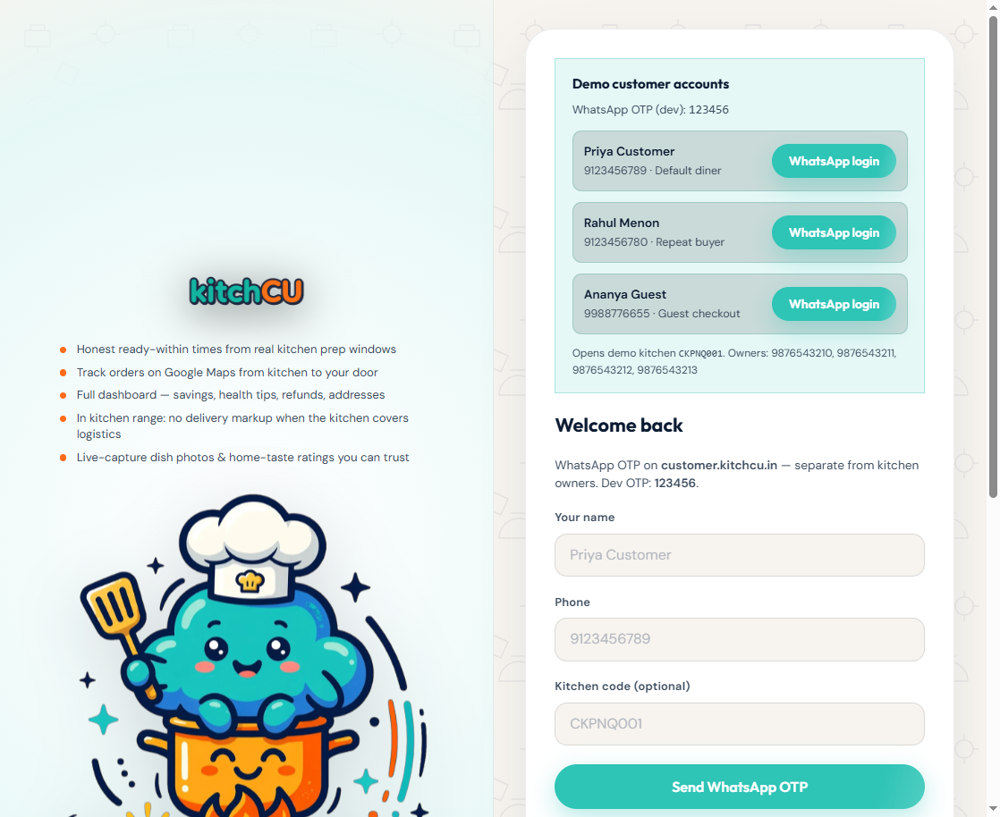

| | |
|--|--|
| **Surface** | `customer.kitchcu.in/login` |
| **Anatomy** | **Left:** wordmark + bullet highlights (ready-within, Maps track, full dashboard, in-range no markup, live-capture) + chef mascot. **Right:** demo WhatsApp login cards + OTP form + social OAuth buttons. |
| **UX intent** | Authenticate **and** teach the customer value prop before the first order — highlights are not decoration; they encode honest timing, Maps, and delivery payer economics. |
| **Brand cues** | Light auth split panel; teal primary OTP CTA. |
| **Demo** | WhatsApp OTP `123456`; demo diners (Priya / Rahul / Ananya). |

### 18.4 Kitchen Login (highlights)

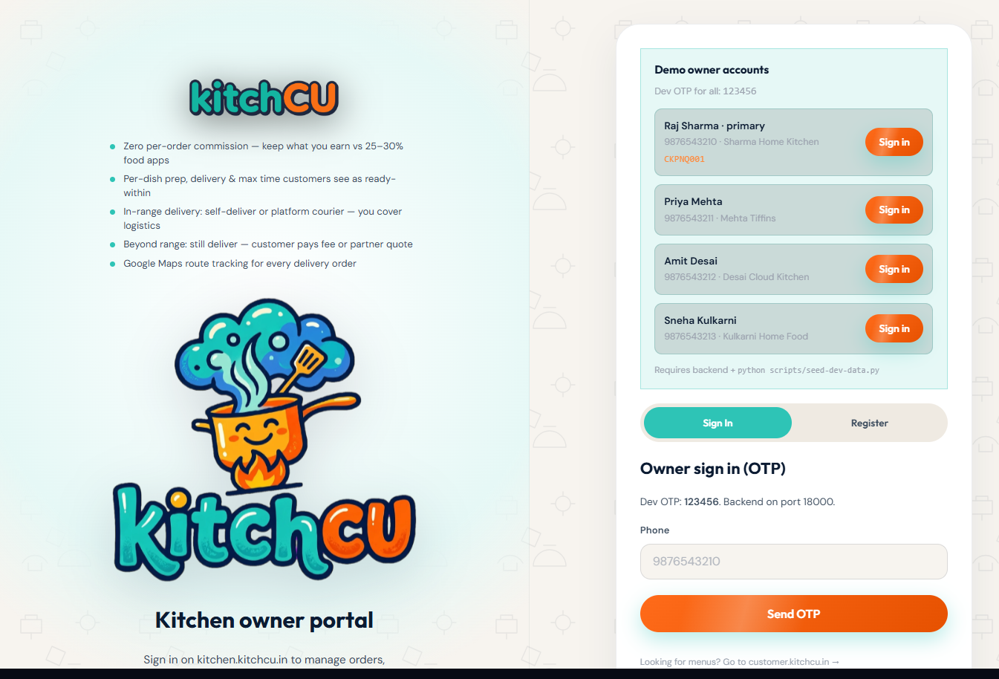

| | |
|--|--|
| **Surface** | `kitchen.kitchcu.in/login` |
| **Anatomy** | **Left:** wordmark + owner highlights (zero commission vs 25–30%, per-dish timing, in-range owner-pays logistics, extended customer-pays, Maps tracking). **Right:** demo owner Sign-in cards + phone/OTP. |
| **UX intent** | Fast OTP path **plus** SaaS positioning — owners see why they are not on an aggregator take-rate before they enter the dark ops shell. |
| **Brand cues** | Light transitional → next screen is dark ops. |
| **Demo** | `9876543210` / OTP `123456` (after `seed-dev-data.py`). |

### 18.5 Owner Dashboard

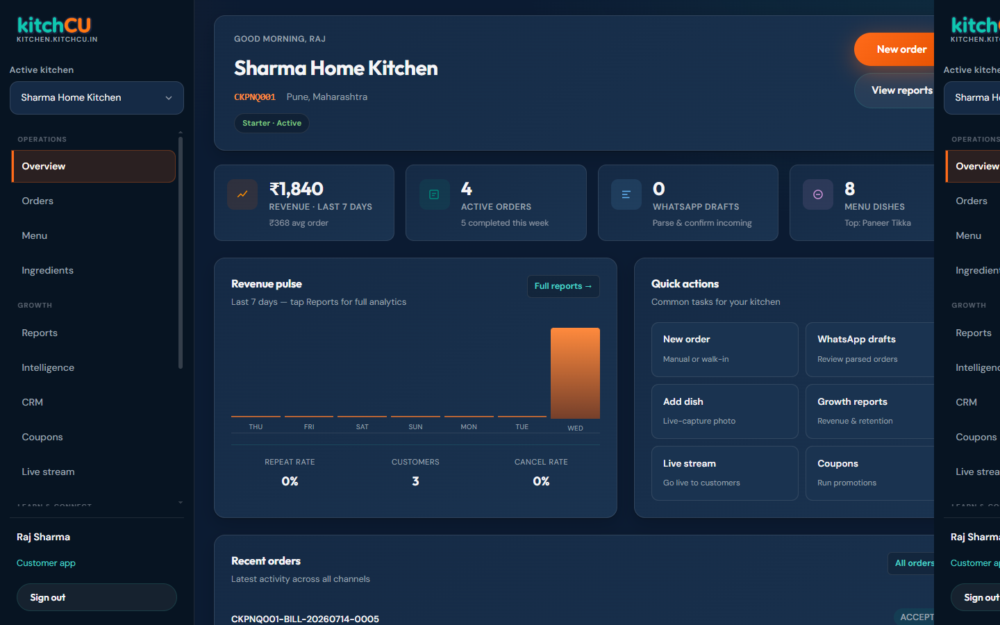

| | |
|--|--|
| **Surface** | Kitchen PWA — `OwnerHomePage` / `OwnerPageShell` |
| **Anatomy** | Side nav (capability ladder) → status strip → **New Order** → recent orders → **`CommissionAdvantagePanel`** (0% food commission vs aggregator comparison chart) → low-stock alerts. |
| **UX intent** | Inbox-first ops; commission panel reinforces the business model every session. |
| **Brand cues** | Dark navy ops `#0B1B32`. |
| **Demo** | Seeded `CKPNQ001` kitchen. |

### 18.6 Admin Login (highlights)

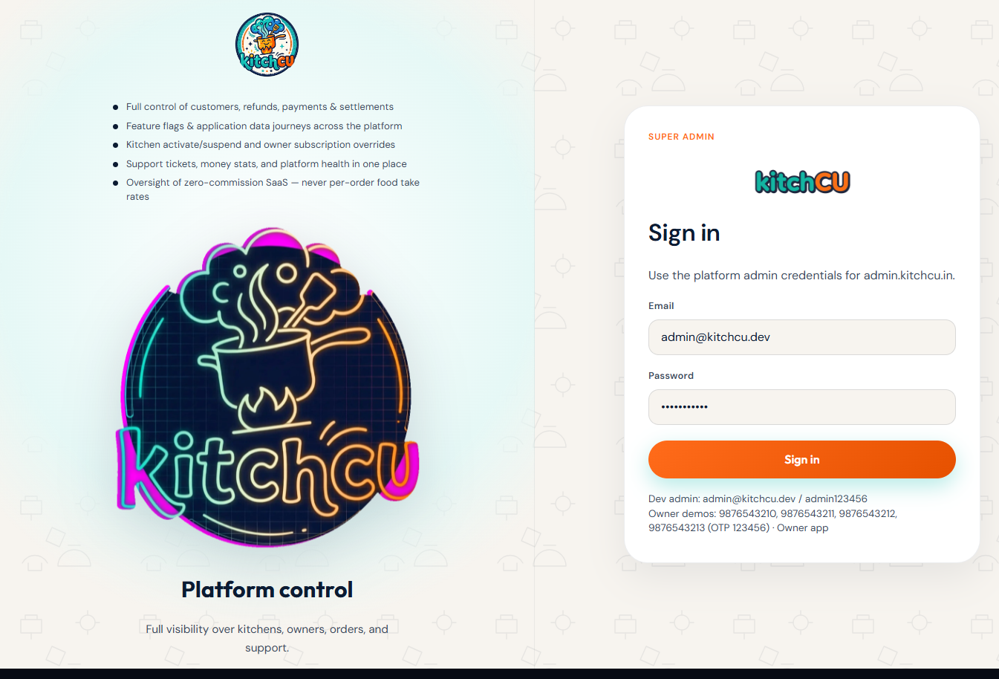

| | |
|--|--|
| **Surface** | `admin.kitchcu.in` unauthenticated |
| **Anatomy** | Left: platform-control highlights (customers/refunds/payments, feature flags & journeys, kitchen suspend, tickets/money, zero-commission oversight). Right: email/password Sign in. |
| **UX intent** | Make the **super-admin job** readable before credentials — this is not a kitchen login. |
| **Brand cues** | Dark-leaning auth; admin continuity with ops theme. |
| **Demo** | Local: `admin@kitchcu.dev` / `admin123456`. Production (`admin.kitchcu.com`): `admin@kitchcu.com` + VM `ADMIN_PASSWORD` (GCE metadata `admin-password`; hash synced on login). |

### 18.7 Admin Overview

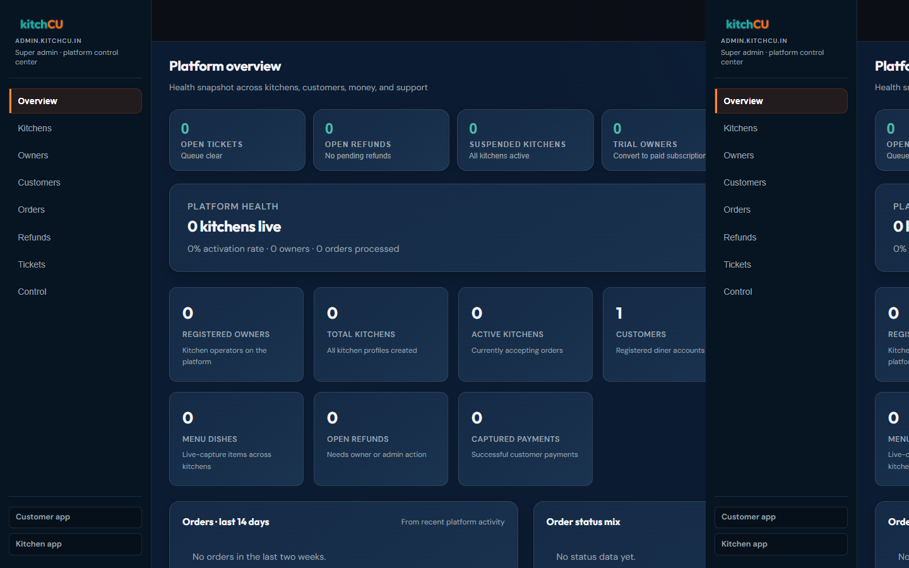

| | |
|--|--|
| **Surface** | Admin PWA Overview |
| **Anatomy** | Nav: Overview, Kitchens, Owners, **Customers**, Orders, **Refunds**, Tickets, **Packages**, **Employees**, **Control** → attention tiles → platform health → charts → Quick actions. Kitchen detail opens workspace tabs (Profile / WhatsApp / Payments / Package / Marketing / Modules / Streaming). |
| **UX intent** | Platform health at a glance; entitlements & staff under Packages / Employees; deep kitchen ops in workspace tabs. |
| **Brand cues** | Dark ops (matches Kitchen). |
| **Demo** | Stats reflect current seed/DB state. |

### 18.8 Admin Control Plane

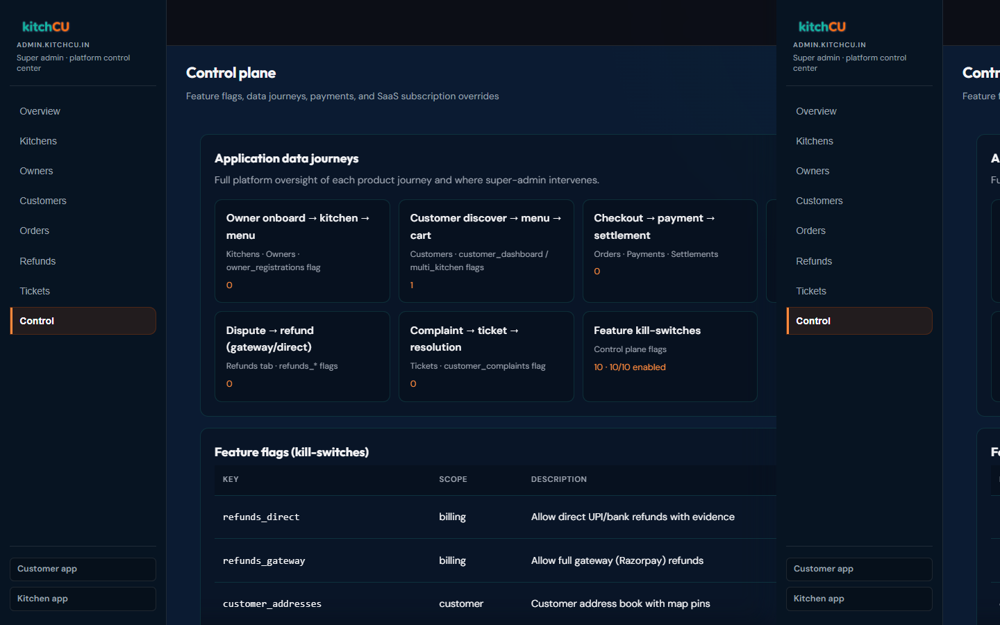

| | |
|--|--|
| **Surface** | Admin PWA → **Control** |
| **Anatomy** | Application data journeys grid (owner onboard, customer discover→cart, checkout→settlement, dispute→refund, complaint→ticket, kill-switches) → Feature flags table (key/scope/description/toggle) → Owner subscription control → Recent payments. |
| **UX intent** | Governance: pause refund paths, understand journey volume, override SaaS tiers — without touching tenant menus. |
| **Brand cues** | Dark ops; orange selection on Control. |
| **Demo** | Flags such as `refunds_gateway`, `refunds_direct`, journey-scoped keys. |

---


# Part VI — Brand & UX System

## 19. Brand / UX System

Source art lives in `/logos`; served copies for the PWAs live in `apps/website/public/brand/`, referenced through the single source of truth `apps/website/src/shared/brand.ts` — no PWA is allowed to hardcode a hex color or asset path outside that file.

### 19.1 Naming

Always presented as **kitchCU** in running text (`kitch` lowercase, `CU` uppercase) — this document and code comments may say "KitchCu" or "Kitchcu" interchangeably in prose, but UI chrome must use the `APP_NAME` constant, never a hand-typed string.

### 19.2 Palette

| Token | Hex | Role |
|-------|-----|------|
| Orange | `#FF6B1A` (light `#FF8A3D`) | Primary CTA, the "CU" half of the wordmark |
| Teal | `#2EC4B6` (deep `#1A9B90`) | Secondary accents, the "kitch" half of the wordmark, success states |
| Navy | `#0B1B32` (mid `#152A45`) | Dark-ops surfaces, outlines |
| Flame yellow | `#FFC107` | Highlights, sparks, attention accents |
| Cream | `#FFF8EE` | Light marketing/customer surfaces |

### 19.3 Two themes, one brand — and why

| Theme | Where it applies | Why |
|-------|--------------------|-----|
| **Light — cream/teal/orange** | Portal, Customer PWA | Marketing and discovery/appetite contexts benefit from warmth and openness; a customer deciding what to eat should feel invited in, not managed. |
| **Dark — navy-first ops** | Kitchen PWA, Admin PWA | Operational contexts are used for extended sessions during active service; a dark, low-glare surface reduces fatigue and visually signals "this is a working tool," distinct from the marketing/discovery surfaces. It also makes status color (teal = good, orange = needs attention, flame = urgent) pop with far higher contrast than it would on a bright background. |

Both themes share the **same** wordmark, mascot, and shape language — the split is a UI-mode decision, never a re-brand.

### 19.4 Asset map

| File | Use |
|------|-----|
| `wordmark.png` | Horizontal wordmark — navbars, headers |
| `appicon.png` | App icon, favicon, PWA install icons |
| `badge.png` | Circular patch badge — marketing, empty states |
| `mascot.png` | Pot + steam + wordmark lockup — warm empty states |
| `mark-circle.png` | Circular mark — avatars, splash screens |
| `lockup-dark.png` | Dark rectangular lockup — dark-theme chrome |
| `creative-chef.png` | Auth / onboarding character hero |
| `creative-neon.png` | Accent / promotional neon circle |
| `creative-hero.png` | Large hero illustration (portal) |

### 19.5 Form spacing system

Every input, select, textarea, label, and submit button across the auth screens (`LoginPage.tsx`, admin login) **and** every owner/admin dashboard form shares one spacing system, `apps/website/src/owner-forms.css`, so a form never feels hand-tuned per screen:

| Token | Value | Role |
|-------|-------|------|
| `--kc-field-stack-gap` | `1.25rem` | Vertical gap between one field (or button) and the next in a form column |
| `--kc-label-control-gap` | `0.5rem` | Gap between a field's label text and its input/select/textarea |
| `--kc-btn-min-h` | `2.85rem` | Minimum height for submit/primary buttons inside a form — keeps a 44px+ effective touch target |
| `--kc-field-h` | `3rem` | Minimum height for text inputs/selects |
| `--kc-field-radius` | `12px` | Border radius on all form controls (auth cards, owner forms, admin filters) |

The `.kc-field` flex-column pattern (`display: flex; flex-direction: column; gap: var(--kc-label-control-gap)`) wraps label→control, and the parent `form` (or `.owner-form`) is itself a flex column with `gap: var(--kc-field-stack-gap)` — so field-to-field rhythm is never hand-set with per-field `margin-bottom`, which is what caused the pre-3.1 inconsistency between the kitchen login card and the owner dashboard forms. One spacing system now spans **both** brand themes (light auth cards and dark ops dashboards), because rhythm is a UX invariant even where color/theme is not.

### 19.6 Shape & motion language

- Rounded, bubble-friendly typography paired with large border-radii (999px pills for buttons/chips, 16–24px for cards) — never sharp corporate corners.
- The mascot exists specifically to keep empty states warm rather than cold/corporate — e.g. "no orders yet" states use `mascot.png`, never a generic gray icon.
- Motion is used **intentionally, never decoratively**: 2–3 purposeful moments per flow (e.g. a stock-number tick-up on purchase post, a suggestion card collapsing into a "Locked" chip) rather than ambient animation everywhere — this is an explicit UX rule from the operating charter ("intentional motion, motion only where it does not fight brand art").
- Dish hero media is never treated as decoration — it is the primary trust artifact on Customer/Portal, always live-capture, never stock photography (§0.2 glossary, "live-capture").

---

# Part VII — Operating Reference

## 20. Demo Credentials

| Role | Identifier | Secret | Notes |
|------|------------|--------|-------|
| Owner (primary) | `9876543210` (Raj Sharma) | OTP `123456` | Kitchen `CKPNQ001` — Sharma Home Kitchen, Pune |
| Owner | `9876543211` (Priya Mehta) | OTP `123456` | Mehta Tiffins |
| Owner | `9876543212` (Amit Desai) | OTP `123456` | Desai Cloud Kitchen |
| Owner | `9876543213` (Sneha Kulkarni) | OTP `123456` | Kulkarni Home Food |
| Customer (default diner) | `9123456789` (Priya Customer) | OTP `123456` | Default seeded diner |
| Customer (repeat buyer) | `9123456780` (Rahul Menon) | OTP `123456` | Weighted into repeat/VIP demo segments |
| Customer (guest) | `9988776655` (Ananya Guest) | OTP `123456` | Guest checkout path |
| Platform admin (local) | `admin@kitchcu.dev` | `admin123456` | Platform-scope only — no owner JWT accepted |
| Platform admin (prod) | `admin@kitchcu.com` | `ADMIN_PASSWORD` from GCE metadata | Same JWT type=admin; password re-synced from env on login |

All OTPs are the fixed dev value `123456` (`ckac_common` dev OTP provider) — production OTP delivery via WhatsApp/SMS is a named target, not yet wired. Seed data is generated by `scripts/seed-dev-data.py` and `scripts/bulk_demo_data.py` / `scripts/demo_data.py`, kept in sync with `apps/website/src/shared/demo.ts` (the single frontend source of truth for these values — never hardcode a demo phone number elsewhere).

## 21. Ports Table

| Surface / Service | Port | Kind |
|--------------------|------|------|
| Portal (`kitchcu.in`) | 13000 | PWA |
| Customer (`customer.kitchcu.in`) | 13001 | PWA |
| Kitchen (`kitchen.kitchcu.in`) | 13002 | PWA |
| Admin (`admin.kitchcu.in`) | 13003 | PWA |
| Gateway | 18000 | API edge |
| Identity | 18001 | Service |
| Catalog | 18002 | Service |
| Order | 18003 | Service |
| Billing | 18004 | Service |
| Notification | 18005 | Service |
| Marketing | 18006 | Service |
| Ratings | 18007 | Service |
| Growth | 18008 | Service |
| Delivery | 18009 | Service |
| Learning | 18010 | Service |
| Community | 18011 | Service |
| Streaming | 18012 | Service |
| PostgreSQL 16 + PostGIS | 15432 | Data |
| Redis 7 | 16379 | Cache/events |
| MinIO API / Console | 9000 / 9001 | Media |

## 22. Operating Charter Reference

Every implementation decision in this repository — human or AI-authored — is bound by the always-on **[KitchCu Strict Operating Charter](../.cursor/rules/kitchcu-executive-operating-charter.mdc)**. It requires every contributor to reason as the founding org (CEO · CPO · CTO · Senior Full-Stack · Principal UX · DBA · QA Lead) simultaneously, and defines the role-gate table that must pass **before** any code is written:

| Role | Must answer before coding |
|------|------------------------------|
| CEO | Improves kitchen growth / unit economics? Zero food commission preserved? |
| CPO | Clear product flow? Builds trust (live-capture, honesty)? Respects progressive complexity? |
| CTO | Correct service boundary? Events used correctly? Gateway-edge-only? No cross-schema writes? |
| Full-stack | Minimal, focused diff? Matches stack conventions? No placeholders in production paths? |
| UX/UI | Brand-first? One composition, intentional motion, correct light/dark theme per surface? |
| DBA | Alembic only? UUID PKs? Tenant isolation? Reversible, scalable migration? |
| QA | Failing tests first? API + schema + events covered? 100% on payment/order state machine? |

If **any** gate fails, the charter's instruction is unambiguous: **stop, redesign, do not implement.** This document (the Complete Guide) exists precisely so that satisfying those gates does not require re-deriving architecture from first principles on every feature — the "why" is written down once, here, and referenced everywhere else (`AGENTS.md`, the `.cursor/rules/*.mdc` files, and every design pack).

---

# Part VIII — Forward Design

## 23. E1 + E2 Kitchen Quality Loop (Design, Not Built)

Full spec: [`E1-E2-KITCHEN-QUALITY-LOOP-DESIGN.md`](./E1-E2-KITCHEN-QUALITY-LOOP-DESIGN.md). Summary for this guide:

**Why both features ship together, not separately:** shipping E1 (purchase ledger) alone leaves stock accurate but says nothing about *why* a dish tastes different batch to batch. Shipping E2 (chef-brief + lock) alone proposes recipe standards without a trustworthy pantry to compute a restock forecast against. The design pack ships them as one vertical slice (proposed **S19**) precisely because they close the same loop from opposite ends:

```
Purchases restock pantry (E1)
        │
        ▼
Recipes consume stock on accept (F19 — already shipped)
        │
        ▼
Orders + home-taste ratings accumulate signal
        │
        ▼
Daily chef brief proposes winning recipe standards (E2)
        │
        ▼
Owner locks standard → recipe becomes the source of truth
        │
        ▼
Next purchase plan uses locked qty × forecasted orders (E1 ← E2)
```

**Key design decisions already locked in (pre-code):**

| Decision | Choice | Rationale |
|----------|--------|-----------|
| New `inventory` microservice? | **No** for S19 | Stock is already Catalog-owned; splitting now would be premature per the split rule (§9.1) |
| Auto-lock a recipe standard overnight? | **No** | Owner consent is a safety/audit invariant — the brief only *proposes*, the owner always explicitly *locks* |
| Where does deduct-on-accept happen? | Unchanged — stays on **accept** | Matches F19's shipped, tested behavior; no regression risk |
| Chef-brief trigger | Owner-initiated generate call (cron optional later) | Simpler ops, easier to test, no silent background writes |
| Scoring engine | Rules-based (`0.45×volume + 0.35×taste + tip_boost + 0.20×quality_risk`), **no LLM in v1** | Owners distrust black-box recipe changes; a transparent formula is auditable and explainable in the UI |

**New tables (planned, `ckac_catalog` unless noted):** `stock_purchases`, `stock_purchase_lines`, `stock_movements` (append-only ledger — every stock delta, purchase or deduct, shares one auditable table), `recipe_standard_versions` (immutable snapshot per lock, never deleted on unlock). **New events (planned):** `purchase.posted`, `purchase.voided`, `recipe.standard.locked`, `recipe.standard.unlocked`, `suggestion.chef_standard.generated`.

**Approval gate before any code is written** (unchanged from the design pack): CPO acceptance criteria matched · CTO architecture/events reviewed · DBA schema reviewed · QA test plan reviewed. Until all four are ticked, **this remains documentation, not implementation** — consistent with the TDD rule that RED tests are written only once a design pack is approved.

---

# Appendix A — Feature Implementation Matrix (F01–F48)

Full acceptance criteria for every feature: [`CKAC-COMPLETE-PLANNING-BENCHMARK.md`](./CKAC-COMPLETE-PLANNING-BENCHMARK.md).

| Band | Feature IDs | Theme | Status |
|------|-------------|-------|--------|
| Order intake & lifecycle | F01–F05 | WhatsApp/manual/custom order capture, lifecycle, history | ✅ done (WhatsApp AI parsing partial) |
| Multi-kitchen & payments | F06, F42–F44 | Master checkout, online pay + COD, UPI, split settlement | ✅ done |
| Analytics & growth | F07–F12, F39 | Revenue/dish/pattern reports, suggestions, daily menu push | ✅ done |
| Catalog & trust media | F13–F15 | Live-capture dish photo, price/quality/ingredients, categories | ✅ done |
| Ratings | F16–F18, F20 | Home-taste rating, aggregate, A/V reviews, customer tips | ✅ done (owner-facing F20 UI still thin) |
| Ingredients | F19 | Ingredient balance mapper (deduct on accept, low-stock warn) | ✅ done — **E1 extends with a purchase ledger, design only** |
| Social & subscription model | F25, F26 | Social share cards, zero-commission subscription | ✅ done |
| Delivery / discovery | F27–F33 | Radius, fee accept/deny, tracking, prep/delivery time, distance, nearby, repeat orders | ✅ done |
| Marketing | F34–F38, F40–F41 | Tiffin subscription, meal plans, coupons, CRM, targeted pricing, event menus, custom requests | ✅ core done |
| Learning / community | F21–F24 | Curated learning, dish trials, recipe rewards, chef rankings | ✅ done |
| Notifications | F45 | App + WhatsApp order notifications | ✅ done |
| Live | F46–F48 | Live prep streaming, owner opt-in, customer live filter | ✅ done |
| GST | *(finance extension beyond the original 48)* | Registration, tax invoices, monthly audit, balance sheet | ✅ done |
| Quality loop | E1, E2 | Purchase ledger, chef-standard lock | 📋 design only |

# Appendix B — Document Index

| Doc | Role |
|-----|------|
| **This guide (v3.2.3)** | CEO/CPO/CTO master encyclopedia |
| [`PLATFORM-SOLUTION-BLUEPRINT.md`](./PLATFORM-SOLUTION-BLUEPRINT.md) | Expectations → CEO/CPO solution → CTO impl → arch/DB/UX per journey & admin controls |
| [`PLATFORM-PERSONA-DEEP-DIVE.md`](./PLATFORM-PERSONA-DEEP-DIVE.md) | Persona lived experience + scorecards |
| [`PLATFORM-STRATEGIC-ANALYSIS.md`](./PLATFORM-STRATEGIC-ANALYSIS.md) | Competitive honesty + Waves A–D |
| [`ADVANCEMENT-TRACKER.md`](./ADVANCEMENT-TRACKER.md) | Living ship board |
| [`CKAC-USERFLOWS.md`](./CKAC-USERFLOWS.md) / [`.pdf`](./CKAC-USERFLOWS.pdf) | Full user journey pack — every persona, every screen, every API call |
| [`API.md`](./API.md) | Public API reference — auth cheat-sheet, quick-start examples, error catalog |
| Gateway `/openapi.json`, `/docs`, `/redoc` · Portal `/openapi` (`/api-docs`) | Live, always-current aggregated OpenAPI contract (see §15.5) |
| [`E1-E2-KITCHEN-QUALITY-LOOP-DESIGN.md`](./E1-E2-KITCHEN-QUALITY-LOOP-DESIGN.md) | Next-sprint design pack (S19 proposed) |
| [`CKAC-IMPLEMENTATION-GUIDE.md`](./CKAC-IMPLEMENTATION-GUIDE.md) | Living code map — what's built, mapped to benchmarks |
| [`CKAC-ARCHITECTURE-CTO.md`](./CKAC-ARCHITECTURE-CTO.md) | CTO layers + CPO product-to-code traceability |
| [`KITCHCU-ENGINEERING-STANDARDS.md`](./KITCHCU-ENGINEERING-STANDARDS.md) | Full engineering constitution |
| [`templates/MODULE-DESIGN-PACK.md`](./templates/MODULE-DESIGN-PACK.md) | Mandatory pre-code design template |
| [`CKAC-COMPLETE-PLANNING-BENCHMARK.md`](./CKAC-COMPLETE-PLANNING-BENCHMARK.md) | Full 48-feature spec + acceptance criteria |
| [`CKAC-SYSTEM-BENCHMARK.md`](./CKAC-SYSTEM-BENCHMARK.md) | Architecture, DB, caching, SLO deep dive |
| [`CKAC-CPO-PRODUCT-BLUEPRINT.md`](./CKAC-CPO-PRODUCT-BLUEPRINT.md) | CPO blueprint (v4.2) — module encyclopedia, challenges, journeys |
| Feature design packs (`F*.md`) | Per-sprint design detail (ingredients, growth, ratings, marketing, delivery, notification, multi-kitchen checkout) |
| [`CKAC-GAPS.md`](./CKAC-GAPS.md) | Historical gap tracker (superseded in most areas by AGENTS.md's current build baseline) |
| [`AGENTS.md`](../AGENTS.md) | Agent / engineer quick spec — read before every code change |
| [`.cursor/rules/`](../.cursor/rules/) | Auto-applied Cursor rules (operating charter, TDD/EDD, backend, frontend, security) |
| [`docs/assets/ui/`](./assets/ui/) | Reference UI screenshots (see §18 — 8 surfaces) |
| [`DELIVERY-PAYER-MODE-DESIGN.md`](./DELIVERY-PAYER-MODE-DESIGN.md) | Delivery payer + platform courier rules |

# Appendix C — Document Control

| Version | Date | Changes |
|---------|------|---------|
| **3.2.3** | July 2026 | Platform Solution Blueprint + Persona Deep Dive + Strategic Analysis linked from tracker/index; multilevel admin & package planner solution matrices. |
| **3.2.3** | 2026-07-20 | P37–P40: dual referrals, GST Excel/PDF + admin GST, super-admin ops console (orders/tickets/settlements/health), platform i18n (10 locales) + HTML/API-key/login-hint harden; docs/PDFs refresh. |
| **3.2.2** | July 2026 | Post-S18 P25–P28: package mapper, owner WA/email templates, employees CRUD+RBAC, expanded kitchen workspace + always-on super-admin Cursor gate; docs/PDFs/tracker refresh. |
| **3.2.1** | July 2026 | Post-S18 P19–P24: branded storefront, golden performance day, kitchen integrations admin workspace, live dish showcase, admin password env sync; prod admin `admin@kitchcu.com`; living [`ADVANCEMENT-TRACKER.md`](./ADVANCEMENT-TRACKER.md). |
| **3.2** | July 2026 | Super-admin Control plane (Customers/Refunds/Control, feature flags, journeys); dish prep/delivery/`max_time` + customer ready-within; delivery payer modes (owner in-range / customer extended) + platform courier + Google Maps tracking; login `AuthLoginHighlights` + owner `CommissionAdvantagePanel` + customer dashboard; expanded UI Catalog (§18.1–18.8) with new screenshots; flows §17.9–17.10; PDF layout v3.2 (header clearance, caption-above-figure, no overlap). |
| 3.1 | July 2026 | Documents the aggregated gateway OpenAPI contract (§15.5: `/openapi.json`, `/docs`, `/redoc`, portal `/openapi`/`/api-docs`, `docs/API.md`, `?refresh=true`, mandatory `summary`/`description`/`Field`/`responses` on every route via `ckac_common.openapi`); adds the unified form spacing system (§19.5: `owner-forms.css` field-stack tokens spanning auth + dashboards); links the new step-by-step [`CKAC-USERFLOWS.md`](./CKAC-USERFLOWS.md) pack from the TOC and Part IV; updates Appendix B/document index and changelog. |
| 3.0 | July 2026 | Full rewrite as a definitions-first encyclopedia: glossary; architecture "why" for microservices/gateway/schemas/streams/outbox/tenant scoping; 100k-session scale lens; TDD+EDD rationale (not just rules); step-by-step product flows with Mermaid sequence/flow diagrams for owner onboarding, OTP login, WhatsApp/manual order intake, single + multi-kitchen checkout, split settlement, GST close, post-delivery ratings; per-schema logical ER using real table names from the codebase; UI Catalog section (5 reference screenshots with anatomy/UX/brand notes); brand/UX system with light-vs-dark theme rationale; demo credentials and ports tables; operating charter reference; E1/E2 quality-loop summary; F01–F48 status appendix. |
| 2.0 | July 2026 | CEO/CPO/CTO module catalog + build status through S18; GST live; E1/E2 design pack referenced |
| 1.0 | (superseded) | Initial Phase 1 baseline (S1–S4) |

---

*KitchCu Complete Executive & Engineering Guide v3.2.3 — Confidential — July 2026*
