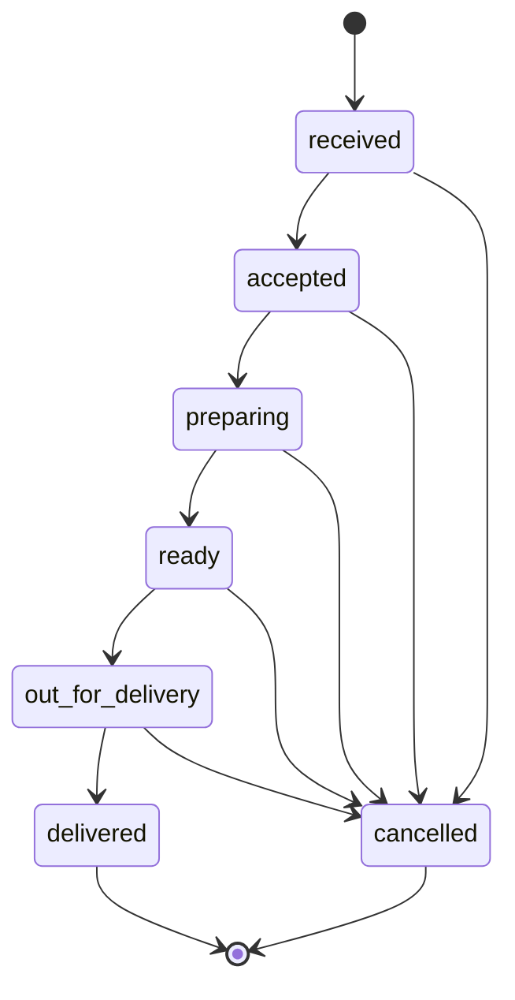
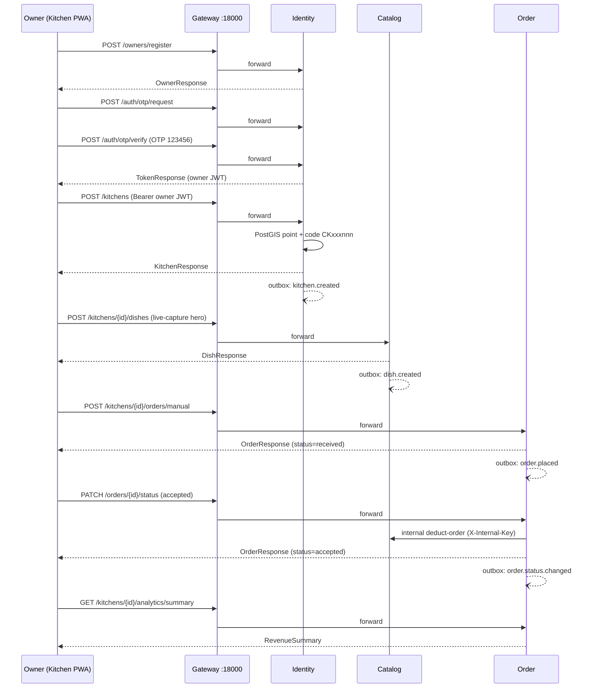
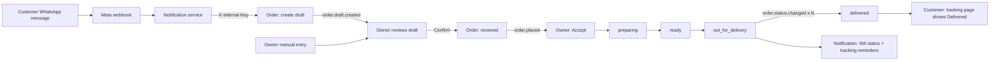
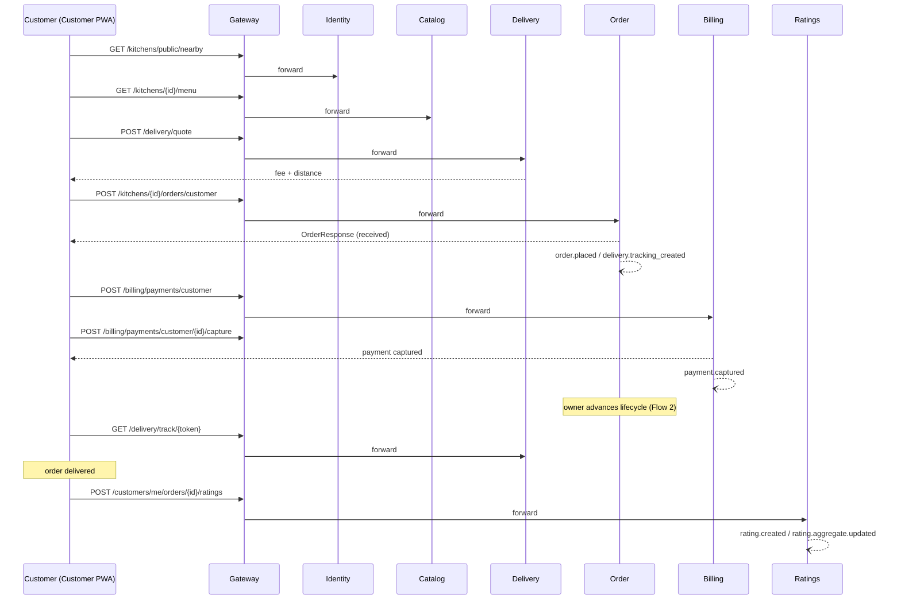
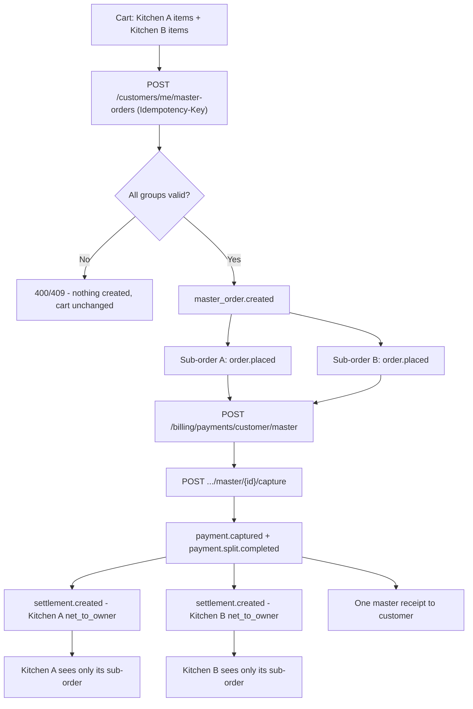
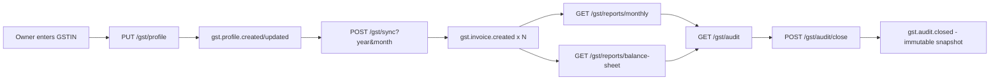
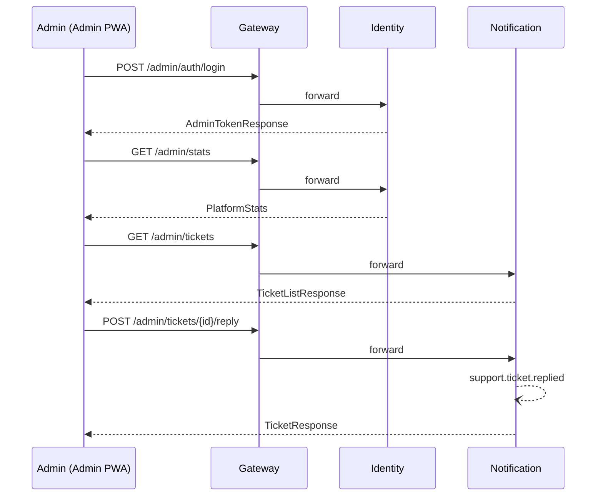
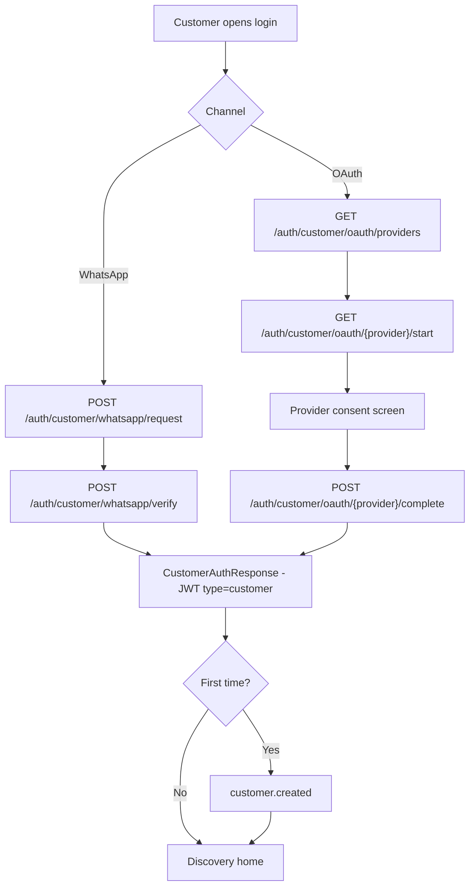
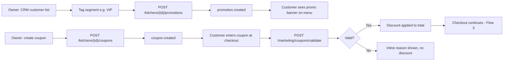
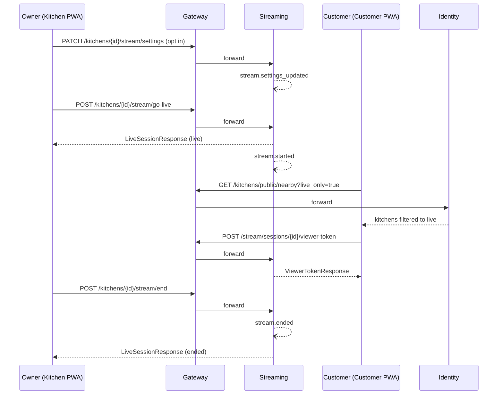

# KitchCu — User Flow Documentation Pack

**Detailed encyclopedia of every major product journey, end to end**

| Field | Value |
|-------|-------|
| Version | **1.0** |
| Date | July 2026 |
| Audience | CPO, Product, Engineering, QA, Investors |
| Status | Traces to code shipped through **S1–S18** (13 domain services + gateway + 4 PWAs) |
| Companion PDF | [`docs/CKAC-USERFLOWS.pdf`](./CKAC-USERFLOWS.pdf) (generate with `scripts/generate_userflows_pdf.py`) |

---

## 0. Purpose & How This Maps to Other Docs

This document is the **single source of truth for "how does a user actually get from A to B"** — every screen tap, every API call, every domain event, every failure path. It exists because the Complete Guide, API reference, and live OpenAPI schema each answer a different question, and product/QA/investor conversations need all three stitched together per journey:

| Question | Answered by |
|----------|-------------|
| *What is KitchCu and why does it exist?* | [`docs/CKAC-COMPLETE-GUIDE.md`](./CKAC-COMPLETE-GUIDE.md) Parts 0–III (CEO/CPO/CTO lenses) |
| *What are the step-by-step flows, at encyclopedia depth?* | **This document** — expands Complete Guide **Part IV (§17.1–17.8)** into full UI-step + API + event + diagram detail, plus 3 flows the Guide only summarizes (multi-kitchen split, coupons/CRM, live streaming) |
| *What is the exact request/response shape for an endpoint?* | [`docs/API.md`](./API.md) (human index) → live OpenAPI: Gateway `/docs` / `/redoc` / `/openapi.json`, or Portal explorer at **`/openapi`** (`apps/website/src/portal/OpenApiPage.tsx`, aggregated by `services/gateway/app/openapi_aggregate.py`) |
| *What does the actual screen look like?* | [`docs/assets/ui/`](./assets/ui/) reference screenshots (linked per flow below) |
| *What's built vs. designed?* | [`docs/CKAC-IMPLEMENTATION-GUIDE.md`](./CKAC-IMPLEMENTATION-GUIDE.md) |

**Read order for a new team member:** Complete Guide Parts 0–III → this document → API.md for exact schemas → live `/openapi` when writing code against a specific route.

**Conventions used throughout:**
- All API paths are relative to the gateway base `/api/v1/` (`http://localhost:18000` in dev, or same-origin `/api` via a PWA). Public clients **must** go through the gateway — never call a service port directly.
- `->` denotes a state/data transition. `Rs` denotes Indian Rupees.
- Every write publishes a domain event via the transactional outbox (`EventPublisher.publish(..., session=session)`) to a Redis Stream named `ckac:<domain>:<aggregate>` — see the events line in every flow section.
- Diagrams use [Mermaid](https://mermaid.js.org/) (renders natively in GitHub/Cursor Markdown preview; ASCII-safe for the PDF companion, which renders an ASCII-art equivalent instead).

---

## 1. Persona Surfaces

| Persona | Surface (PWA) | Host : Port (dev) | Auth JWT `type` | Primary jobs |
|---------|----------------|--------------------|------------------|---------------|
| Guest / prospect | Portal | `kitchcu.in` : **13000** | none | Brand story, pricing, live `/openapi` explorer, demo |
| Owner / chef | Kitchen | `kitchen.kitchcu.in` : **13002** | `owner` | Menu, orders, GST, CRM, growth, ratings, stream |
| Customer / diner | Customer | `customer.kitchcu.in` : **13001** | `customer` | Discover, order, pay, track, rate |
| Platform admin | Admin | `admin.kitchcu.in` : **13003** | `admin` | Oversight, kitchen moderation, support tickets |

| Edge | Port | Role |
|------|------|------|
| API Gateway | **18000** | Sole public HTTP edge for `/api/v1/*`; path-routes to 13 services; injects `X-Correlation-ID`; aggregates `/openapi.json`, `/docs`, `/redoc`, `/health/ready` |
| identity / catalog / order / billing / notification / marketing / ratings / growth / delivery / learning / community / streaming | **18001–18012** | Domain services — never called directly by public clients |
| PostgreSQL 16 + PostGIS | 15432 | `ckac_<domain>` schema per service |
| Redis 7 | 16379 | Streams (events) + tenant-scoped cache |

---

## 2. Auth JWT Types

| Type | Issued via | Header | Validated by | Notes |
|------|-----------|--------|---------------|-------|
| `owner` | `POST /api/v1/auth/otp/verify` (after `POST /api/v1/auth/otp/request`) | `Authorization: Bearer <jwt>` | `get_current_owner` / `get_current_owner_id` (identity) | Dev OTP always `123456` when `APP_ENV=development`. Owner JWT rejected on customer/admin routes. |
| `customer` | `POST /api/v1/auth/customer/whatsapp/verify` or `POST /api/v1/auth/customer/oauth/{provider}/complete` | `Authorization: Bearer <jwt>` | `get_current_customer` / `get_current_customer_id` — explicit `type == "customer"` check | Separate namespace from owner; first login emits `customer.created`. |
| `admin` | `POST /api/v1/admin/auth/login` | `Authorization: Bearer <jwt>` | `get_current_admin` — explicit `type == "admin"` check | Platform scope only — never touches owner-mutation routes. |
| Internal | n/a (shared secret, not a JWT) | `X-Internal-Key: <INTERNAL_API_KEY>` | Service-to-service dependency guard | Used for WhatsApp draft creation, stock deduction, notification dispatch. Gateway returns `404` for any public request to `/api/v1/internal/*` — these routes are **never proxied**. |

**Demo credentials (dev seed — `scripts/seed-dev-data.py`, `scripts/bulk_demo_data.py`):**

| Role | Identifier | Secret | Notes |
|------|-----------|--------|-------|
| Owner (primary) | `9876543210` | OTP `123456` | Raj Sharma — kitchen `CKPNQ001`, Sharma Home Kitchen, Pune |
| Owner | `9876543211` | OTP `123456` | Priya Mehta — Mehta Tiffins |
| Owner | `9876543212` | OTP `123456` | Amit Desai — Desai Cloud Kitchen |
| Owner | `9876543213` | OTP `123456` | Sneha Kulkarni — Kulkarni Home Food |
| Customer | `9123456789` | OTP `123456` | Priya Customer — default diner |
| Customer | `9123456780` | OTP `123456` | Rahul Menon — repeat/VIP segment |
| Customer | `9988776655` | OTP `123456` | Ananya Guest — guest checkout |
| Admin | `admin@kitchcu.dev` | `admin123456` | Platform scope only |

---

## 3. Order Status State Machine

Every order (single-kitchen or a master-order sub-order) moves through one linear machine. `delivered` and `cancelled` are terminal; `cancelled` is reachable from **any** non-terminal state. Enforced server-side by `can_transition()` in `services/order/app/models.py` — any other transition returns `400`.

Every transition writes an immutable `ckac_orders.order_status_events` row and publishes `order.status.changed` on `ckac:orders:order`. Notification consumes this to send WhatsApp status updates (F45) and tracking-interval reminders (F29) — **never a fabricated ETA**, only owner-set prep/delivery windows.

---

## 4. Flow 1 — Owner Register -> OTP -> Create Kitchen -> Add Live-Capture Dish -> First Manual Order -> Accept -> Revenue Report

**Goal:** Get a new owner from zero to "I can see today's revenue" in one sitting — the day-1 promise.
**Persona:** Owner
**Entry URL:** `kitchen.kitchcu.in` (13002) — login/register screen
**Screenshot:** [`docs/assets/ui/03-kitchen-login.png`](./assets/ui/03-kitchen-login.png)

### Preconditions
- None for a fresh owner. To replay with seed data, use phone `9876543210`, OTP `123456` (already has kitchen `CKPNQ001` — skip step 4 and jump straight to adding a dish/order).

### Step-by-step UI actions

1. Owner opens Kitchen PWA, enters phone number.
2. New owner: fills name/email on the register card. Existing owner: goes straight to OTP.
3. Enters OTP (dev fixed `123456`), lands in the owner shell.
4. First-run wizard: "Create your kitchen" — name, address, pin on map (PostGIS point).
5. "Add your first dish" — name, price, category, and a **live-capture photo** taken with the device camera (`getUserMedia`) — gallery upload is rejected as a hero.
6. "Record your first order" — New Order screen, pick dish(es), quantity, customer name/phone, mark manual/WhatsApp.
7. Order appears in the Orders inbox with status `received` — owner taps **Accept**.
8. Owner opens Reports — same-day revenue is visible.

### API calls

| Step | Method + Path | Auth | Notes |
|------|----------------|------|-------|
| 2 | `POST /api/v1/owners/register` | none | `OwnerRegisterRequest{phone, name, email}` -> `OwnerResponse` (`subscription_tier: starter`, `subscription_status: trial`) |
| 3a | `POST /api/v1/auth/otp/request` | none | `OTPRequest{phone}` -> `202` |
| 3b | `POST /api/v1/auth/otp/verify` | none | `OTPVerifyRequest{phone, otp}` -> `TokenResponse{access_token, expires_in}` |
| — | `GET /api/v1/owners/me` | owner | Profile hydration on shell load |
| 4 | `POST /api/v1/kitchens` | owner | `KitchenCreateRequest{name, address, latitude, longitude}` -> `KitchenResponse{code: "CKPNQ001", ...}` |
| 5a | `POST /api/v1/kitchens/{kitchen_id}/media/upload` | owner | multipart upload; response includes `is_live_capture` echo |
| 5b | `POST /api/v1/kitchens/{kitchen_id}/dishes` | owner | `DishCreateRequest{name, price, category_id, media:[{url, is_live_capture:true}]}` -> `DishResponse`; server **rejects** hero media with `is_live_capture:false` (`400`) |
| 6 | `POST /api/v1/kitchens/{kitchen_id}/orders/manual` | owner | `ManualOrderCreateRequest{items, customer_name, customer_phone, payment_method}` -> `OrderResponse{status:"received", order_code}` |
| 7 | `PATCH /api/v1/orders/{order_id}/status` | owner | `OrderStatusUpdateRequest{status:"accepted"}` -> `OrderResponse`; triggers internal stock deduction: `POST /api/v1/internal/kitchens/{kitchen_id}/stock/deduct-order` (catalog, `X-Internal-Key`) |
| 8 | `GET /api/v1/kitchens/{kitchen_id}/analytics/summary?days=1` | owner | `RevenueSummary` |

### Domain events published

`kitchen.created` (`ckac:identity:kitchen`) -> `dish.created` (`ckac:catalog:dish`) -> `order.placed` (`ckac:orders:order`) -> `order.status.changed` (`ckac:orders:order`, `received -> accepted`) -> `ingredient.stock.deducted` (`ckac:catalog:ingredient`, if a recipe is mapped) -> `notification.sent` (`ckac:notify:dispatch`, order-accepted push if configured).

### Success screen / failure paths

- **Success:** Reports tab shows non-zero revenue, order count = 1, order visible in "Recent Orders" with green `accepted` chip.
- **Failure — OTP:** wrong/expired OTP -> `401 {"detail": "Invalid OTP"}`; owner not registered -> `404` on verify, UI routes back to register.
- **Failure — dish media:** gallery photo submitted as hero -> `400/422`, UI blocks save and prompts "use camera capture."
- **Failure — order accept:** invalid status jump (e.g. `received -> ready`) -> `400`; low/zero stock on a mapped ingredient -> `200` with a stock-warning banner (`GET /api/v1/orders/{id}/stock-warnings`), order still accepted (owner decision, not blocked).

### Diagram

---

## 5. Flow 2 — Owner Daily Login + New WhatsApp/Manual Order -> Lifecycle Status Updates -> Tracking

**Goal:** Repeat-day operations — the owner's steady-state loop.
**Persona:** Owner
**Entry URL:** `kitchen.kitchcu.in` (13002)
**Screenshot:** [`docs/assets/ui/04-owner-dashboard.png`](./assets/ui/04-owner-dashboard.png)

### Preconditions
- Owner already has a kitchen and at least one dish (use `9876543210` / OTP `123456`, kitchen `CKPNQ001`).

### Step-by-step UI actions

1. Owner logs in (phone -> OTP `123456`) — lands on the dashboard status strip (revenue, orders, pending).
2. **Path A — WhatsApp:** a customer message arrives on the kitchen's WhatsApp number; it appears in the "Drafts" queue for review.
3. **Path B — Manual:** owner taps New Order and keys the order directly (as in Flow 1 step 6).
4. Owner reviews/edits the draft, taps **Confirm** to convert it to a real order.
5. Owner advances the order through the lifecycle as kitchen work progresses: Accept -> Start Preparing -> Mark Ready -> Out for Delivery -> Delivered.
6. Customer receives a WhatsApp status push at each transition and periodic tracking-interval reminders while `out_for_delivery` (owner-set delivery SLA, never a fake countdown).
7. Owner or customer opens the shareable tracking link to see current status.

### API calls

| Step | Method + Path | Auth | Notes |
|------|----------------|------|-------|
| 1 | `POST /api/v1/auth/otp/request` -> `POST /api/v1/auth/otp/verify` | none | Same as Flow 1 |
| 2 | *(inbound)* `POST /api/v1/webhooks/whatsapp` | none (Meta signature) | notification service receives raw message |
| 2 | `POST /api/v1/internal/kitchens/{kitchen_id}/orders/from-whatsapp` | internal key | notification -> order service; creates `order_drafts` row |
| 2 (owner view) | `GET /api/v1/kitchens/{kitchen_id}/orders/drafts` | owner | List pending drafts |
| 3 (manual alt) | `POST /api/v1/kitchens/{kitchen_id}/orders/manual` | owner | Same as Flow 1 |
| — (parse alt) | `POST /api/v1/kitchens/{kitchen_id}/orders/parse-message` | owner | Manually paste WA text -> parsed draft |
| 4 | `POST /api/v1/kitchens/{kitchen_id}/orders/drafts/{draft_id}/confirm` | owner | Draft -> `OrderResponse` (status `received`) |
| 5 (each hop) | `PATCH /api/v1/orders/{order_id}/status` | owner | `{status: accepted\|preparing\|ready\|out_for_delivery\|delivered\|cancelled}` |
| — | `GET /api/v1/kitchens/{kitchen_id}/orders?status=&source=` | owner | Orders inbox list/filter |
| 7 | `GET /api/v1/delivery/track/{token}` | none (signed token) | Public tracking page data |

### Domain events published

`order.draft.created` (`ckac:orders:draft`) -> `order.placed` (`ckac:orders:order`, on confirm) -> `delivery.tracking_created` (`ckac:delivery:tracking`, when `delivery_type=delivery`) -> `order.status.changed` **per transition** (`ckac:orders:order`) -> `notification.sent` (`ckac:notify:dispatch`, F45 WA status push) -> `notification.tracking_interval` (`ckac:notify:tracking`, F29 reminders while `out_for_delivery`).

### Success screen / failure paths

- **Success:** order card moves through colored lifecycle chips; customer's WhatsApp thread shows each status line; tracking page shows current stage without a fake ETA countdown.
- **Failure:** confirming a draft with a since-deleted dish -> `409`/`400` with detail, owner must edit line items first; skipping a stage (`preparing -> delivered`) -> `400`; tracking token expired/invalid -> `404` on the public page.

### Diagram

---

## 6. Flow 3 — Customer Discovery Nearby -> Menu -> Delivery Quote -> Checkout (Single Kitchen) -> Pay -> Track -> Rate Home Taste

**Goal:** The core trust-to-purchase loop for a diner.
**Persona:** Customer
**Entry URL:** `customer.kitchcu.in` (13001)
**Screenshot:** [`docs/assets/ui/02-customer-home.png`](./assets/ui/02-customer-home.png)

### Preconditions
- Customer logged in via WhatsApp OTP or OAuth (see Flow 7). Demo: `9123456789` / OTP `123456`.
- At least one kitchen with an active menu near the demo location (Koregaon Park, Pune — `18.5362, 73.8958`).

### Step-by-step UI actions

1. Customer allows/uses location; sees nearby kitchens sorted by distance with live-capture thumbnails, ratings, diet filters.
2. Taps a kitchen card -> menu screen (live photos only, per-dish rating badge).
3. Adds dishes to cart; cart drawer shows subtotal.
4. Before checkout, app fetches a delivery-fee quote and shows it plainly (no surprise fee at payment).
5. Confirms address/location, optionally applies a coupon, chooses payment method (online/UPI or COD), places the order.
6. Pays (if online) — UPI intent or card via Razorpay.
7. Tracks order on the shareable tracking link/page through to `delivered`.
8. Post-delivery, rates **home taste** and **quality** (1–5 each) with an optional anonymous audio/video note and tip.

### API calls

| Step | Method + Path | Auth | Notes |
|------|----------------|------|-------|
| 1 | `GET /api/v1/kitchens/public/nearby` | none | Query: `lat, lng, diet, live_capture, live_only` -> `KitchenNearbyListResponse` |
| 2 | `GET /api/v1/kitchens/{kitchen_id}/menu` | none | Cached `menu:{kitchen_id}` TTL 5 min -> `MenuResponse` |
| 2 | `GET /api/v1/kitchens/{kitchen_id}/ratings/summaries` | none | Per-dish rating badges |
| 2 | `GET /api/v1/kitchens/{kitchen_id}/promotions/active` | none / optional customer JWT | Banner promos (F38) |
| 4 | `POST /api/v1/delivery/quote` | none | `DeliveryQuoteRequest{kitchen_id, latitude, longitude, subtotal}` -> `DeliveryQuoteResponse{fee, distance_km, status}` |
| 5 (coupon) | `POST /api/v1/marketing/coupons/validate` | customer | `CouponValidateRequest{code, kitchen_id, subtotal}` -> `CouponValidateResponse{discount, ...}` |
| 5 | `POST /api/v1/kitchens/{kitchen_id}/orders/customer` | customer | `CustomerOrderCreateRequest{items, delivery_type, payment_method, delivery_fee, delivery_fee_accepted, distance_km, customer_latitude, customer_longitude}` -> `OrderResponse{order_code, status:"received", tracking_token}` |
| 6a | `POST /api/v1/billing/payments/customer` | customer | `PaymentCreateRequest{order_id, amount, method}` -> `PaymentResponse` |
| 6b | `POST /api/v1/billing/payments/customer/upi-intent` | customer | `UpiIntentRequest` -> `UpiIntentResponse{deep_link}` |
| 6c | `POST /api/v1/billing/payments/customer/{payment_id}/capture` | customer | -> `PaymentResponse{status:"captured"}` |
| 7 | `GET /api/v1/delivery/track/{token}` | none | Public tracking page |
| 7 | `GET /api/v1/customers/me/orders/{order_id}` | customer | Own-order detail/poll |
| 8 | `POST /api/v1/customers/me/orders/{order_id}/ratings` | customer | `OrderRatingsCreateRequest{home_taste, quality, tip, review}` -> `OrderRatingsCreateResponse` (verifies `delivered` + ownership) |

### Domain events published

`delivery.fee_quoted` (`ckac:delivery:quote`) -> `order.placed` + `delivery.tracking_created` (`ckac:orders:order`, `ckac:delivery:tracking`) -> `payment.created` -> `payment.captured` (`ckac:billing:payment`) -> `order.status.changed` **x5** through delivery -> `rating.created` + `rating.aggregate.updated` (`ckac:ratings:rating`, `ckac:ratings:dish`, overall = `0.6*taste + 0.4*quality`).

### Success screen / failure paths

- **Success:** order confirmation screen with `order_code`; tracking page reaches "Delivered"; rating screen shows "Thanks — rating saved" and updates the dish's public average.
- **Failure — delivery quote:** distance beyond `max_delivery_radius_km` -> `status: "out_of_range"`, checkout blocked with a clear reason (never a silently inflated fee).
- **Failure — payment:** capture fails/times out -> order stays `received` with `payment: pending`; retry allowed via same `payment_id`.
- **Failure — rating:** attempt to rate a non-delivered or not-owned order -> `403`/`400`.

### Diagram

---

## 7. Flow 4 — Multi-Kitchen Cart -> Master Order -> Aggregated Payment -> Route Split Settlements -> Master Receipt

**Goal:** One cart spanning two or more kitchens, one payment, fair independent per-kitchen payout — without either kitchen seeing the other was in the same cart.
**Persona:** Customer
**Entry URL:** `customer.kitchcu.in` (13001), cart drawer once 2+ kitchens are added

### Preconditions
- Customer logged in. Cart contains items from **Kitchen A** and **Kitchen B** (e.g. `CKPNQ001` + a second seeded kitchen).

### Step-by-step UI actions

1. Customer adds dishes from two different kitchens into one cart; UI groups the cart visually by kitchen.
2. Customer reviews per-kitchen delivery type (delivery/pickup) and fee for each group.
3. Confirms — the client attaches an `Idempotency-Key` header so a network retry never double-creates the master order.
4. One combined payment screen shows a single total; customer pays once.
5. On capture, the app shows one **master receipt** and a note that each kitchen settles independently.
6. Each kitchen owner sees only their own sub-order in their Orders inbox — never that the customer also ordered elsewhere.

### API calls

| Step | Method + Path | Auth | Notes |
|------|----------------|------|-------|
| 3 | `POST /api/v1/customers/me/master-orders` | customer + `Idempotency-Key` header | `MasterOrderCreateRequest{payment_method, groups:[{kitchen_id, items, delivery_type, delivery_fee, delivery_fee_accepted}]}` -> `MasterOrderResponse{master_order_code:"MORD-YYYYMMDD-XXXX", sub_orders:[...]}`. **Atomic:** if any group is invalid, the whole master order rolls back — nothing is created. |
| — | `GET /api/v1/customers/me/master-orders/{master_order_id}` | customer | Poll combined status |
| 4 | `POST /api/v1/billing/payments/customer/master` | customer | `MasterPaymentCreateRequest{master_order_id, amount, method}` -> `PaymentResponse` |
| 4 | `POST /api/v1/billing/payments/customer/master/{payment_id}/capture` | customer | -> `MasterPaymentCaptureResponse{settlements:[{kitchen_id, net_to_owner}, ...]}` (Razorpay Route-style split; **no take-rate/commission field**) |
| 5 | `GET /api/v1/customers/me/master-orders/{master_order_id}/bill.pdf` | customer | Single combined receipt PDF |
| 6 (each owner) | `GET /api/v1/kitchens/{kitchen_id}/orders/{order_id}` (via `GET /api/v1/orders/{order_id}`) | owner | Sees only their own sub-order |

### Domain events published

`master_order.created` (`ckac:orders:master_order`) -> `order.placed` **per sub-order** (`ckac:orders:order`) -> `payment.created` -> `payment.captured` -> `payment.split.completed` (`ckac:billing:payment`) -> `settlement.created` **per kitchen** (`ckac:billing:settlement`).

### Success screen / failure paths

- **Success:** one master receipt PDF; each kitchen's settlement shows its own `net_to_owner`, summing to `total - platform fees (if any)` with zero per-order commission.
- **Failure — atomicity:** one kitchen's group has a now-unavailable dish -> **entire** master order request fails `400/409`; nothing partially created; customer edits cart and resubmits.
- **Failure — idempotent retry:** duplicate submit with the same `Idempotency-Key` -> returns the original `MasterOrderResponse` instead of creating a second order.
- **Failure — split payment:** capture fails mid-split -> no partial settlement is marked paid; retried from the same `payment_id`.

### Diagram

---

## 8. Flow 5 — Owner GST: Profile -> Sync Invoices -> Monthly Report -> Close Audit

**Goal:** Turn delivered orders into GST-compliant invoices and a closed monthly audit ready for accountant handoff.
**Persona:** Owner
**Entry URL:** `kitchen.kitchcu.in` -> GST section in the owner side-nav

### Preconditions
- Owner has a kitchen with delivered orders in the target month. GST registration is **optional** — kitchens under the threshold can skip this entire flow; GST features stay dormant until `is_active=true`.

### Step-by-step UI actions

1. Owner opens GST settings, enters GSTIN, legal/trade name, registered address, default tax rate.
2. Saves the profile — GST subsystem activates for this kitchen.
3. Owner taps **Sync Invoices** for the target month/year — delivered orders since registration are converted to tax invoices.
4. Opens the **Monthly Report** to review totals, and the **Balance Sheet** for a fuller financial view.
5. Reviews the audit screen; once satisfied, taps **Close Audit** for the month.
6. The month is now locked as an immutable snapshot; the owner (or their accountant) exports it.

### API calls

| Step | Method + Path | Auth | Notes |
|------|----------------|------|-------|
| 1/2 | `GET /api/v1/kitchens/{kitchen_id}/gst/profile` then `PUT .../gst/profile` | owner | `GstProfileUpsertRequest{gstin, legal_name, trade_name, registered_address, default_tax_rate, is_active}` -> `GstProfileResponse` |
| 3 | `POST /api/v1/kitchens/{kitchen_id}/gst/sync?year=&month=` | owner | Converts eligible delivered orders -> `gst_tax_invoices`; -> `GstSyncResponse{invoices_created, ...}` |
| 4a | `GET /api/v1/kitchens/{kitchen_id}/gst/reports/monthly` | owner | `GstMonthlyReportResponse` |
| 4b | `GET /api/v1/kitchens/{kitchen_id}/gst/reports/balance-sheet` | owner | `GstBalanceSheetResponse` |
| 5 | `GET /api/v1/kitchens/{kitchen_id}/gst/audit` | owner | `GstAuditResponse` (pre-close state) |
| 5 | `POST /api/v1/kitchens/{kitchen_id}/gst/audit/close` | owner | -> `GstAuditResponse{closed:true}` |

### Domain events published

`gst.profile.created` / `gst.profile.updated` (`ckac:billing:gst`) -> `gst.invoice.created` **per synced order** (`ckac:billing:gst`) -> `gst.audit.closed` (`ckac:billing:gst`, immutable `gst_monthly_audits` snapshot).

### Success screen / failure paths

- **Success:** GST tab shows a green "Closed" badge for the month; balance sheet and monthly report numbers match the closed snapshot going forward (they no longer recompute from live orders).
- **Failure — profile:** malformed GSTIN (wrong length/format) -> `422` validation error.
- **Failure — sync:** syncing a month before registration date returns zero new invoices (documented, not an error) — profile date is the invoice-eligibility floor.
- **Failure — close:** closing an already-closed month -> `409`; closing is one-way (no un-close in v1) so the UI requires an explicit confirm.

### Diagram

---

## 9. Flow 6 — Admin Login -> Overview -> Tickets

**Goal:** Platform-scope oversight — is the platform healthy, who is stuck — never owner-scope menu/order mutation.
**Persona:** Platform admin
**Entry URL:** `admin.kitchcu.in` (13003)
**Screenshot:** [`docs/assets/ui/05-admin-overview.png`](./assets/ui/05-admin-overview.png)

### Preconditions
- Admin account seeded: `admin@kitchcu.dev` / `admin123456`.

### Step-by-step UI actions

1. Admin logs in with email + password.
2. Lands on the Overview screen — platform stat tiles (owners, kitchens, orders) and a recent-activity table.
3. Drills into Kitchens or Owners lists for detail; can moderate a kitchen's status (e.g. suspend) if needed.
4. Opens Tickets — sees the support queue, including AI-chat-escalated tickets flagged distinctly.
5. Opens a ticket, reads the timeline, replies; can mark it resolved.

### API calls

| Step | Method + Path | Auth | Notes |
|------|----------------|------|-------|
| 1 | `POST /api/v1/admin/auth/login` | none | `AdminLoginRequest{email, password}` -> `AdminTokenResponse` (JWT `type:"admin"`) |
| 2 | `GET /api/v1/admin/me` | admin | Profile |
| 2 | `GET /api/v1/admin/stats` | admin | `PlatformStats` |
| 3 | `GET /api/v1/admin/owners` / `GET /api/v1/admin/kitchens` / `GET /api/v1/admin/orders` | admin | Platform-wide lists |
| 3 | `PATCH /api/v1/admin/kitchens/{kitchen_id}/status` | admin | `KitchenStatusUpdate{status}` -> `AdminKitchenRow` |
| 4 | `GET /api/v1/admin/tickets` | admin | `TicketListResponse` |
| 5 | `GET /api/v1/admin/tickets/{ticket_id}` | admin | Detail + timeline |
| 5 | `PATCH /api/v1/admin/tickets/{ticket_id}` | admin | `TicketUpdateRequest{status, priority, ...}` |
| 5 | `POST /api/v1/admin/tickets/{ticket_id}/reply` | admin | `TicketReplyRequest{message}` -> `TicketResponse` |

### Domain events published

`support.ticket.created` (customer/owner-initiated, `ckac:notify:support`) -> `support.ticket.updated` -> `support.ticket.replied` (admin actions on `ckac:notify:support`).

### Success screen / failure paths

- **Success:** ticket status flips to the new value; reply appears in the timeline; requester is notified.
- **Failure — auth:** wrong password -> `401`; admin JWT used against an owner-mutation route (e.g. `POST /kitchens/{id}/dishes`) -> `403` — admin scope is intentionally narrow.
- **Failure — moderation:** suspending a kitchen with in-flight non-terminal orders is allowed but flagged in the UI as a caution (orders still complete their lifecycle).

### Diagram

---

## 10. Flow 7 — Customer WhatsApp OTP / OAuth Login

**Goal:** Get a diner authenticated with the least friction, via whichever channel they already use.
**Persona:** Customer
**Entry URL:** `customer.kitchcu.in` (13001) — login sheet

### Preconditions
- None. Demo WhatsApp number: `9123456789`, OTP `123456`.

### Step-by-step UI actions — Path A: WhatsApp OTP

1. Customer taps "Continue with WhatsApp number", enters phone.
2. Receives OTP on WhatsApp (dev: fixed `123456`).
3. Enters OTP -> authenticated; first-time numbers are auto-provisioned as a new customer record.

### Step-by-step UI actions — Path B: Social OAuth

1. Customer taps a provider button (Google / Facebook / Instagram / Twitter-X).
2. Redirected to the provider's consent screen, approves.
3. Redirected back; app completes the exchange -> authenticated.

### API calls

| Path | Method + Path | Auth | Notes |
|------|----------------|------|-------|
| A.2 | `POST /api/v1/auth/customer/whatsapp/request` | none | `CustomerPhoneRequest{phone}` -> `202` |
| A.3 | `POST /api/v1/auth/customer/whatsapp/verify` | none | `CustomerPhoneVerifyRequest{phone, otp}` -> `CustomerAuthResponse{access_token}` (JWT `type:"customer"`) |
| B.1 | `GET /api/v1/auth/customer/oauth/providers` | none | -> list of enabled providers |
| B.1 | `GET /api/v1/auth/customer/oauth/{provider}/start?redirect_uri=` | none | -> `OAuthStartResponse{authorize_url}` |
| B.3 | `POST /api/v1/auth/customer/oauth/{provider}/complete` | none | `OAuthCompleteRequest{code, state}` -> `CustomerAuthResponse` |
| — | `GET /api/v1/customers/me` | customer | Profile hydration post-login |

### Domain events published

`customer.created` (`ckac:identity:customer`) — emitted **only on first-time provisioning**, from both the WhatsApp verify path and the OAuth complete path.

### Success screen / failure paths

- **Success:** customer lands on the discovery home with their session persisted (separate cookie/session-key namespace from owner sessions on the same device/browser profile).
- **Failure — OTP:** wrong/expired OTP -> `401`.
- **Failure — OAuth:** provider denies consent or state mismatch -> app shows "login failed, try again" and returns to the login sheet; no partial customer record is created.

### Diagram

---

## 11. Flow 8 — Coupon Apply / CRM Promotion Path

**Goal:** Owner runs a promotion from their own customer data; customer redeems it at checkout — all without selling cross-tenant data or per-order commission.
**Persona:** Owner (creates) + Customer (redeems)
**Entry URL:** Owner: `kitchen.kitchcu.in` -> CRM / Coupons; Customer: checkout screen in `customer.kitchcu.in`

### Preconditions
- Owner has order history so CRM has rolled-up customers to target (`kitchen_customers`, owner-scoped only — never a cross-kitchen profile).

### Step-by-step UI actions

1. Owner opens CRM, reviews customer list (spend, order count, last order, tags) and optionally tags a segment (e.g. "VIP").
2. Owner creates a coupon: code, discount type/value, validity window, optional minimum subtotal.
3. Owner creates a targeted promotion (e.g. "10% off for VIP tag this weekend") — visible to eligible customers automatically.
4. Customer browsing the menu sees the active promotion banner.
5. At checkout, customer enters a coupon code; app validates it live and shows the discount before payment.
6. Customer completes checkout with the discounted total (Flow 3 continues from here).

### API calls

| Step | Method + Path | Auth | Notes |
|------|----------------|------|-------|
| 1 | `GET /api/v1/kitchens/{kitchen_id}/crm/customers?refresh=` | owner | `KitchenCustomerListResponse` |
| 1 | `PATCH /api/v1/kitchens/{kitchen_id}/crm/customers/{customer_id}` | owner | `KitchenCustomerTagsUpdate{tags}` -> `KitchenCustomerResponse` |
| 2 | `POST /api/v1/kitchens/{kitchen_id}/coupons` | owner | `CouponCreateRequest{code, discount_type, discount_value, valid_from, valid_until, min_subtotal}` -> `CouponResponse` |
| 2 | `PATCH /api/v1/kitchens/{kitchen_id}/coupons/{coupon_id}` | owner | `CouponUpdateRequest{is_active}` -> `CouponResponse` |
| 3 | `POST /api/v1/kitchens/{kitchen_id}/promotions` | owner | `PromotionCreateRequest{title, segment_tags, discount, starts_at, ends_at}` -> `PromotionResponse` |
| 4 | `GET /api/v1/kitchens/{kitchen_id}/promotions/active` | none / optional customer JWT | Segment-aware if customer JWT present |
| 5 | `POST /api/v1/marketing/coupons/validate` | customer | `CouponValidateRequest{code, kitchen_id, subtotal}` -> `CouponValidateResponse{valid, discount_amount, reason?}` |

> **Note:** There is no separate promotion-redeem-at-checkout endpoint — promotions surface passively via `promotions/active`; only **coupons** have an explicit checkout-time validate call. This is an accurate reflection of current code, not an omission in this doc.

### Domain events published

`crm.synced` (`ckac:marketing:crm`, on CRM refresh/rollup) -> `coupon.created` (`ckac:marketing:coupon`) -> `promotion.created` (`ckac:marketing:promotion`).

### Success screen / failure paths

- **Success:** checkout total reflects the discount; owner's coupon list shows redemption count ticking up.
- **Failure — coupon validate:** expired/inactive/below-minimum-subtotal -> `200` with `valid:false, reason:"expired"` (or similar) so the UI can show a clear inline message rather than a hard error.
- **Failure — CRM tag:** tagging a customer who has never ordered from this kitchen -> `404` (CRM rollups are owner-scoped and only exist for kitchens the customer has actually ordered from).

### Diagram

---

## 12. Flow 9 — Live Stream Opt-In (Owner Go-Live; Customer Live Filter)

**Goal:** Owner opts in to a live prep session (never mandatory); customers can filter discovery to kitchens live right now — an engagement layer that reinforces live-capture trust, not a broadcast gimmick.
**Persona:** Owner (streams) + Customer (watches)
**Entry URL:** Owner: `kitchen.kitchcu.in` -> Stream; Customer: `customer.kitchcu.in` discovery filters

### Preconditions
- Owner has reviewed and enabled stream opt-in settings at least once.

### Step-by-step UI actions

1. Owner opens Stream settings, toggles "Allow live sharing" and Q&A on/off, saves.
2. Owner taps **Go Live** when ready to show kitchen prep.
3. Customers browsing nearby kitchens can toggle a "Live now" filter to see only currently-streaming kitchens.
4. Interested customer opens the live kitchen's card, taps Watch — gets a viewer session.
5. Owner taps **End Stream** when done; the kitchen drops out of the live filter immediately.

### API calls

| Step | Method + Path | Auth | Notes |
|------|----------------|------|-------|
| 1 | `GET /api/v1/kitchens/{kitchen_id}/stream/settings` then `PATCH .../stream/settings` | owner | `StreamSettingsUpdate{live_sharing_enabled, qa_enabled}` -> `StreamSettingsResponse`; publishes `stream.settings_updated` |
| 2 | `POST /api/v1/kitchens/{kitchen_id}/stream/go-live` | owner | `GoLiveRequest{title?}` -> `LiveSessionResponse{session_id, livekit_room, status:"live"}` |
| — | `GET /api/v1/kitchens/{kitchen_id}/stream/session` | owner | Current active session (null if none) |
| 3 | `GET /api/v1/kitchens/public/nearby?live_only=true` | none | Identity discovery, filtered to streaming kitchens |
| 3 (alt) | `GET /api/v1/stream/live-kitchens` | none | `LiveKitchenListResponse` — direct live roster |
| 4 | `POST /api/v1/stream/sessions/{session_id}/viewer-token` | customer | -> `ViewerTokenResponse{livekit_token}` (LiveKit viewer join) |
| 5 | `POST /api/v1/kitchens/{kitchen_id}/stream/end` | owner | -> `LiveSessionResponse{status:"ended"}` |

### Domain events published

`stream.settings_updated` -> `stream.started` -> `stream.ended` (all on `ckac:streaming:session`).

### Success screen / failure paths

- **Success:** owner sees a "You're live" badge with a viewer count; customer's live filter instantly reflects the new session; ending the stream removes it from discovery within one poll cycle.
- **Failure — opt-out:** owner with `live_sharing_enabled:false` gets `403` on `go-live` — must opt in first.
- **Failure — double session:** calling `go-live` while a session is already active -> `409`, UI just shows the existing session instead.
- **Failure — viewer token:** requesting a token for an ended/nonexistent session -> `404`.

### Diagram

---

## 13. Gateway Proxy Map (Reference)

Public clients only ever call the gateway. The gateway's `resolve_service_url()` (`services/gateway/app/main.py`) routes by path prefix/marker to the owning service — never by hostname the client controls.

| Path prefix / marker | Upstream service |
|-----------------------|-------------------|
| `/api/v1/auth/*`, `/api/v1/owners/*`, `/api/v1/customers/*` (except orders/master-orders/ratings below), `/api/v1/admin/*` (except tickets) | identity |
| `/api/v1/customers/me/orders*`, `/api/v1/customers/me/master-orders*`, `/api/v1/orders/*` | order |
| `/api/v1/customers/me/orders/.../ratings` | ratings |
| `/api/v1/kitchens/*` with `/categories`, `/menu`, `/dishes`, `/cuisines`, `/ingredients`, `/media` | catalog |
| `/api/v1/kitchens/*` with `/orders` or `/analytics` | order |
| `/api/v1/kitchens/*` with `/ratings` or `/suggestions` | ratings |
| `/api/v1/kitchens/*` with `/crm`, `/coupons`, `/promotions` | marketing |
| `/api/v1/kitchens/*` with `/gst` | billing |
| `/api/v1/kitchens/*` with `/growth` | growth |
| `/api/v1/kitchens/*` with `/learning` | learning |
| `/api/v1/kitchens/*` with `/community` | community |
| `/api/v1/kitchens/*` with `/stream` | streaming |
| `/api/v1/kitchens/*` (fallback, e.g. base kitchen CRUD) | identity |
| `/api/v1/billing/*`, `/api/v1/webhooks/razorpay` | billing |
| `/api/v1/marketing/*` | marketing |
| `/api/v1/delivery/*` | delivery |
| `/api/v1/growth/*` | growth |
| `/api/v1/learning/*` | learning |
| `/api/v1/community/*` | community |
| `/api/v1/stream/*` | streaming |
| `/api/v1/webhooks/*` (non-razorpay), `/api/v1/support/*`, `/api/v1/admin/tickets*` | notification |
| `/api/v1/internal/*` | **not proxied — gateway returns 404** |

Gateway-owned (not forwarded): `GET /`, `GET /health/live`, `GET /health/ready`, `GET /openapi.json` (aggregated via `services/gateway/app/openapi_aggregate.py`, cache-refreshable with `?refresh=true`), `GET /docs`, `GET /redoc`. The Portal's `/openapi` route (`apps/website/src/portal/OpenApiPage.tsx`) renders this same aggregated schema for non-technical browsing.

---

## 14. Cross-References

| Need | Go to |
|------|-------|
| Exact request/response JSON per endpoint | [`docs/API.md`](./API.md); live schema at gateway `/docs`, `/redoc`, `/openapi.json`, or Portal `/openapi` |
| CEO/CPO/CTO narrative for these same flows | [`docs/CKAC-COMPLETE-GUIDE.md`](./CKAC-COMPLETE-GUIDE.md) §17.1–17.8 (this doc supersedes those sections in depth; the Guide keeps the condensed executive version) |
| UI reference screenshots per surface | [`docs/assets/ui/`](./assets/ui/) — `01-portal-home`, `02-customer-home`, `03-kitchen-login`, `04-owner-dashboard`, `05-admin-overview` |
| Feature acceptance criteria (F01–F48) | `docs/CKAC-COMPLETE-PLANNING-BENCHMARK.md` |
| Architecture / scale / TDD+EDD rationale | `docs/CKAC-ARCHITECTURE-CTO.md`, `docs/KITCHCU-ENGINEERING-STANDARDS.md` |
| Build status per module | `docs/CKAC-IMPLEMENTATION-GUIDE.md` |

---

## Document Control

| Field | Value |
|-------|-------|
| Document | `CKAC-USERFLOWS.md` |
| Version | 1.0 |
| Date | July 2026 |
| Author | KitchCu engineering (AI-assisted, human-reviewed) |
| Traceability | Every route/event cited here was read directly from `services/*/app/routes.py`, `schemas.py`, and `main.py` in this repository as of July 2026 — not inferred from memory |
| Companion | `docs/CKAC-USERFLOWS.pdf` — generate/refresh via `python scripts/generate_userflows_pdf.py` |
| Change policy | Update this file whenever a route, event name, or status transition changes; regenerate the PDF in the same change |
| Supersedes | Nothing (net-new pack); condenses into Complete Guide §17 on next Guide revision |
