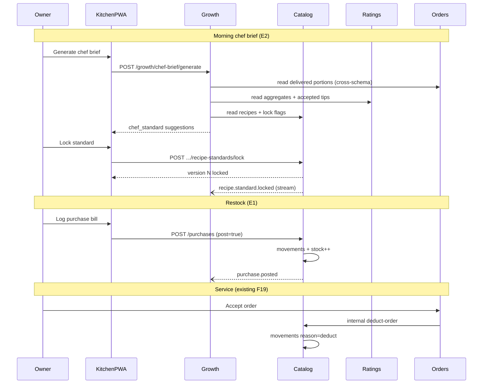

# E1 + E2 — Kitchen Quality Loop Design Pack

**Inventory from purchases · Chef standard locking from ratings + volume**

| Field | Value |
|-------|-------|
| Feature IDs | **E1** (extends F19) · **E2** (extends F11 + F12 + F20) |
| Status | **Design only — no production code until approval** |
| Service owners | Catalog (write) · Growth (orchestrate) · Ratings / Order (read) |
| Sprint | Proposed **S19** (both shipped together) |
| Author | Engineering |
| Date | 2026-07-14 |
| Depends on | F19 ingredients, F11 growth suggestions, F16–F18 ratings, F20 dish suggestions |
| Product gate | Y — locks taste consistency + stock truth without aggregator dependency |

---

## 0. Why build both together

These are not two unrelated features. They form one **closed kitchen quality loop**:

```
Purchases restock pantry (E1)
        │
        ▼
Recipes consume stock on order Ready / bulk prep Prepared (F19b — exists)
        │
        ▼
Orders + home-taste ratings accumulate signal
        │
        ▼
Daily chef brief proposes winning recipe standards (E2)
        │
        ▼
Owner locks standard → recipe becomes the source of truth
        │
        ▼
Next purchase plan uses locked qty × forecasted orders (E1 ← E2)
```

Shipping only E1 leaves stock accurate but quality drift unsolved.  
Shipping only E2 proposes standards without trusting pantry math for “buy this much.”  
**S19 ships both in one vertical slice.**

---

## 1. Business understanding

### E1 — Purchase-linked automatic inventory

- **Problem:** Owners still restock by guessing. F19b deducts on Ready / bulk prepared and allows manual adjust — there is no purchase ledger, so `current_stock` drifts from reality.
- **Vision:** Every purchase (kirana / vendor bill) becomes an immutable stock-in entry tied to ingredient lines; pantry updates automatically from the bill, not from memory.
- **Business objective:** Trustworthy stock → fewer “accepted then can’t cook” moments → higher accept confidence and less waste.
- **Why now:** Recipe deduct already ships; without stock-in, the balance mapper is half a system.

### E2 — Daily chef suggestions → lock winning ingredient standards

- **Problem:** Taste varies batch to batch. Ratings + customer tips (F20) exist, but owners have no daily ritual that turns **order volume × home-taste signal × accepted tips** into a locked recipe standard.
- **Vision:** Each morning the Growth engine surfaces a short “chef brief”: which dishes won yesterday/week, which ingredient lines to tighten, and one-tap **Lock standard**.
- **Business objective:** Repeatable home-taste quality → higher ratings → organic repeat without ads.
- **Why now:** Cross-service data already exists (catalog recipes, order items, rating aggregates, F20 suggestions). The gap is the **orchestration + lock write-path**, not more telemetry.

### Shared product gate

Does this help cloud kitchens grow without aggregator dependency? **Yes** — consistency + stock truth are what aggregator apps never give owners.

---

## 2. Challenge & improvement

### Assumptions challenged

| Assumption | Challenge | Decision |
|------------|-----------|----------|
| “Just auto-deduct from purchases” | Purchases are *stock-in*; recipes are *stock-out*. Mixing them confused F19. | E1 = purchase ledger + auto stock-in; keep F19b deduct on Ready / prepared. |
| “AI invents new recipes” | Owners distrust black-box recipe changes. | E2 proposes **deltas on existing recipe lines** from evidence; owner must lock. |
| “Put everything in catalog” | Daily ranking needs order + ratings fan-in. | Growth **orchestrates**; Catalog **owns lock + purchases**. |
| “New microservice for inventory” | Stock already lives in catalog; premature split. | Stay in `services/catalog/` until purchase volume / multi-vendor warrants `inventory` service. |
| “Lock silently overnight” | Safety + audit risk. | Lock is explicit owner action; auto-generate brief only. |

### Improvements over raw ask

1. **Purchase bills** as first-class aggregate (not ad-hoc positive `adjust-stock`).
2. **Recipe standard versions** — lock creates a versioned snapshot; can roll back.
3. **Structured F20 bridge** — optional `target_ingredient_id` + `proposed_qty` so E2 is not NLP-only.
4. **Unified owner UI** — “Quality loop” panel on Ingredients + Growth (one mental model).
5. **Idempotent stock ledger** — every stock change (purchase, deduct, manual, lock-rebuild restock hint) shares one movement table for audit.

### Out of scope (explicit)

- Vendor master / AP invoices / GST input credit on purchases (billing GST stays output-side)
- Barcode scanners, weighing scales, IoT pantry
- Automatic recipe rewrite without owner lock
- Multi-kitchen stock transfer
- Full ERP costing / WAC inventory valuation (Phase 2 — optional `unit_cost` on purchase lines only stubbed)
- Phase 2 LLM paraphrasing of customer tips (rules + optional keyword map first)

---

## 3. Personas & user journey

| Persona | Goal | Journey steps |
|---------|------|---------------|
| Kitchen owner | Know what to buy and cook the same winning taste | Morning: open Growth → review chef brief → lock 1–2 standards → afternoon: log vendor purchase → stock rises → accept orders with confidence |
| Home chef / operator | Follow one standard recipe | Open dish recipe → see “Locked standard” badge + locked qty/photos |
| Customer (indirect) | Consistent home taste | Rate dish → optionally suggest (“less oil”) → later experiences locked standard |
| Platform (system) | Emit signal, never mutate kitchen recipe without consent | Nightly/on-demand generate → `suggestion.chef_standard` → wait for lock |

### Happy path (same day)

1. Owner logs purchase: 5 kg onions, 2 L oil → stock increments; movement ledger written.
2. Lunch rush: orders accepted → F19 deducts against **locked** (or current) recipe.
3. Customers rate high-volume dishes; one tip accepted: “reduce oil on Dal.”
4. Owner taps **Generate chef brief** (or cron morning): Growth finds Dal = top volume + tip accepted → proposes oil `25ml → 20ml`.
5. Owner taps **Lock standard** → Catalog writes `recipe_standard_versions` + updates `dish_ingredients`.
6. Next purchase plan shows expected oil burn from locked qty × 7-day order rate.

---

## 4. Functional requirements

| ID | Requirement | Priority | Enhancement |
|----|-------------|----------|-------------|
| FR-1 | Owner creates a purchase with line items (ingredient, qty, unit, optional unit_cost, vendor note) | Must | E1 |
| FR-2 | Posting a purchase increments `current_stock` per line and writes immutable stock movements | Must | E1 |
| FR-3 | Purchase cannot be edited after post; void creates reversing movements | Must | E1 |
| FR-4 | List purchases + movements for kitchen (tenant-scoped, paginated) | Must | E1 |
| FR-5 | Manual adjust remains available but must record reason ∈ {manual, purchase, deduct, void, correction} | Must | E1 |
| FR-6 | Growth generates daily chef brief cards from order volume + rating aggregates + F20 accepted tips + current recipe | Must | E2 |
| FR-7 | Chef brief proposes concrete recipe deltas (ingredient_id, from_qty, to_qty, rationale) | Must | E2 |
| FR-8 | Owner can lock a proposed standard → Catalog applies recipe update + version snapshot | Must | E2 |
| FR-9 | Owner can dismiss / snooze a chef brief suggestion | Must | E2 |
| FR-10 | Locked dishes show badge + read-only qty until unlock / re-lock newer version | Must | E2 |
| FR-11 | Optional F20 extension: structured tip fields (`ingredient_id`, `proposed_qty`) when customer picks from recipe | Should | E2 |
| FR-12 | Purchase forecast helper: locked (or current) recipe × rolling 7-day volume → restock hints | Should | E1←E2 |
| FR-13 | Events published for purchase posted, purchase voided, standard locked, chef brief generated | Must | Both |
| FR-14 | Owner UI: Purchases tab on Ingredients + Chef brief on Growth (and Ingredients deep-link) | Must | Both |

---

## 5. Non-functional requirements

| ID | Requirement | Target |
|----|-------------|--------|
| NFR-1 | Purchase post p95 | ≤ 400 ms (same-region) |
| NFR-2 | Chef brief generate p95 | ≤ 2 s for kitchens with ≤ 5k orders / 90d |
| NFR-3 | Tenant isolation | All tables + queries filter `kitchen_id`; owner JWT + ownership check |
| NFR-4 | Stock cache | Invalidate pantry list / low-stock keys on purchase/deduct/lock (TTL ≤ 30s as today) |
| NFR-5 | Idempotency | `Idempotency-Key` on POST purchase; generate brief de-dupes open cards of same type/day |
| NFR-6 | Availability | Catalog + Growth; degrade: brief generate returns 503 if ratings DB read fails mid-flight — never partial lock |
| NFR-7 | Audit | Stock movements + recipe versions retained ≥ 24 months |

---

## 6. Business rules & validation

| Rule | Enforcement |
|------|-------------|
| Purchase qty > 0; unit must match ingredient unit (or convertible set: g↔kg, ml↔l) | Pydantic + domain |
| Cannot post empty purchase | Domain |
| Void only if `status=posted` and not already voided | Domain |
| Stock never goes negative on deduct (F19 today warns; keep same policy — soft warn, deduct clamps at 0 with event) | Catalog |
| Chef brief eligibility: dish has ≥ N delivered portions in window (default N=10 / 14d) AND rating_count ≥ R (default 5) OR ≥1 accepted F20 tip | Growth rules |
| Propose delta only for ingredients already on recipe (or accepted F20 with `ingredient_id`) | Growth |
| Lock requires active owner of kitchen; creates new version number monotonic per dish | Catalog |
| Unlock allowed; does not delete versions | Catalog |
| Cross-schema: Growth/Catalog read-only into order/ratings; **writes only in owning schema** | Architecture |

### E2 scoring formula (rules engine v1 — no LLM)

For each dish in kitchen:

```
volume_score   = normalized_portions_14d          # 0–1
taste_score    = avg_home_taste / 5               # 0–1
tip_boost      = 0.15 if accepted F20 on dish else 0
quality_risk   = max(0, 0.6 - overall_rating/5)   # reward fixing under-performers slightly

priority = 0.45*volume_score + 0.35*taste_score + tip_boost + 0.20*quality_risk
```

Surfacing rule:
- If high volume + high taste → **“Protect winner”** (lock current recipe as-is if unlocked / aged).
- If high volume + accepted tip with `proposed_qty` → **“Adopt tip”** delta.
- If high volume + low taste, no tip → **“Review standards”** (nudge only; no invented qty).

Default taxonomies for tip keywords (Phase 1 map, not free AI):

| Keyword cluster | Ingredient heuristic |
|-----------------|----------------------|
| oil / oily / greasy | reduce oil line by 10–20% if present |
| salt / salty | reduce salt line by 10% if present |
| spice / spicy / chilli | reduce chilli/masala line by 10% |
| bland / less flavour | increase primary masala by 10% if present |

Only apply keyword map if structured fields missing.

---

## 7. Permissions

| Actor | Can | Cannot |
|-------|-----|--------|
| Owner | CRUD purchases (post/void), generate/dismiss chef brief, lock/unlock standards, edit unlocked recipes | Touch other kitchens; auto-lock without UI |
| Customer | Rate, submit F20 (optionally structured) | See pantry, purchases, drafts of standards |
| Admin | Read platform metrics later | Mutate kitchen stock / recipes via owner JWT paths |
| Internal services | Order → deduct (existing); Growth → read aggregates | Catalog write without owner lock API |

---

## 8. Domain model & bounded context

### Ownership map

| Aggregate | Schema / service | Notes |
|-----------|------------------|-------|
| `StockPurchase` | `ckac_catalog` / catalog | E1 write owner |
| `StockMovement` | `ckac_catalog` / catalog | Ledger for all stock deltas |
| `Ingredient` / `DishIngredient` | `ckac_catalog` | Existing; lock updates lines |
| `RecipeStandardVersion` | `ckac_catalog` | E2 write owner (snapshot) |
| `Suggestion` (type `chef_standard`) | `ckac_growth` / growth | E2 orchestration |
| `DishSuggestion` (F20) | `ckac_ratings` | Input signal |
| `Order` / items | `ckac_orders` | Volume signal (read-only) |
| `DishRatingAggregate` | `ckac_ratings` | Taste signal (read-only) |

```
Aggregates:
  StockPurchase { id, kitchen_id, vendor_name?, purchased_at, status, lines[], idempotency_key }
  StockPurchaseLine { ingredient_id, quantity, unit, unit_cost? }
  StockMovement { id, kitchen_id, ingredient_id, delta, reason, ref_type, ref_id, balance_after }
  RecipeStandardVersion { id, kitchen_id, dish_id, version, locked_at, locked_by, source_suggestion_id?, lines_snapshot JSONB, rationale }
  Growth Suggestion { type=chef_standard, action_payload: { dish_id, deltas[], evidence } }

Invariants:
  - Σ(movements.delta) + initial == current_stock (soft invariant; reconcile job Phase 2)
  - Posted purchase movements are append-only; void adds reverse deltas
  - Lock never deletes prior RecipeStandardVersion
  - Growth never UPDATEs ckac_catalog.*
```

### Unit conversion (domain VO)

Supported pairs only: `g↔kg`, `ml↔l`, `pcs` identity. Else 400.

---

## 9. Events

| Event | Producer | Stream | Subscribers | Idempotency key |
|-------|----------|--------|-------------|-----------------|
| `purchase.posted` | catalog | `ckac:catalog:purchase` | growth (forecast refresh), notify (optional) | `purchase_id` |
| `purchase.voided` | catalog | `ckac:catalog:purchase` | growth | `purchase_id:void` |
| `ingredient.stock.adjusted` | catalog | `ckac:catalog:ingredient` | (existing) | `movement_id` |
| `ingredient.stock.deducted` | catalog | `ckac:catalog:ingredient` | (existing) | `order_id` |
| `recipe.standard.locked` | catalog | `ckac:catalog:dish` | growth (dismiss open briefs for dish), notify | `dish_id:version` |
| `recipe.standard.unlocked` | catalog | `ckac:catalog:dish` | growth | `dish_id:unlock:ts` |
| `suggestion.chef_standard.generated` | growth | `ckac:growth:suggestion` | (analytics) | `kitchen_id:date:dish_id` |
| `suggestion.dismissed` | growth | `ckac:growth:suggestion` | — | `suggestion_id` |
| `rating.aggregate.updated` | ratings | `ckac:ratings:dish` | growth (optional future consumer) | `dish_id` |
| `order.status.changed` | order | `ckac:orders:order` | catalog deduct (today sync); future optional | existing |

**Phase 1 consumer strategy:** Growth **generate is pull-based** (owner tap or cron HTTP). Event subscribers optional after S19 stabilize. Catalog purchase events still published (EDD mandatory).

---

## 10. Database

### Catalog migrations — proposed `007_stock_purchases.py`, `008_recipe_standards.py`

| Table | Schema | Indexes | Purpose |
|-------|--------|---------|---------|
| `stock_purchases` | `ckac_catalog` | `(kitchen_id, purchased_at DESC)`, unique `(kitchen_id, idempotency_key)` | Purchase header |
| `stock_purchase_lines` | `ckac_catalog` | `(purchase_id)`, `(ingredient_id)` | Lines |
| `stock_movements` | `ckac_catalog` | `(kitchen_id, created_at)`, `(ingredient_id, created_at)`, `(ref_type, ref_id)` | Immutable ledger |
| `recipe_standard_versions` | `ckac_catalog` | unique `(dish_id, version)`, `(kitchen_id, locked_at DESC)` | Lock snapshots |
| `dishes.is_standard_locked` | column | — | Fast UI flag |
| `dishes.locked_standard_version` | column | — | Current version pointer |

#### Column sketches

```sql
-- stock_purchases
id UUID PK
kitchen_id UUID NOT NULL
vendor_name VARCHAR(255)
note TEXT
purchased_at TIMESTAMPTZ NOT NULL
status VARCHAR(16) NOT NULL  -- draft|posted|voided
idempotency_key VARCHAR(64)
posted_at TIMESTAMPTZ
voided_at TIMESTAMPTZ
created_by_owner_id UUID
created_at TIMESTAMPTZ

-- stock_purchase_lines
id UUID PK
purchase_id UUID NOT NULL REFERENCES stock_purchases
ingredient_id UUID NOT NULL
quantity NUMERIC(12,3) NOT NULL
unit VARCHAR(20) NOT NULL
unit_cost NUMERIC(12,2)  -- optional; valuation Phase 2

-- stock_movements
id UUID PK
kitchen_id UUID NOT NULL
ingredient_id UUID NOT NULL
delta NUMERIC(12,3) NOT NULL  -- + purchase / - deduct
reason VARCHAR(32) NOT NULL    -- purchase|void|deduct|manual|correction
ref_type VARCHAR(32)          -- purchase|order|manual
ref_id UUID
balance_after NUMERIC(12,3) NOT NULL
created_at TIMESTAMPTZ

-- recipe_standard_versions
id UUID PK
kitchen_id UUID NOT NULL
dish_id UUID NOT NULL
version INT NOT NULL
lines_snapshot JSONB NOT NULL  -- [{ingredient_id, name, quantity, unit, photo_url}]
rationale TEXT
source_suggestion_id UUID      -- growth suggestion if any
locked_by_owner_id UUID
locked_at TIMESTAMPTZ
```

### Growth — extend existing `suggestions`

| Change | Detail |
|--------|--------|
| `suggestion_type` add | `chef_standard` \| `restock_plan` |
| `action_payload` shape | see §11 |

### Ratings — optional S19b migration

| Column on `dish_suggestions` | Purpose |
|------------------------------|---------|
| `target_ingredient_id UUID NULL` | Structured tip |
| `proposed_quantity NUMERIC(12,3) NULL` | Structured tip |
| `proposed_unit VARCHAR(20) NULL` | Structured tip |

### Cross-schema reads (no foreign FKs across schemas)

- Growth → `ckac_orders.order_items` + `orders` (delivered counts)
- Growth → `ckac_ratings.dish_rating_aggregates` + accepted `dish_suggestions`
- Growth → `ckac_catalog.dish_ingredients` + `ingredients` + `dishes`
- Catalog lock API may receive `source_suggestion_id` (UUID only; no FK)

---

## 11. API contracts

Gateway: existing `/ingredients` → catalog; `/growth` → growth; `/suggestions` → ratings.  
Add markers: `/purchases`, `/stock-movements`, `/recipe-standards`.

### Catalog — E1

| Method | Path | Auth | Request | Response | Errors |
|--------|------|------|---------|----------|--------|
| POST | `/api/v1/kitchens/{kid}/purchases` | Owner | `{ vendor_name?, note?, purchased_at?, lines:[{ingredient_id, quantity, unit, unit_cost?}], post?:true }` + `Idempotency-Key` | `PurchaseResponse` | 400 unit/qty, 403, 409 duplicate key |
| GET | `/api/v1/kitchens/{kid}/purchases?limit=&cursor=` | Owner | — | `{ purchases[], next_cursor? }` | 403 |
| GET | `/api/v1/kitchens/{kid}/purchases/{pid}` | Owner | — | `PurchaseResponse` | 404 |
| POST | `/api/v1/kitchens/{kid}/purchases/{pid}/post` | Owner | — | `PurchaseResponse` | 400 if already posted |
| POST | `/api/v1/kitchens/{kid}/purchases/{pid}/void` | Owner | `{ reason? }` | `PurchaseResponse` | 400 |
| GET | `/api/v1/kitchens/{kid}/stock-movements?ingredient_id=&limit=` | Owner | — | `{ movements[] }` | 403 |
| GET | `/api/v1/kitchens/{kid}/restock-forecast?days=7` | Owner | — | `{ lines:[{ingredient_id, name, needed_qty, on_hand, deficit}] }` | 403 |

### Catalog — E2 lock

| Method | Path | Auth | Request | Response | Errors |
|--------|------|------|---------|----------|--------|
| POST | `/api/v1/kitchens/{kid}/dishes/{did}/recipe-standards/lock` | Owner | `{ deltas?:[{ingredient_id, quantity, unit}], rationale?, source_suggestion_id?, use_current?:true }` | `RecipeStandardVersionResponse` | 400, 403 |
| POST | `/api/v1/kitchens/{kid}/dishes/{did}/recipe-standards/unlock` | Owner | — | `{ dish_id, is_standard_locked:false }` | 403 |
| GET | `/api/v1/kitchens/{kid}/dishes/{did}/recipe-standards` | Owner | — | `{ versions[] }` | 403 |

Lock behavior:
1. Start from current `dish_ingredients`.
2. Apply `deltas` if provided (from Growth payload).
3. Snapshot → bump version → set `is_standard_locked=true`.
4. Publish `recipe.standard.locked`.

### Growth — E2 brief

| Method | Path | Auth | Request | Response | Errors |
|--------|------|------|---------|----------|--------|
| POST | `/api/v1/kitchens/{kid}/growth/chef-brief/generate` | Owner | `{ window_days?:14 }` | `{ suggestions: Suggestion[] }` | 403 |
| GET | `/api/v1/kitchens/{kid}/growth/suggestions?type=chef_standard` | Owner | — | existing list filter | — |

`action_payload` for `chef_standard`:

```json
{
  "kind": "chef_standard",
  "dish_id": "...",
  "dish_name": "Dal Tadka",
  "evidence": {
    "portions_14d": 86,
    "avg_home_taste": 4.4,
    "overall_rating": 4.2,
    "accepted_tips": 1
  },
  "mode": "adopt_tip" | "protect_winner" | "review",
  "deltas": [
    {
      "ingredient_id": "...",
      "ingredient_name": "Oil",
      "from_qty": 25,
      "to_qty": 20,
      "unit": "ml",
      "source": "f20" | "keyword" | "none"
    }
  ],
  "lock_path": "/api/v1/kitchens/{kid}/dishes/{did}/recipe-standards/lock"
}
```

`restock_plan` suggestion (optional same generate pass):

```json
{
  "kind": "restock_plan",
  "deficits": [{ "ingredient_id": "...", "deficit": 2.5, "unit": "kg" }],
  "based_on_locked_standards": true
}
```

### Ratings — F20 structured (Should)

| Method | Path | Change |
|--------|------|--------|
| POST | `/kitchens/{kid}/dishes/{did}/suggestions` | Optional fields `target_ingredient_id`, `proposed_quantity`, `proposed_unit` |

OpenAPI updated: **Y** (catalog + growth + ratings) after implementation.

---

## 12. Workflow & notifications



| Trigger | Channel | Template |
|---------|---------|----------|
| Low stock after deduct/purchase void | Existing owner UX + optional WA later | F19 low-stock |
| Chef brief ready (cron Phase 2) | WhatsApp optional | “3 dishes ready to lock standards” |
| Lock applied | In-app only S19 | — |

---

## 13. Analytics & reports

| Question answered | Metric | Storage |
|-------------------|--------|---------|
| Did purchases keep pantry healthy? | purchase_count, movement +sum vs −sum | catalog movements |
| Which standards are locked? | locked_dish_count / menu_size | catalog dishes flags |
| Do locked dishes retain ratings? | Δ avg_home_taste 14d before/after lock | ratings aggregates + version timestamp |
| Are chef briefs acted on? | lock_rate = locks / briefs_generated | growth suggestions + catalog versions |
| Restock accuracy | deficit after N days vs forecast | restock-forecast snapshots (Phase 2) |

---

## 14. Edge cases · failures · recovery

| Case | Behavior | Recovery |
|------|----------|----------|
| Duplicate Idempotency-Key | Return existing purchase 200 | — |
| Purchase void after partial consume | Stock may go low/zero; warn if clamp | Manual correction movement |
| Deduct after unlock mid-day | Uses current recipe lines (may differ from last lock) | Document; accept uses live recipe always |
| Generate with no eligible dishes | Empty list + message | Lower thresholds? Owner educates |
| Lock while recipe empty | 400 | Add recipe first |
| Ratings DB down during generate | 503; no cards | Retry |
| Catalog down during lock | 503; suggestion remains open | Retry |
| Concurrent two locks | Unique `(dish_id, version)` serializes; second wins next version | — |
| F20 tip ingredient not on recipe | Brief mode `review` only | Owner adds line then re-generate |
| Unit mismatch g vs kg on purchase | Convert if pair supported else 400 | — |

---

## 15. Security & privacy

- **PII:** purchase `vendor_name` / `note` — owner business data, not customer PII; still mask in logs.
- **OWASP:** validate UUIDs, numeric bounds, no raw SQL concatenation; rate-limit generate (e.g. 10/min/kitchen).
- **Tenant:** every catalog/growth query filters `kitchen_id` + `verify_kitchen_owner`.
- **Audit log:** `stock_movements` + `recipe_standard_versions` = enough for S19; Y.
- **Customer tips:** never show customer identity on chef brief (aggregate evidence only).

---

## 16. Test plan

| Test | Type | File |
|------|------|------|
| Purchase posts increments stock + movement | API | `catalog/tests/test_purchases.py` |
| Idempotent purchase | API | `test_purchases.py` |
| Void reverses stock | API | `test_purchases.py` |
| Unit conversion kg→g | unit | `test_purchase_units.py` |
| Lock creates version + updates recipe | API | `catalog/tests/test_recipe_standards.py` |
| Unlock clears flag, keeps history | API | `test_recipe_standards.py` |
| Chef brief ranks high-volume dish | API | `growth/tests/test_chef_brief.py` |
| Adopt tip delta from accepted F20 | API | `test_chef_brief.py` |
| Protect winner when unlocked top dish | API | `test_chef_brief.py` |
| Restock forecast uses locked qty | API | `test_restock_forecast.py` |
| `purchase.posted` / `recipe.standard.locked` outbox | event | `test_events.py` (per service) |
| Owner cannot lock other kitchen | security | `test_recipe_standards.py` |

### BDD

```
Scenario: Purchase restocks pantry
  Given kitchen has Oil stock 1.0 L
  When owner posts purchase of 2 L Oil
  Then Oil current_stock is 3.0 L
  And a stock_movement +2 reason=purchase exists

Scenario: Lock adopts customer tip
  Given Dal sold 40 portions in 14d with avg_home_taste 4.3
  And an accepted tip proposes Oil 20ml (current 25ml)
  When owner generates chef brief and locks the Dal card
  Then recipe Oil quantity is 20
  And recipe_standard_versions version=1 exists
  And dish.is_standard_locked is true

Scenario: Both together
  Given locked Dal oil=20ml and 7-day pace implies 1.4 L oil / week
  And on_hand oil=0.3 L
  When owner opens restock forecast
  Then Oil deficit ≈ 1.1 L is shown
```

### Acceptance criteria

**E1**
- [ ] Owner can post multi-line purchase; stock increases per line
- [ ] Void reverses stock; ledger shows both movements
- [ ] Manual adjust still works and writes ledger
- [ ] Restock forecast endpoint returns deficits using recipe × volume

**E2**
- [ ] Generate produces `chef_standard` cards with evidence + optional deltas
- [ ] Lock applies deltas, versions recipe, emits event
- [ ] Unlock does not delete versions
- [ ] Growth never writes catalog tables directly

**Together**
- [ ] Locked standards feed restock forecast
- [ ] Ingredients + Growth UI expose the loop without POS/dine-in features
- [ ] `scripts/run-tests.ps1` green for catalog + growth (+ ratings if F20 columns)

---

## 17. Implementation plan (after approval)

| Step | Task | Owner service | Est. |
|------|------|---------------|------|
| 1 | Design pack approved (this doc) | — | — |
| 2 | RED: `test_purchases.py`, `test_recipe_standards.py`, `test_chef_brief.py` | catalog / growth | 0.5d |
| 3 | Alembic `007` purchases + movements; `008` recipe standards | catalog | 0.5d |
| 4 | Domain: post/void purchase, movements helper; refactor F19 deduct to write movements | catalog | 1d |
| 5 | Domain: lock/unlock + version snapshot | catalog | 0.5d |
| 6 | Growth: `generate_chef_brief`, new types, payload builder | growth | 1d |
| 7 | Routes + gateway markers | catalog / growth / gateway | 0.5d |
| 8 | Optional ratings structured tip columns | ratings | 0.25d |
| 9 | Owner UI: Purchases on Ingredients; Chef brief on Growth; lock CTA | website | 1d |
| 10 | Events + tests + `run-tests.ps1` | all | 0.5d |
| 11 | Docs: AGENTS.md stream keys + implementation guide | docs | 0.25d |

**Do not start steps 2–11 until CPO/CTO checklist below is ticked.**

---

## 18. UI design (Owner PWA)

Preserve existing `OwnerPageShell` / dash-card language (match Home quality).

### Ingredients page — add tabs

1. **Pantry** (existing list + adjust)
2. **Purchases** (new)
   - List recent bills; CTA “Log purchase”
   - Form: vendor, date, lines (ingredient select, qty, unit), Post
   - Drill-in: lines + linked movements
3. **Forecast** (new, lightweight)
   - Deficit table from `restock-forecast`
   - CTA “Create purchase from deficits” (prefill lines)

Recipe editor:
- Badge **Locked standard vN** when `is_standard_locked`
- Qty inputs read-only while locked; buttons Unlock / View history

### Growth page — Chef brief section (top)

- Card list: dish name, evidence chips (portions, home taste), proposed delta table
- Primary CTA: **Lock standard** → calls catalog lock with payload deltas
- Secondary: Dismiss · View recipe
- Empty: “Not enough rated volume yet — need ~10 portions + 5 ratings”

### No new nav item required

Keep loop inside **Ingredients** + **Growth** to avoid dashboard sprawl. Optional Account deep-link later.

### Motion (2–3 intentional)

1. Purchase post success: stock number tick-up
2. Lock success: brief card collapses → “Locked” chip on dish
3. Forecast deficit row highlight when purchase covers it

---

## 19. Future AI & expansion

- LLM summarization of free-text F20 tips → structured deltas (guardrailed)
- Split `inventory-service` when purchase volume / multi-warehouse appears
- FIFO / WAC costing for GST input reports
- Event-driven Growth consumer on `rating.aggregate.updated` for push briefs
- Supplier directory + recurring purchase templates

---

## 20. Relationship to existing features

| Existing | Role in E1/E2 |
|----------|----------------|
| F19b stock deduct on ready / prepared | Unchanged trigger; gains ledger rows |
| F11 generate suggestions | Extended with `chef_standard` / `restock_plan` |
| F12 performance + recipe suggestions | E2 fulfills the “act on suggestions” half |
| F20 customer tips | Primary evidence for `adopt_tip` mode |
| F16–F18 ratings aggregates | Scoring inputs |

---

## Approval

- [ ] CPO acceptance criteria matched (quality loop + purchase truth)
- [ ] CTO architecture / events reviewed (catalog writes · growth orchestrates · no cross-schema writes)
- [ ] DBA schema reviewed (`007`/`008` + optional ratings columns)
- [ ] QA test plan reviewed

**Only after approval → implement production code (TDD RED → GREEN).**

---

## Decision log (pre-code)

| Decision | Choice | Rationale |
|----------|--------|-----------|
| Inventory service split? | **No** for S19 | Stock already catalog-owned |
| Auto-lock overnight? | **No** | Owner consent invariant |
| Deduct timing | Keep on **ready** / bulk **prepared** | Matches F19b shipped behavior |
| Brief trigger | Owner generate + optional later cron | Simpler ops, testable |
| Build E1 alone first? | **No** | User asked to design/build both together; forecast needs lock |
