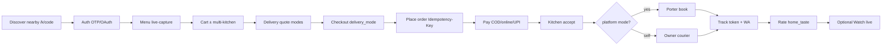
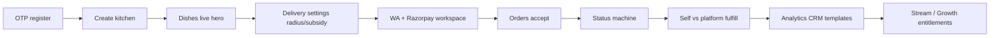

# KitchCu — Platform Architecture & Flow Report

**Living executive report.** Current-state architecture, persona flows, events, and gaps after Phase 1 S1–S18 + post-S18 **P19–P32.1**.

| Field | Value |
|-------|-------|
| Version | **1.0** |
| Date | 2026-07-19 |
| Baseline | S1–S18 + P19–P32.1 (`caf9c73`) |
| Production | `*.kitchcu.com` (GCP VM + Caddy) |
| Companions | [ADVANCEMENT-TRACKER](./ADVANCEMENT-TRACKER.md) · [PERSONA DEEP DIVE](./PLATFORM-PERSONA-DEEP-DIVE.md) · [SOLUTION BLUEPRINT](./PLATFORM-SOLUTION-BLUEPRINT.md) · [DELIVERY PAYER](./DELIVERY-PAYER-MODE-DESIGN.md) · [ARCHITECTURE CTO](./CKAC-ARCHITECTURE-CTO.md) |

**Verdict (CEO / CPO / CTO)**

| Lens | One-liner |
|------|-----------|
| **CEO** | Subscription SaaS, zero food commission intact. Packages + hard entitlements monetize modules. In-range kitchens absorb delivery as a growth lever. |
| **CPO** | Customer Self vs Porter with visible ₹ split is product-complete for demo. Owner delivery settings + accept-time Porter booking close the honesty loop. Kitchen staff + live PG remain trust gaps. |
| **CTO** | Gateway + 13 bounded contexts, outbox EDD, tenant `kitchen_id`. Next: live Razorpay, prod OTP, Porter webhooks, kitchen staff RBAC, Cloud Run / OTel. |

---

## 1. System topology

```
┌──────────────────────────────────────────────────────────────────┐
│  PWAs (apps/website/)                                            │
│  portal:13000 · customer:13001 · kitchen:13002 · admin:13003     │
└────────────────────────────┬─────────────────────────────────────┘
                             │ HTTPS / JWT  (public clients → gateway only)
┌────────────────────────────▼─────────────────────────────────────┐
│  GATEWAY :18000                                                  │
│  /api/v1/* · CORS · X-Correlation-ID · OTP rate limits · OpenAPI │
└────────────────────────────┬─────────────────────────────────────┘
     ┌───────────┬───────────┼───────────┬───────────┬────────────┐
     ▼           ▼           ▼           ▼           ▼            ▼
 identity    catalog      order      billing   notification   marketing
  :18001      :18002      :18003      :18004      :18005         :18006
 ratings     growth     delivery   learning   community     streaming
  :18007      :18008      :18009      :18010      :18011         :18012
                              │
              PostgreSQL (schema-per-domain) · Redis Streams + cache · MinIO
              Outbox: ckac_events.outbox
```

| Service | Port | Schema | Owns |
|---------|------|--------|------|
| gateway | 18000 | — | Public edge only |
| identity | 18001 | `ckac_identity` | Owners, customers, kitchens, admin RBAC/audit, delivery-settings, branded page |
| catalog | 18002 | `ckac_catalog` | Menu, dishes, live-capture media, ingredients/recipes |
| order | 18003 | `ckac_orders` | Orders, drafts, master orders, analytics, Porter book on accept |
| billing | 18004 | `ckac_billing` | Payments, subscriptions, GST, refunds, packages, messaging wallet |
| notification | 18005 | `ckac_support` | WA webhook, tickets, order/tracking notify, template-blast |
| marketing | 18006 | `ckac_marketing` | CRM, coupons, promos, message templates |
| ratings | 18007 | `ckac_ratings` | Home-taste ratings |
| growth | 18008 | `ckac_growth` | Combos, patterns, suggestions, daily menu, golden day |
| delivery | 18009 | `ckac_delivery` | Fee quotes (modes + cost-share), track token, Porter quote |
| learning | 18010 | `ckac_learning` | Portal + dish trials |
| community | 18011 | `ckac_community` | Recipe rewards, rankings |
| streaming | 18012 | `ckac_streaming` | LiveKit sessions, dish showcase |

**Auth**

| Actor | Credential | JWT `type` |
|-------|------------|------------|
| Owner | Phone OTP | `owner` |
| Customer | WhatsApp OTP / OAuth | `customer` |
| Admin | Email/password + role | `admin` |
| Service↔service | `X-Internal-Key` | — |

---

## 2. Canonical data / event path

```
Actor → Gateway → Service route → Domain
  → DB commit (owning ckac_* schema) + outbox row (same txn)
  → Redis XADD  ckac:{domain}:{aggregate}
  → Consumers (notify, growth, side-effects)
  → UI poll / refetch
```

Missing events on writes = incomplete feature. Payments never cached.

### Primary streams

| Stream | Domain |
|--------|--------|
| `ckac:identity:kitchen` | kitchens |
| `ckac:catalog:dish`, `ckac:catalog:ingredient` | menu / stock |
| `ckac:orders:order`, `draft`, `master_order` | checkout / lifecycle |
| `ckac:billing:payment`, `settlement`, `subscription`, `wallet`, `gst`, `refund`, `package` | money |
| `ckac:marketing:coupon`, `promotion`, `crm`, `template` | CRM / blasts |
| `ckac:ratings:rating`, `dish` | ratings |
| `ckac:growth:suggestion`, `daily_menu` | intelligence |
| `ckac:delivery:quote`, `tracking` | fees / track |
| `ckac:learning:trial` · `ckac:community:*` · `ckac:streaming:session` | growth loops |
| `ckac:notify:whatsapp`, `dispatch`, `tracking` | outbound |

Also: `order.delivery_mode.set`, `order.status.changed` → notify / stock / Porter.

---

## 3. End-to-end persona flows

### 3.1 Customer — discover → eat → rate



| Stage | API / surface | Status |
|-------|---------------|--------|
| Discover | `GET /kitchens/public/nearby`, `/k/:code` | ✅ |
| Quote | `POST /delivery/quote` → modes self \| platform | ✅ P32 |
| Place | `delivery_mode` + fee re-validate | ✅ P32.1 |
| Pay | billing intents | 🟡 mock/prod risk |
| Accept → Porter | order status `accepted` | ✅ P32.1 |
| Track / notify | `/delivery/track/{token}`, F29/F45 | ✅ |
| Watch | `/live/:sessionId` LiveKit | ✅ P30 |
| Rate | F16–F18 | ✅ |

### 3.2 Owner — onboard → serve → grow



| Capability | Status |
|------------|--------|
| Delivery cost-share settings UI | ✅ P32.1 |
| Hard package entitlements + nav | ✅ P29 |
| Template send + wallet + Meta | ✅ P30–P31 |
| LiveKit publish + camera | ✅ P30/P32 |
| Kitchen staff (manager/cook) | 🔴 not built |

### 3.3 Admin — hire safely → govern kitchens

```
Login (role) → /admin/me permissions → filtered tabs
  → Employees · Packages · Audit · API Keys · Control flags
  → Kitchen workspace: Profile · WA · Payments · Package · Marketing · Modules · Streaming
  → Money: refunds / settlements (permission-gated)
  → Tickets (support)
```

| Capability | Status |
|------------|--------|
| RBAC enforce + tab filter | ✅ P29 |
| Admin audit (+ billing writes) | ✅ P30–P31 |
| Package mapper + assign | ✅ P25/P29 |

### 3.4 Delivery payer rules (product law)

| Distance | Min order met? | Who pays logistics |
|----------|----------------|--------------------|
| ≤ `max_delivery_radius_km` | n/a | Kitchen **100%** (customer ₹0) |
| Beyond max | No | Customer **100%** |
| Beyond max | Yes (`subtotal ≥ min_order`) | Kitchen **`delivery_subsidy_percent`%** (default 50); rest customer (`shared`) |

Modes: **self** | **platform** (Porter when `DELIVERY_PARTNER=porter` + flag `courier_porter_dunzo`).  
Book Porter **on kitchen accept**, not at cart place. Design: [DELIVERY-PAYER-MODE-DESIGN.md](./DELIVERY-PAYER-MODE-DESIGN.md).

---

## 4. Control model (multi-role)

```
SUPERADMIN → Employees · API Keys · Flags · Packages · Audit · all kitchens
OPS / SUPPORT / FINANCE → permission-scoped tabs (enforced)
KITCHEN OWNER → single phone JWT today
CUSTOMER → OTP / OAuth
✗ Kitchen staff — NOT BUILT
```

Super-admin kitchen-scoped work stays on Admin kitchen workspace (not owner JWT). See `.cursor/rules/kitchcu-superadmin-integration.mdc`.

---

## 5. Shipped vs open (post-S18)

### Shipped (do not re-list as gaps)

P19 branded storefront · P20 golden day · P21 WA/PG workspace · P22 dish showcase · P23 admin password sync · P25 packages · P26 templates · P27–P29 employees/RBAC/hard entitlements · P30 LiveKit + audit · P31 wallet/Meta · **P32 / P32.1 Porter + cost-share + checkout wire-up**

### Open (prioritized)

| Wave | Item | Why |
|------|------|-----|
| **A** | Live Razorpay + prod OTP | Trust / money |
| **B** | Kitchen staff RBAC | TAM beyond solo chefs |
| **B** | Porter webhooks / live courier status | Ops honesty after book |
| **C** | E1–E2 Quality Loop | Profit OS |
| **D** | Cloud Run + OTel + load SLOs | 100k sessions |

---

## 6. Scale risks (100k sessions)

| Risk | Today | Required |
|------|-------|----------|
| Single GCP VM | Demo prod | Cloud Run + managed SQL/Redis |
| Redis Streams bus | Fine early | Kafka/PubSub + lag alerts |
| Outbox in-request | Latency under load | Async dispatcher workers |
| Soft module defaults (historical) | Hardened when package assigned | Keep default-deny for paid modules |
| Observability | `/health/*` + correlation | OTel + money SLOs |
| RLS | Pattern only | Prove on tenant tables in prod |

---

## 7. Flow achievement scorecard (2026-07-19)

| Journey | Persona | Score | Notes |
|---------|---------|-------|-------|
| Discover → menu | Customer | A | Ranking still weak |
| Checkout → delivery modes → pay | Customer | A− | Porter/cost-share shipped; live PG 🟡 |
| Track → rate | Customer | A− | Prompt timing |
| Watch live | Customer | A− | Prod LiveKit config |
| Owner onboard | Owner | A− | Checklist wizard missing |
| Order lifecycle + Porter | Owner | A | Staff roles missing |
| Templates send | Owner | A− | Wallet + Meta shipped |
| Package / entitlements | Finance | A− | Hard gate shipped |
| Admin hire safely | Superadmin | A− | RBAC + audit shipped |
| Kitchen staff | Cook/Manager | F | Not built |
| Quality/profit loop | Owner | — | E1–E2 design only |

---

## 8. Doc map

| Doc | Job |
|-----|-----|
| **This file** | Architecture + flow snapshot (current state) |
| [PLATFORM-PERSONA-DEEP-DIVE.md](./PLATFORM-PERSONA-DEEP-DIVE.md) | Lived voice + friction |
| [PLATFORM-SOLUTION-BLUEPRINT.md](./PLATFORM-SOLUTION-BLUEPRINT.md) | Expectations → solution → gaps per journey |
| [ADVANCEMENT-TRACKER.md](./ADVANCEMENT-TRACKER.md) | Ship board P19–P32.1 |
| [CKAC-ARCHITECTURE-CTO.md](./CKAC-ARCHITECTURE-CTO.md) | Layered arch + registry |
| [CKAC-USERFLOWS.md](./CKAC-USERFLOWS.md) | Step APIs |

---

## Document control

| Version | Date | Changes |
|---------|------|---------|
| **1.0** | 2026-07-19 | Full platform architecture & flow report post P32.1 |

*Update this file when a persona-blocking gap closes or a service boundary changes.*
